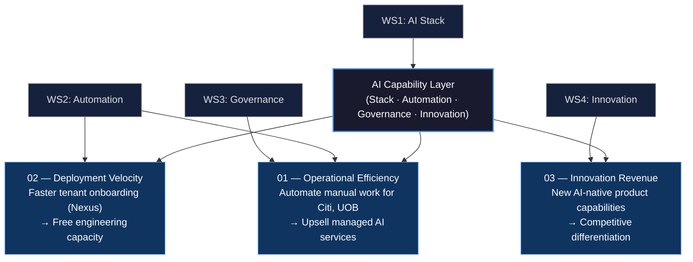
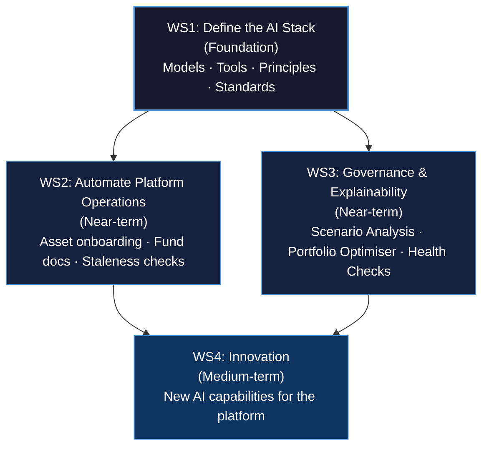
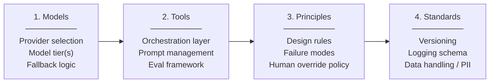
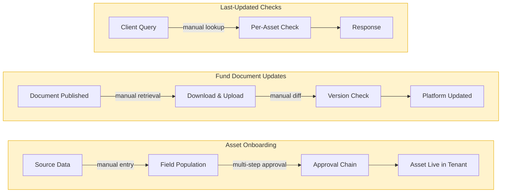
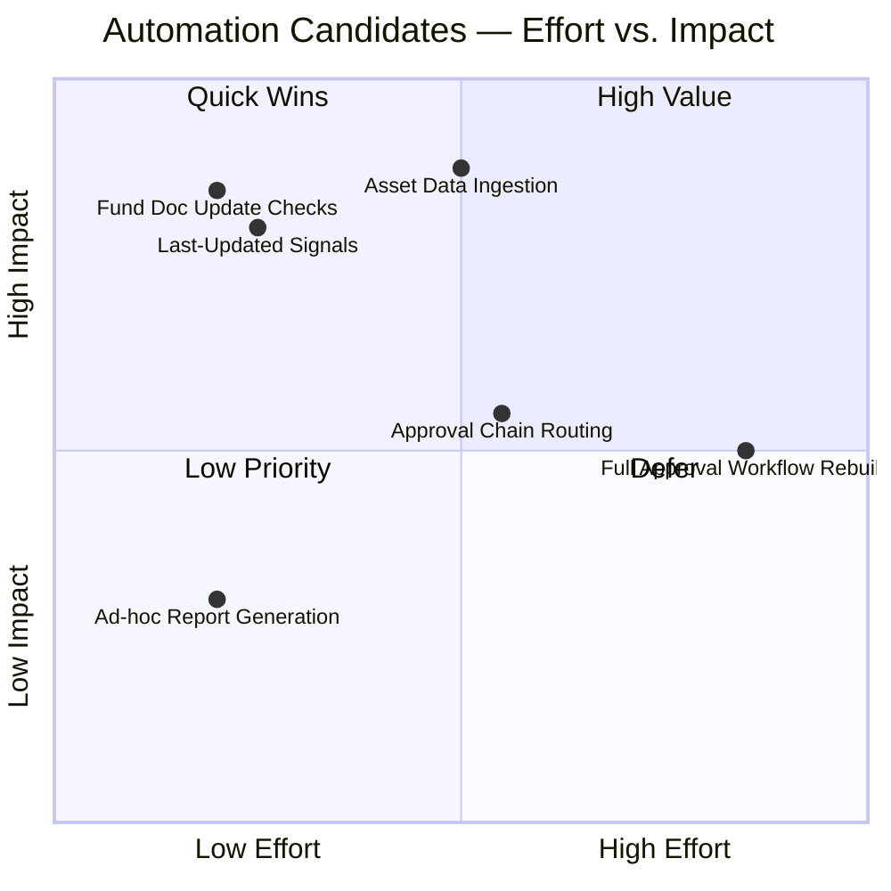
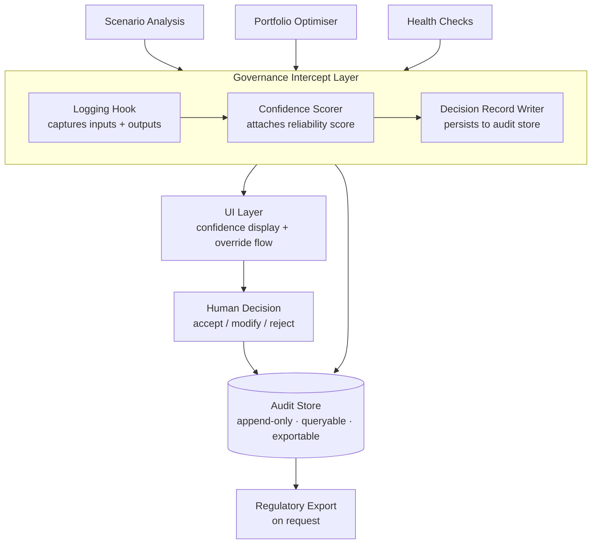
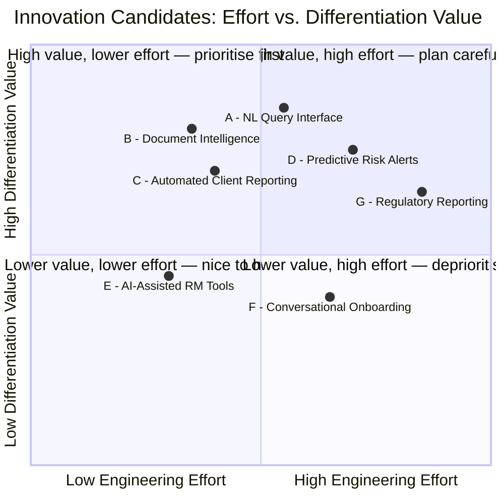
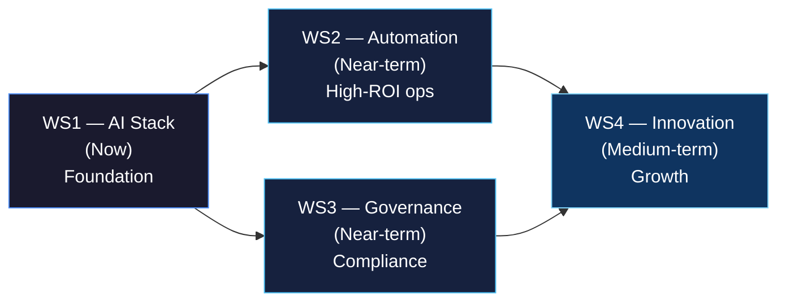

# STORYBOARD: Building the AI Muscle at Privé

**Audience:** Technology leadership (Alex, Head of Technology, Privé Technologies)
**Narrative arc:** Situation → Gap → Structured Response → Payoff
**Total slides:** 24
**Date:** 2026-06-18
**Generated:** 2026-06-18

---

## Narrative arc

**Situation → Gap → Structured Response → Payoff**

The deck opens by grounding Alex in what Privé is already doing with AI — establishing credibility and shared context. It then surfaces the structural gap: shipping AI products without a defined AI capability layer is a growing liability, technically and commercially. The middle sections propose four concrete workstreams that together constitute the AI capability build — each scoped, sequenced, and owned by Technology. The deck closes by connecting the workstreams to three strategic outcomes that matter to the business, giving Alex a clear narrative to carry upward and a set of next steps he can act on immediately.

---

## Audience profile

- **Mindset:** Systems thinker. Evaluates proposals through feasibility, architectural coherence, and engineering risk. Wants to know what changes, what breaks, and who owns it.
- **Care about:** (1) Technical rigour — is the proposed approach sound and implementable? (2) Scope realism — does this land within existing team capacity and priorities? (3) Platform integrity — will this destabilise what already ships to clients?
- **Skeptical of:** Vague "AI strategy" language with no concrete tooling decisions; proposals that underestimate engineering lift; anything that sounds like it was written by Partnerships without understanding the tech constraints.
- **Success signal:** Alex leaves the meeting with a clear picture of four concrete workstreams he can scope, assign, and sequence — and sees this as a tech-led initiative, not a top-down mandate from another department.

---

## Slide outline

| # | Title | Section | Type | Intent |
|---|-------|---------|------|--------|
| 1 | Building the AI Muscle at Privé | Cover | Title | Set tone: this is a serious engineering initiative, not a buzzword pitch — audience should feel this is worth 30 minutes. |
| 2 | What This Session Covers | Framing | Section-header | Give Alex a map of the four workstreams and the strategic goals so he knows where we're going before we start. |
| 3 | Privé Already Ships AI — Here's What That Looks Like | Situation | Content | Anchor the audience in existing reality: Scenario Analysis, Portfolio Optimiser, Health Checks are live AI features — establish shared ground before surfacing the problem. |
| 4 | The Gap: We're Shipping AI Products Without an AI Capability Layer | Complication | Content | Name the structural problem clearly — features shipped without a defined stack, governance model, or automation discipline create compounding technical and regulatory risk. |
| 5 | Three Outcomes This Initiative Must Deliver | Strategic Goals | Diagram | Make the business case explicit: cost efficiencies for existing clients (Citi, UOB) with upsell potential; faster platform deployment (Nexus context); long-term innovation revenue — audience connects engineering work to commercial outcomes. |
| 6 | How We Think About Building AI Capability: The Four Workstreams | Bridge | Diagram | Introduce the four-workstream framework as a structured response to the gap — audience sees a coherent plan, not a wishlist. |
| 7 | Workstream 1: Define the AI Stack | WS1 — AI Stack | Section-header | Signal that the first workstream is foundational — everything else depends on having agreed tooling and principles. |
| 8 | What a Tech Stack Gives Us — and Why We Need the Equivalent for AI | WS1 — AI Stack | Content | Analogy to Privé's existing tech stack makes the concept concrete: model choices, tool selection, design principles, and standards are to AI what frameworks and languages are to engineering. |
| 9 | Proposed AI Stack Dimensions: Models, Tools, Principles, Standards | WS1 — AI Stack | Diagram | Show the four dimensions of the AI stack as a visual framework — audience can see what decisions need to be made and in what order. |
| 10 | What Decisions the Stack Must Answer | WS1 — AI Stack | Content | Make the stack actionable: which model provider(s), which orchestration layer, how we handle versioning, how we evaluate outputs — gives Alex concrete scoping inputs. |
| 11 | Workstream 2: Automate Platform Operations | WS2 — Automation | Section-header | Shift to the near-term, high-ROI workstream — audience mentally shifts from "future architecture" to "problems we can solve now." |
| 12 | Where the Manual Work Lives Today | WS2 — Automation | Diagram | Map the platform operational processes that are manual and high-friction — asset onboarding into a tenant, fund document updates, last-updated checks — making the automation candidates visible and concrete. |
| 13 | Automation Candidate Scoring: Effort vs. Impact | WS2 — Automation | Data | Prioritise the automation backlog by engineering effort versus operational impact so Alex can sequence work — audience leaves with a starting point, not a full roadmap. |
| 14 | What Automation Unlocks for Clients and the Team | WS2 — Automation | Content | Connect platform automation to the strategic goals: reduced manual load for clients like Citi and UOB, faster tenant deployments, and freed engineering capacity for higher-value work. |
| 15 | Workstream 3: Governance and Explainability for Existing AI Features | WS3 — Governance | Section-header | Signal that this workstream is non-optional — regulatory context means existing AI features have a compliance liability that needs resolving. |
| 16 | The Regulatory Reality: Human-in-the-Loop Is Not Optional | WS3 — Governance | Content | Frame the regulatory driver clearly — financial regulators in Asia and Europe require explainability and override capability for AI-assisted decisions — audience understands why this is urgent. |
| 17 | What Governance Looks Like Across Our Three AI Features | WS3 — Governance | Diagram | Map Scenario Analysis, Portfolio Optimiser, and Health Checks against four governance requirements — audit trail, confidence display, override mechanism, documented decision logic — showing what exists and what is missing. |
| 18 | Governance Layer Architecture: What Needs to Be Built | WS3 — Governance | Diagram | Sketch the technical components required per feature: logging hooks, UI confidence indicators, human-override flows, and decision documentation — gives Alex a scoping target. |
| 19 | Workstream 4: Innovation — Where the Platform Goes Next | WS4 — Innovation | Section-header | Shift register to forward-looking: this workstream is about growth and differentiation, not fixing existing problems. |
| 20 | Where the Market Is Moving: AI Capabilities Wealth Platforms Will Need | WS4 — Innovation | Content | Establish the external landscape — what AI-driven capabilities are becoming table stakes or differentiators in wealth management SaaS — gives the innovation workstream a market grounding. |
| 21 | Innovation Candidates: New AI Capabilities for the Privé Platform | WS4 — Innovation | Diagram | Present a set of candidate innovations mapped to platform gaps and client demand signals — not a committed roadmap, but a structured starting point for Technology to evaluate and prioritise. |
| 22 | Connecting the Workstreams: Sequence and Dependencies | Synthesis | Diagram | Show how the four workstreams relate and sequence — WS1 (stack) enables the others; WS2 and WS3 are near-term; WS4 is medium-term — audience sees a coherent programme, not four parallel projects. |
| 23 | What We're Asking Technology to Own | Next Steps | Content | Be explicit about what this initiative requires from Alex's team: workstream leads, timeline inputs, and a decision on the AI stack — audience knows exactly what a "yes" means in practice. |
| 24 | Proposed Next Steps and Decision Points | Next Steps | CTA | Close with three concrete actions — agree workstream owners, schedule AI stack decision session, and identify the first automation candidate to pilot — so the meeting ends with commitments, not follow-up ambiguity. |

---

## Slide 1: Building the AI Muscle at Privé
**Type:** Title | **Section:** Cover
**Intent:** Set tone: this is a serious engineering initiative, not a buzzword pitch — audience should feel this is worth 30 minutes.

### Layout

```
┌──────────────────────────────────────────────────────────────────┐
│                                                                  │
│                                                                  │
│                                                                  │
│          Building the AI Muscle at Privé                        │
│                                                                  │
│          A structured engineering initiative                     │
│          across four workstreams                                 │
│                                                                  │
│                                                                  │
│          Presented by: Partnerships                              │
│          Audience: Technology Leadership                         │
│          Date: June 2026                                         │
│                                                                  │
│                                                                  │
└──────────────────────────────────────────────────────────────────┘
```

### Content

**Headline:** Shipping credible AI products requires building the AI capability to match — that's what this session is about.

**Body:**
- This is not a features pitch — it is a proposal for how Privé's engineering organisation builds the internal capability AI products require
- Four workstreams: AI Stack, Platform Automation, Governance, Innovation
- Grounded in Privé's existing platform and client obligations — not a greenfield exercise
- Outcome: Technology owns a concrete programme it can scope, sequence, and staff

**Speaker notes:**
Open by naming what this is not — a slide deck from Partnerships asking Technology to "do AI." This is a structured engineering proposal developed with Privé's platform context in mind. The goal for the next 30 minutes is to give Alex enough detail to evaluate, push back on, and ultimately own these workstreams. Everything in this deck has been designed to be scoped and sequenced — not vague direction.

---

## Slide 2: What This Session Covers
**Type:** Section-header | **Section:** Framing
**Intent:** Give Alex a map of the four workstreams and the strategic goals so he knows where we're going before we start.

### Layout

```
┌──────────────────────────────────────────────────────────────────┐
│  What This Session Covers                                        │
├──────────────────────────────────────────────────────────────────┤
│                                                                  │
│  SITUATION & GAP          WORKSTREAMS                           │
│  ┌───────────────┐        ┌─────────────────────────────────┐   │
│  │ What Privé    │        │ 1 → AI Stack (foundational)     │   │
│  │ already ships │        │ 2 → Platform Automation         │   │
│  │ + the gap     │        │ 3 → Governance & Explainability │   │
│  └───────────────┘        │ 4 → Innovation                  │   │
│          │                └─────────────────────────────────┘   │
│          ▼                          │                            │
│  ┌───────────────────────────────── ▼ ─────────────────────┐    │
│  │  STRATEGIC GOALS                                         │    │
│  │  Cost efficiency + upsell (Citi / UOB)                  │    │
│  │  Faster platform deployment (Nexus)                      │    │
│  │  Long-term innovation growth                             │    │
│  └──────────────────────────────────────────────────────────┘   │
│                                                                  │
└──────────────────────────────────────────────────────────────────┘
```

### Content

**Headline:** Four workstreams, three strategic outcomes — here is exactly where the next 30 minutes goes.

**Body:**

**Part 1 — Situation & Gap** (Slides 3–4)
- What AI Privé already ships today
- The structural problem those features expose

**Part 2 — Strategic Goals** (Slide 5)
- Three commercial outcomes this initiative is designed to unlock

**Part 3 — Four Workstreams** (Slides 6–21)
- WS1: Define the AI Stack — agreed models, tooling, principles, standards
- WS2: Automate Platform Operations — reduce manual lift across onboarding and operations
- WS3: Governance & Explainability — close the compliance gap in existing AI features
- WS4: Innovation — structured candidates for next-generation platform capabilities

**Part 4 — Synthesis & Next Steps** (Slides 22–24)
- Workstream sequencing and dependencies
- What Technology is being asked to own, and three immediate decisions

**Speaker notes:**
This is a signposting slide — spend no more than 60 seconds on it. The value is in giving Alex a mental model before the detail lands, not in narrating the agenda. Point to the two-part structure: we start with the problem (situation and gap), then move to the solution (four workstreams), and close with what we need from this room. If Alex wants to front-load any questions about scope or team capacity, this is a natural moment to surface them before diving in.

---

## Slide 3: Privé Already Ships AI — Here's What That Looks Like
**Type:** Content | **Section:** Situation
**Intent:** Anchor the audience in existing reality: Scenario Analysis, Portfolio Optimiser, Health Checks are live AI features — establish shared ground before surfacing the problem.

### Layout

```
┌─────────────────────────────────────────────────────────────────────┐
│  Privé already ships AI — here's what that looks like               │
├─────────────────────────────────────────────────────────────────────┤
│                                                                     │
│  ┌─────────────────────┐  ┌─────────────────────┐  ┌────────────────────┐ │
│  │  Scenario Analysis  │  │ Portfolio Optimiser  │  │   Health Checks    │ │
│  ├─────────────────────┤  ├─────────────────────┤  ├────────────────────┤ │
│  │ What it does:       │  │ What it does:        │  │ What it does:      │ │
│  │ Runs forward-       │  │ Surfaces rebalancing │  │ Flags portfolio    │ │
│  │ looking what-if     │  │ recommendations      │  │ drift, threshold   │ │
│  │ simulations on      │  │ against client risk  │  │ breaches, and      │ │
│  │ portfolio positions │  │ profile and mandate  │  │ mandate violations │ │
│  ├─────────────────────┤  ├─────────────────────┤  ├────────────────────┤ │
│  │ AI component:       │  │ AI component:        │  │ AI component:      │ │
│  │ Model-driven        │  │ Optimisation         │  │ Rule + signal-     │ │
│  │ outcome projection  │  │ algorithm with       │  │ based detection    │ │
│  │ across asset        │  │ constraint inputs    │  │ against live       │ │
│  │ classes             │  │ from adviser         │  │ portfolio data     │ │
│  ├─────────────────────┤  ├─────────────────────┤  ├────────────────────┤ │
│  │ Status: LIVE        │  │ Status: LIVE         │  │ Status: LIVE       │ │
│  └─────────────────────┘  └─────────────────────┘  └────────────────────┘ │
│                                                                     │
│  These are real AI outputs that advisers and clients act on.        │
│                                                                     │
└─────────────────────────────────────────────────────────────────────┘
```

### Content

**Headline:** Privé is already in the AI business — three live features produce outputs advisers act on.

**Body:**

| Feature | What it does | AI component | User |
|---|---|---|---|
| Scenario Analysis | Forward-looking what-if simulations on portfolio positions | Model-driven outcome projection across asset classes | Adviser / client |
| Portfolio Optimiser | Rebalancing recommendations against client risk profile and mandate | Constrained optimisation algorithm | Adviser |
| Health Checks | Flags portfolio drift, threshold breaches, mandate violations | Signal detection against live portfolio data | Adviser / compliance |

These are not prototypes. They are in production, used by clients at institutions including Citi and UOB, and they produce outputs that advisers and end clients treat as advisory inputs.

**Speaker notes:**
We are not starting from zero. Privé already has AI in the product — these three features are live and in use by real clients. I'm naming them explicitly because the rest of this conversation builds on the fact that we are already an AI company in practice, whether we have positioned ourselves that way internally or not. The question is not whether to ship AI — we already do. The question is whether we have the infrastructure to do it responsibly at scale.

---

## Slide 4: The Gap: We're Shipping AI Products Without an AI Capability Layer
**Type:** Content | **Section:** Complication
**Intent:** Name the structural problem clearly — features shipped without a defined stack, governance model, or automation discipline create compounding technical and regulatory risk.

### Layout

```
┌─────────────────────────────────────────────────────────────────────┐
│  The gap: we're shipping AI products without an AI capability layer  │
├───────────────────────────────┬─────────────────────────────────────┤
│  What we have                 │  What we're missing                 │
├───────────────────────────────┼─────────────────────────────────────┤
│                               │                                     │
│  ▶ Three live AI features     │  ▶ No agreed model or tool          │
│    in production              │    selection standard               │
│                               │                                     │
│  ▶ Real clients acting on     │  ▶ No audit trail or confidence     │
│    AI-generated outputs       │    display on AI outputs            │
│                               │                                     │
│  ▶ Active development         │  ▶ No human-override mechanism      │
│    velocity on the platform   │    documented per feature           │
│                               │                                     │
│                               │  ▶ No automation discipline for     │
│                               │    manual platform operations       │
│                               │                                     │
│                               │  ▶ No internal AI literacy or       │
│                               │    engineering standards            │
│                               │                                     │
├───────────────────────────────┴─────────────────────────────────────┤
│                                                                     │
│  Each missing layer is independently a risk.                        │
│  Together they compound — technical, regulatory, and commercial.    │
│                                                                     │
└─────────────────────────────────────────────────────────────────────┘
```

### Content

**Headline:** Three live AI features and zero underlying AI capability infrastructure is a compounding liability.

**Body:**

The features on the previous slide were shipped feature-by-feature. Each solved a product problem. None were built as part of a deliberate AI capability layer — and that absence now creates risk across three dimensions:

**Technical risk**
- No defined model or tooling standards means each new AI feature gets built on ad hoc choices that are hard to maintain, version, or audit.
- No shared orchestration or evaluation layer means output quality is untested at the infrastructure level.

**Regulatory risk**
- Financial regulators in Asia and Europe require explainability and human-override capability for AI-assisted decisions. None of the three live features currently have a documented audit trail, confidence display, or override mechanism.
- This is not a future compliance concern — it applies to features that are live and in client hands today.

**Commercial risk**
- Manual platform operations (asset onboarding, fund data updates, deployment processes) are a scaling bottleneck. As clients like Citi and UOB grow usage, the cost of that manual work scales with it.
- The absence of an AI engineering standard slows the team's ability to evaluate, adopt, or confidently reject AI tooling — including in the development workflow itself.

**The point is not that these features should not have been shipped.** They should. The point is that continuing to ship AI products without resolving the capability layer underneath is the pattern that needs to change.

**Speaker notes:**
The three features on the previous slide are valuable. Shipping them was the right call. But each one was built without a shared foundation — no agreed model selection process, no standard for how we log or explain AI outputs, no human-override mechanism that would satisfy a regulator asking us to demonstrate control. That was acceptable when we had one feature in early adoption. It is not acceptable now that we have three features in production at regulated financial institutions. The rest of this session is about what it looks like to close that gap — concretely, with four workstreams that Technology owns.

---

## Slide 5: Three Outcomes This Initiative Must Deliver
**Type:** Diagram | **Section:** Strategic Goals
**Intent:** Make the business case explicit: cost efficiencies for existing clients (Citi, UOB) with upsell potential; faster platform deployment (Nexus context); long-term innovation revenue — audience connects engineering work to commercial outcomes.

### Layout

```
┌─────────────────────────────────────────────────────────────────────┐
│                                                                       │
│    THREE OUTCOMES THIS INITIATIVE MUST DELIVER                        │
│    ─────────────────────────────────────────────────────────────     │
│                                                                       │
│  ┌───────────────────┐  ┌───────────────────┐  ┌───────────────────┐│
│  │                   │  │                   │  │                   ││
│  │  01               │  │  02               │  │  03               ││
│  │  OPERATIONAL      │  │  DEPLOYMENT       │  │  INNOVATION       ││
│  │  EFFICIENCY       │  │  VELOCITY         │  │  REVENUE          ││
│  │                   │  │                   │  │                   ││
│  │  Reduce manual    │  │  Cut time-to-     │  │  New AI-driven    ││
│  │  work for Citi,   │  │  live for new     │  │  capabilities     ││
│  │  UOB and peers    │  │  tenants          │  │  that clients     ││
│  │                   │  │  (Nexus context)  │  │  will pay for     ││
│  │  → Upsell path    │  │                   │  │                   ││
│  │    for managed    │  │  → Frees eng.     │  │  → Competitive    ││
│  │    AI services    │  │    capacity for   │  │    moat vs.       ││
│  │                   │  │    product work   │  │    generalist     ││
│  │                   │  │                   │  │    platforms      ││
│  └───────────────────┘  └───────────────────┘  └───────────────────┘│
│                                                                       │
│  All three require the same prerequisite: a deliberate AI capability  │
│  layer — stack, automation, governance, and innovation pipeline.      │
│                                                                       │
└─────────────────────────────────────────────────────────────────────┘
```

### Content

**Headline:** Every workstream in this initiative maps to one of three outcomes that move the commercial needle.

**Body:**

| | Outcome | Near-term driver | Commercial upside |
|---|---|---|---|
| **01** | **Operational Efficiency** | Reduce manual operational burden for existing clients — Citi, UOB, and peers — through platform automation and AI-assisted workflows | Solved problems become upsell opportunities: managed AI services, premium support tiers |
| **02** | **Deployment Velocity** | Shorten time-to-live for new tenant onboardings; AI tooling reduces the configuration and data-wiring work that currently bottlenecks delivery (Nexus is the live example) | Each week saved in deployment is engineering capacity freed for product work — and a faster sales cycle |
| **03** | **Innovation Revenue** | Build new AI-native capabilities — beyond the three features already shipped — that clients cannot get from generalist platforms | First-mover positioning in wealth management AI; new contract lines and differentiated RFP responses |

**Speaker notes:**
These three outcomes are not aspirational — they are the commercial justification for the engineering investment we're about to propose. The workstreams in this deck are structured specifically to deliver against each one. Efficiency and deployment velocity are near-term; innovation revenue is the 12-to-18-month payoff. The prerequisite for all three is the same thing: a deliberate AI capability layer that we currently do not have. That is what the four workstreams are building.



---

## Slide 6: How We Think About Building AI Capability: The Four Workstreams
**Type:** Diagram | **Section:** Framework Bridge
**Intent:** Introduce the four-workstream framework as a structured response to the gap — audience sees a coherent plan, not a wishlist.

### Layout

```
+---------------------------------------------------------------+
|                                                               |
|   The Response to the Gap: Four Workstreams                   |
|                                                               |
|  +------------------+        +------------------+            |
|  |  WS1             |        |  WS2             |            |
|  |  AI Stack        | -----> |  Automation      |            |
|  |  (Foundation)    |        |  (Near-term)     |            |
|  +------------------+        +------------------+            |
|          |                           |                        |
|          |                           v                        |
|          |                   +------------------+            |
|          +-----------------> |  WS3             |            |
|                              |  Governance      |            |
|                              |  (Near-term)     |            |
|                              +------------------+            |
|                                      |                        |
|                                      v                        |
|                              +------------------+            |
|                              |  WS4             |            |
|                              |  Innovation      |            |
|                              |  (Medium-term)   |            |
|                              +------------------+            |
|                                                               |
|   WS1 is the prerequisite. WS2 + WS3 run in parallel.        |
|   WS4 unlocks once the foundation is stable.                 |
|                                                               |
+---------------------------------------------------------------+
```

### Content

**Headline:** Four workstreams, one programme — each scoped, sequenced, and owned by Technology.

**Body:**

| # | Workstream | Focus | Horizon |
|---|-----------|-------|---------|
| WS1 | Define the AI Stack | Models, tools, design principles, standards | Foundation — must resolve first |
| WS2 | Automate Platform Operations | Asset onboarding, fund document updates, last-updated checks | Near-term, high ROI |
| WS3 | Governance and Explainability | Scenario Analysis, Portfolio Optimiser, Health Checks | Near-term, regulatory-driven |
| WS4 | Innovation | New AI capabilities to evolve the platform | Medium-term, growth-oriented |

Sequencing logic:
- WS1 (Stack) is the prerequisite — without agreed tooling and principles, WS2, WS3, and WS4 build on unstable ground.
- WS2 (Automation) and WS3 (Governance) are parallel near-term tracks — both are actionable once the stack decisions are made.
- WS4 (Innovation) is unlocked when the foundation is stable and the team has operating experience with the stack.

**Speaker notes:**
The gap we just named — shipping AI products without a defined capability layer — does not get fixed with a single project. It requires work across four distinct areas, each with a different owner profile and time horizon. WS1 is the foundation; everything else depends on it. WS2 and WS3 are the near-term tracks — one focused on operational efficiency, the other on regulatory compliance. WS4 is where the platform's growth story lives, but it only makes sense once the foundation is stable. The rest of the deck walks through each workstream in detail.



---

## Slide 7: Workstream 1: Define the AI Stack
**Type:** Section-header | **Section:** WS1 — AI Stack
**Intent:** Signal that the first workstream is foundational — everything else depends on having agreed tooling and principles.

### Layout

```
┌─────────────────────────────────────────────────────────────────────┐
│                                                                     │
│   WORKSTREAM 1                                                      │
│   ─────────────────────────────────────────────────────────        │
│                                                                     │
│   Define the AI Stack                                               │
│                                                                     │
│   ─────────────────────────────────────────────────────────        │
│   The foundation everything else is built on.                       │
│                                                                     │
│                          [WS1 of 4]                                 │
│                                                                     │
└─────────────────────────────────────────────────────────────────────┘
```

### Content

**Headline:** The AI stack must be defined before any other workstream can proceed.

**Body:**
Before we can automate, govern, or innovate — we need a set of agreed decisions: which models, which tools, which principles, which standards. Without that baseline, every feature shipped is a one-off with its own implicit choices and no consistent foundation to build on.

**Speaker notes:**
This is the prerequisite workstream — deliberately placed first. The other three workstreams each depend on it: automation requires a decided orchestration layer, governance requires a defined evaluation and logging standard, and innovation has nowhere to prototype without agreed infrastructure. We're not asking for a perfect stack on day one; we're asking for a first version that the team can converge on and iterate.

---

## Slide 8: What a Tech Stack Gives Us — and Why We Need the Equivalent for AI
**Type:** Content | **Section:** WS1 — AI Stack
**Intent:** Analogy to Privé's existing tech stack makes the concept concrete: model choices, tool selection, design principles, and standards are to AI what frameworks and languages are to engineering.

### Layout

```
┌─────────────────────────────────────────────────────────────────────┐
│                                                                     │
│  HEADLINE:                                                          │
│  Privé already has a tech stack. AI needs the same treatment.       │
│                                                                     │
│  ┌──────────────────────────────┐  ┌──────────────────────────────┐│
│  │  TECH STACK (what we have)   │  │  AI STACK (what we're missing)│
│  │──────────────────────────────│  │──────────────────────────────│
│  │  Language / runtime          │  │  Model provider(s)           ││
│  │  Frameworks and libraries    │  │  Orchestration layer         ││
│  │  Data access patterns        │  │  Prompt management           ││
│  │  API standards               │  │  Output evaluation           ││
│  │  Security & compliance rules │  │  Data handling standards     ││
│  │  CI/CD and deployment        │  │  Deployment and monitoring   ││
│  └──────────────────────────────┘  └──────────────────────────────┘│
│                                                                     │
│  Without the right column, every AI feature is a custom build.      │
│                                                                     │
└─────────────────────────────────────────────────────────────────────┘
```

### Content

**Headline:** Privé already has a tech stack. AI needs the same treatment.

**Body:**
A tech stack exists to eliminate repeated decisions, enforce consistency, and give engineers a known surface to build on. Right now, each AI feature Privé ships makes its own implicit choices about models, data handling, and evaluation — because there is no equivalent AI stack codifying those decisions. The result is compounding divergence: more features means more undocumented assumptions, harder maintenance, and higher onboarding cost.

The right column is not a long-term aspiration. It is a decision backlog that needs to be cleared.

**Speaker notes:**
The analogy is intentional — the tech stack is something Alex's team already owns and maintains, so framing the AI stack the same way grounds this as engineering work, not strategy theatre. Each item in the right column is a concrete decision with a concrete answer: which model provider, which orchestration library, what constitutes an acceptable output. We're not asking Technology to reinvent anything — we're asking them to apply the same rigour they already apply to the engineering stack.

---

## Slide 9: Proposed AI Stack Dimensions: Models, Tools, Principles, Standards
**Type:** Diagram | **Section:** WS1 — AI Stack
**Intent:** Show the four dimensions of the AI stack as a visual framework — audience can see what decisions need to be made and in what order.

### Layout

```
┌─────────────────────────────────────────────────────────────────────┐
│                                                                     │
│  HEADLINE: Four dimensions. One coherent AI stack.                  │
│                                                                     │
│  ┌────────────────┐  ┌────────────────┐                            │
│  │  1. MODELS     │  │  2. TOOLS      │                            │
│  │────────────────│  │────────────────│                            │
│  │ Which provider │  │ Orchestration  │                            │
│  │ Which model(s) │  │ Prompt mgmt    │                            │
│  │ Fallback logic │  │ Eval framework │                            │
│  └────────────────┘  └────────────────┘                            │
│                                                                     │
│  ┌────────────────┐  ┌────────────────┐                            │
│  │  3. PRINCIPLES │  │  4. STANDARDS  │                            │
│  │────────────────│  │────────────────│                            │
│  │ Design rules   │  │ Versioning     │                            │
│  │ Failure modes  │  │ Logging schema │                            │
│  │ Human override │  │ Data handling  │                            │
│  └────────────────┘  └────────────────┘                            │
│                                                                     │
│       Decide in order: Models → Tools → Principles → Standards      │
│                                                                     │
└─────────────────────────────────────────────────────────────────────┘
```

### Content

**Headline:** Four dimensions. One coherent AI stack.

**Body:**
The AI stack breaks into four decision domains, each building on the last:

1. **Models** — which provider(s) and which model tiers serve which use cases. Provider choice gates everything else.
2. **Tools** — which orchestration layer, prompt management system, and output evaluation framework the team standardises on.
3. **Principles** — the design rules that govern how AI features behave: failure modes, confidence thresholds, human override requirements.
4. **Standards** — the operational layer: prompt versioning, structured logging, PII handling, and deployment patterns.

The sequence matters. You cannot choose an evaluation framework before knowing which models you are evaluating.

**Speaker notes:**
The diagram is deliberately sequential, not parallel. Model provider selection is the first decision because it constrains tool choices — for example, if we commit to Azure OpenAI, we may lean toward the Azure AI ecosystem; if we go direct to Anthropic, the tooling surface looks different. Principles are defined after tooling because some design rules depend on what the chosen tools can actually enforce. Standards are last because they codify what has already been decided in the first three layers. This ordering gives Alex a scoping sequence, not just a list of open questions.



---

## Slide 10: What Decisions the Stack Must Answer
**Type:** Content | **Section:** WS1 — AI Stack
**Intent:** Make the stack actionable: which model provider(s), which orchestration layer, how we handle versioning, how we evaluate outputs — gives Alex concrete scoping inputs.

### Layout

```
┌─────────────────────────────────────────────────────────────────────┐
│                                                                     │
│  HEADLINE: These are the six decisions the stack must resolve.      │
│                                                                     │
│  ┌─────┬──────────────────────────────────┬─────────────────────┐  │
│  │  #  │  Decision                        │  Example options    │  │
│  ├─────┼──────────────────────────────────┼─────────────────────┤  │
│  │  1  │  Model provider(s)               │  Anthropic, OpenAI, │  │
│  │     │                                  │  Azure OpenAI       │  │
│  ├─────┼──────────────────────────────────┼─────────────────────┤  │
│  │  2  │  Orchestration layer             │  LangChain,         │  │
│  │     │                                  │  LlamaIndex, custom │  │
│  ├─────┼──────────────────────────────────┼─────────────────────┤  │
│  │  3  │  Prompt management & versioning  │  PromptLayer,       │  │
│  │     │                                  │  LangSmith, Git     │  │
│  ├─────┼──────────────────────────────────┼─────────────────────┤  │
│  │  4  │  Output evaluation & testing     │  LangSmith evals,   │  │
│  │     │                                  │  custom harness     │  │
│  ├─────┼──────────────────────────────────┼─────────────────────┤  │
│  │  5  │  Data handling & PII policy      │  Where data leaves  │  │
│  │     │                                  │  Privé's boundary   │  │
│  ├─────┼──────────────────────────────────┼─────────────────────┤  │
│  │  6  │  Deployment & monitoring         │  Logging schema,    │  │
│  │     │                                  │  latency thresholds │  │
│  └─────┴──────────────────────────────────┴─────────────────────┘  │
│                                                                     │
│  Output: a one-page AI Stack Decision Record owned by Technology.   │
│                                                                     │
└─────────────────────────────────────────────────────────────────────┘
```

### Content

**Headline:** These are the six decisions the stack must resolve.

**Body:**
The AI stack is not a philosophy document. It is the output of six concrete decisions:

1. **Model provider(s)** — Anthropic (Claude), OpenAI (GPT-4o), or Azure OpenAI for enterprise data boundary compliance. May be one provider or a tiered mix by use case.
2. **Orchestration layer** — LangChain and LlamaIndex are the dominant frameworks; a custom lightweight layer is viable if the team has capacity and wants to minimise dependency surface.
3. **Prompt management and versioning** — how prompts are stored, versioned, reviewed, and rolled back. PromptLayer and LangSmith both integrate with the major providers; Git-based versioning is a minimal fallback.
4. **Output evaluation and testing** — how AI outputs are assessed before and after deployment. LangSmith evaluation pipelines are the current standard; custom test harnesses give more control.
5. **Data handling and PII policy** — which data can be sent to which providers, under what contractual terms, and where the data boundary sits relative to Privé's client data.
6. **Deployment and monitoring patterns** — structured logging schema, latency thresholds, error handling, and alerting for AI calls in production.

The deliverable from this workstream is a one-page AI Stack Decision Record that Technology owns and all subsequent AI work references.

**Speaker notes:**
The example options in the table are illustrative — the point is not to make these decisions now, but to make clear that each item has a bounded answer space and a knowable resolution path. Decision 5 — data handling and PII — is the one most likely to require legal or compliance input given Privé's institutional client base; it should be flagged as a dependency early. The one-page Decision Record format is intentional: we want a single authoritative source that engineers can reference, not a committee document no one reads.

---

## Slide 11: Workstream 2: Automate Platform Operations
**Type:** Section-header | **Section:** WS2 — Automation
**Intent:** Shift to the near-term, high-ROI workstream — audience mentally shifts from "future architecture" to "problems we can solve now."

### Layout

```
┌─────────────────────────────────────────────────────────────┐
│                                                             │
│   WORKSTREAM 2                                              │
│   ━━━━━━━━━━━━━━━━━━━━━━━━━━━━━━━━━━━━━━━━━━━━             │
│                                                             │
│   Automate Platform Operations                              │
│                                                             │
│   ─────────────────────────────────────────────            │
│   Near-term. High-ROI. Starts with what we already know    │
│   is broken.                                                │
│                                                             │
│   [ WS1: AI Stack ]  ▶ [ WS2: Automation ]  [ WS3 ] [ WS4]│
│                            ↑ YOU ARE HERE                   │
│                                                             │
└─────────────────────────────────────────────────────────────┘
```

### Content

**Headline:** The fastest wins are hiding inside our own operational processes.

**Body:**
- WS1 defined what we build with. WS2 defines what we stop doing by hand.
- Scope: platform-level operational processes that are manual, repetitive, and high-friction.
- These are not speculative AI use cases — they are known pain points with clear automation paths.
- Outcome: reduced manual load on clients, faster tenant deployments, engineering capacity freed.

**Speaker notes:**
WS1 was about foundations. This workstream is where we start generating return on that investment immediately. We're not talking about novel AI here — we're talking about applying automation to processes that are already slowing us and our clients down every week. The examples I'm about to show are ones the team already knows. The question is whether we're treating them as a structured backlog or continuing to absorb them as background noise.

---

## Slide 12: Where the Manual Work Lives Today
**Type:** Diagram | **Section:** WS2 — Automation
**Intent:** Map the platform operational processes that are manual and high-friction — asset onboarding into a tenant, fund document updates, last-updated checks — making the automation candidates visible and concrete.

### Layout

```
┌─────────────────────────────────────────────────────────────────┐
│  WHERE THE MANUAL WORK LIVES TODAY                              │
│                                                                 │
│  Process 1: Asset Onboarding into a Tenant                      │
│  ┌──────────┐   ┌──────────┐   ┌──────────┐   ┌──────────┐    │
│  │ Source   │──▶│ Manual   │──▶│ Approval │──▶│ Data     │    │
│  │ Data     │   │ Entry    │   │ Chain    │   │ Live in  │    │
│  │ Received │   │ (Fields) │   │ (Multi-  │   │ Tenant   │    │
│  │          │   │          │   │  step)   │   │          │    │
│  └──────────┘   └──────────┘   └──────────┘   └──────────┘    │
│                      ↑ ERROR-PRONE, SLOW                        │
│                                                                 │
│  Process 2: Fund Document Updates                               │
│  ┌──────────┐   ┌──────────┐   ┌──────────┐   ┌──────────┐    │
│  │ Document │──▶│ Manual   │──▶│ Version  │──▶│ Platform │    │
│  │ Published│   │ Retrieval│   │ Check /  │   │ Updated  │    │
│  │ Externally│  │ & Upload │   │ Diff     │   │          │    │
│  └──────────┘   └──────────┘   └──────────┘   └──────────┘    │
│                      ↑ REPEATED, UNDIFFERENTIATED               │
│                                                                 │
│  Process 3: Last-Updated Checks                                 │
│  ┌──────────┐   ┌──────────┐   ┌──────────┐                    │
│  │ Client / │──▶│ Manual   │──▶│ Response │                    │
│  │ Internal │   │ Lookup   │   │ to Query │                    │
│  │ Query    │   │ per Asset│   │          │                    │
│  └──────────┘   └──────────┘   └──────────┘                    │
│                      ↑ QUERY-DRIVEN, REACTIVE                   │
└─────────────────────────────────────────────────────────────────┘
```

### Content

**Headline:** Three processes, all manual, all running on human time and human error tolerance.

**Body:**
- **Asset onboarding into a tenant:** Source data arrives, fields are entered manually, an approval chain fires, asset goes live. Each step is a handoff with no automated validation.
- **Fund document updates:** Documents are published externally, retrieved manually, version-checked by eye, and uploaded to the platform. Frequency varies by fund; the process does not.
- **Last-updated checks:** When a client or internal team asks whether data is current, someone looks it up manually per asset. No automated freshness signal exists at the platform level.
- Common properties across all three: rules-based inputs, deterministic expected outputs, low tolerance for error, high cost of doing this at scale.

**Speaker notes:**
These three processes were identified through conversations with the Partnerships and Operations teams — they come up repeatedly as friction points for client onboarding and ongoing account management. None of them require judgement to execute. They follow the same steps every time. That's exactly what automation is for. The reason they haven't been automated yet isn't that they're hard — it's that they haven't been treated as a formal engineering workstream.



---

## Slide 13: Automation Candidate Scoring: Effort vs. Impact
**Type:** Data | **Section:** WS2 — Automation
**Intent:** Prioritise the automation backlog by engineering effort versus operational impact so Alex can sequence work — audience leaves with a starting point, not a full roadmap.

### Layout

```
┌─────────────────────────────────────────────────────────────────┐
│  AUTOMATION CANDIDATE SCORING: EFFORT vs. IMPACT               │
│                                                                 │
│  IMPACT  High │  Fund Doc        │  Asset           │          │
│  (Ops +       │  Update Checks   │  Onboarding      │          │
│   Client)     │  [Quick Win]     │  Automation      │          │
│               │                  │  [High Value]    │          │
│               ├──────────────────┼──────────────────┤          │
│          Low  │  Ad-hoc Report   │  Full Approval   │          │
│               │  Generation      │  Workflow        │          │
│               │  [Low priority]  │  Rebuild         │          │
│               │                  │  [Defer]         │          │
│               └──────────────────┴──────────────────┘          │
│                    Low Effort         High Effort               │
│                                                                 │
│  ┌────────────────────────────────────────────────────┐        │
│  │ Candidate               │ Effort │ Impact │ Start? │        │
│  │─────────────────────────│────────│────────│────────│        │
│  │ Fund doc update checks  │  Low   │  High  │  Yes   │        │
│  │ Last-updated signals    │  Low   │  High  │  Yes   │        │
│  │ Asset data ingestion    │  Med   │  High  │  Yes   │        │
│  │ Approval chain routing  │  Med   │  Med   │  Later │        │
│  │ Ad-hoc report gen.      │  Low   │  Low   │  Low   │        │
│  │ Full approval rebuild   │  High  │  Med   │  Defer │        │
│  └────────────────────────────────────────────────────┘        │
└─────────────────────────────────────────────────────────────────┘
```

### Content

**Headline:** Start with high-impact, low-effort candidates — three qualify immediately.

**Body:**
Scoring dimensions:
- **Effort:** Engineering complexity, integration surface area, dependency on external systems.
- **Impact:** Operational hours saved per week, client-facing friction removed, error rate reduction.

Top-tier candidates (high impact, low-to-medium effort):
1. **Fund document update checks** — automated freshness detection against external document sources; minimal integration surface.
2. **Last-updated signals** — platform-level metadata flag surfaced in the UI; single integration point per data feed.
3. **Asset data ingestion** — structured intake form replaces manual field entry; validation rules codifiable from existing approval logic.

Candidates to defer:
- Full approval workflow rebuild is high effort with moderate impact — the manual steps are annoying but not the core bottleneck.
- Ad-hoc report generation is low effort but low operational impact; it does not address the platform-level friction.

**Speaker notes:**
This is not a finalised backlog — it is a starting framework for Technology to validate and sequence. The scoring is based on what Partnerships hears repeatedly from clients and operations. Alex's team will have a clearer view of the actual engineering effort for each item, and that input should sharpen the quadrant before work is scoped. The three top-tier candidates are the recommendation for the first pilot sprint: they generate visible output quickly and build the automation muscle before we tackle the higher-complexity items.



---

## Slide 14: What Automation Unlocks for Clients and the Team
**Type:** Content | **Section:** WS2 — Automation
**Intent:** Connect platform automation to the strategic goals: reduced manual load for clients like Citi and UOB, faster tenant deployments, and freed engineering capacity for higher-value work.

### Layout

```
┌─────────────────────────────────────────────────────────────────┐
│  WHAT AUTOMATION UNLOCKS                                        │
│                                                                 │
│  ┌─────────────────────┐  ┌─────────────────────┐              │
│  │  FOR CLIENTS        │  │  FOR THE PLATFORM   │              │
│  │  (Citi, UOB)        │  │  (Nexus & Beyond)   │              │
│  │                     │  │                     │              │
│  │  ✦ Faster asset     │  │  ✦ Shorter tenant   │              │
│  │    onboarding SLA   │  │    deployment cycle │              │
│  │                     │  │                     │              │
│  │  ✦ Fewer manual     │  │  ✦ Repeatable       │              │
│  │    ops requests     │  │    provisioning     │              │
│  │                     │  │    steps            │              │
│  │  ✦ Self-service     │  │                     │              │
│  │    data freshness   │  │  ✦ Audit trail per  │              │
│  │    visibility       │  │    automated action │              │
│  └─────────────────────┘  └─────────────────────┘              │
│                                                                 │
│  ┌──────────────────────────────────────────────────┐          │
│  │  FOR ENGINEERING                                 │          │
│  │                                                  │          │
│  │  Manual ops work absorbed today → freed capacity │          │
│  │  that can be directed at WS3 (governance),       │          │
│  │  WS4 (innovation), and product feature work.     │          │
│  └──────────────────────────────────────────────────┘          │
│                                                                 │
│  The compounding effect: each automated process reduces        │
│  the operational surface area the team must maintain.          │
└─────────────────────────────────────────────────────────────────┘
```

### Content

**Headline:** Automation does not just save time — it removes a class of problem from the platform permanently.

**Body:**

**For clients (Citi, UOB):**
- Asset onboarding SLAs shrink because manual entry and approval handoffs are replaced by validated, automated intake.
- Clients no longer need to raise support requests to confirm data freshness — the platform surfaces it.
- Reduced ops overhead makes the platform more attractive at commercial review and renewal.

**For the platform (Nexus deployment context):**
- Tenant provisioning steps that are currently manual become repeatable, scriptable, and auditable.
- Faster deployment cycles mean new tenants reach production sooner and with fewer ops-team hours consumed.
- Every automated action generates a log — which feeds the governance requirements in WS3.

**For engineering:**
- Time currently absorbed by operational requests (data checks, document uploads, field corrections) is returned to the team.
- That capacity can be directed at WS3 (governance layer), WS4 (innovation candidates), and product velocity.
- The automation layer itself becomes a reusable internal capability — not a one-off script per process.

**Speaker notes:**
The commercial framing matters here because this is ultimately what justifies the engineering investment to the business. For a client like Citi or UOB, operational friction in asset onboarding or data freshness is a real pain point — one that surfaces in account reviews and renewal conversations. Fixing it through automation is not just an internal efficiency play; it is a tangible improvement to the client experience that Partnerships can point to. And for the engineering team, it is a structural reduction in interrupt-driven work that compounds over time as more processes are automated.

---

## Slide 15: Workstream 3: Governance and Explainability for Existing AI Features
**Type:** Section-header | **Section:** WS3 — Governance
**Intent:** Signal that this workstream is non-optional — regulatory context means existing AI features have a compliance liability that needs resolving.

### Layout

```
┌─────────────────────────────────────────────────────────────────────┐
│                                                                     │
│   WORKSTREAM 3                                                      │
│   ─────────────────────────────────────────────────────────────    │
│                                                                     │
│   Governance and Explainability                                     │
│   for Existing AI Features                                          │
│                                                                     │
│   ─────────────────────────────────────────────────────────────    │
│   Regulatory compliance is not a future concern.                    │
│   It applies to features already in production.                     │
│                                                                     │
│                    [ WS1: Stack ]  [ WS2: Automation ]  [ WS3 ► ]  │
│                                                                     │
└─────────────────────────────────────────────────────────────────────┘
```

### Content

**Headline:** Governance is already overdue — three AI features are in production without a compliance layer.

**Body:**
- Scenario Analysis, Portfolio Optimiser, and Health Checks are live
- Regulators in Singapore (MAS), Hong Kong (SFC), and Europe (FCA) have published expectations for AI-assisted financial advice
- The gap is not theoretical — it exists today, in shipped code
- This workstream defines and builds the governance layer those features need

**Speaker notes:**
This is the one workstream where the question is not "should we do it" — it is "how fast can we move." MAS FEAT guidelines, SFC circular on AI, and FCA's AI update all require explainability and human oversight for AI that touches client outcomes. Our three live AI features do not currently meet that bar. We need to resolve that before a client asks us to demonstrate it, or before a regulator does.

---

## Slide 16: The Regulatory Reality: Human-in-the-Loop Is Not Optional
**Type:** Content | **Section:** WS3 — Governance
**Intent:** Frame the regulatory driver clearly — financial regulators in Asia and Europe require explainability and override capability for AI-assisted decisions — audience understands why this is urgent.

### Layout

```
┌─────────────────────────────────────────────────────────────────────┐
│  The Regulatory Reality: Human-in-the-Loop Is Not Optional         │
│─────────────────────────────────────────────────────────────────────│
│                                                                     │
│  ┌───────────────────┐  ┌───────────────────┐  ┌───────────────┐  │
│  │  MAS (Singapore)  │  │  SFC (Hong Kong)  │  │  FCA (UK/EU)  │  │
│  │  ───────────────  │  │  ───────────────  │  │  ───────────  │  │
│  │  FEAT Principles  │  │  AI Circular      │  │  AI Update    │  │
│  │                   │  │                   │  │               │  │
│  │  · Explainability │  │  · Human review   │  │  · Audit      │  │
│  │    of AI outputs  │  │    before client  │  │    trail req. │  │
│  │  · Human override │  │    action         │  │  · Explainable│  │
│  │    capability     │  │  · Documented     │  │    decisions  │  │
│  │  · Audit trail    │  │    decision logic │  │  · Override   │  │
│  └───────────────────┘  └───────────────────┘  └───────────────┘  │
│                                                                     │
│  Common thread across all three: AI may assist; humans must decide. │
│                                                                     │
└─────────────────────────────────────────────────────────────────────┘
```

### Content

**Headline:** Three regulatory regimes covering our primary markets have converged on the same requirement: AI-assisted financial decisions must be explainable and overridable by a human.

**Body:**

**MAS — FEAT Principles (Singapore)**
- Fairness, Ethics, Accountability, Transparency framework
- Requires firms to document how AI models make decisions affecting clients
- Human oversight and override must be demonstrable

**SFC — AI Circular (Hong Kong)**
- AI used in investment advice or portfolio management requires human review before action
- Firms must maintain records of AI-generated recommendations and human decisions made on them

**FCA — AI Update (UK / Europe)**
- Audit trail requirements for AI touching regulated activities
- Explainability of model outputs is expected, not optional
- Consumer Duty implications for AI-driven client-facing tools

**What this means for Privé:**
Clients operating under any of these regimes — which is most of our existing book — can be asked to demonstrate compliance. If we cannot show an audit trail, confidence indicator, or override capability for our AI features, our clients are exposed and so are we.

**Speaker notes:**
This is not a forward-looking regulatory risk — these frameworks are live. MAS FEAT has been in effect since 2018 and updated guidance has tightened since. SFC issued AI-specific guidance in 2023. FCA's AI update aligns with existing Consumer Duty obligations that came into force in 2023. Our clients at institutions like Citi and UOB are operating under these rules daily. The question is whether Privé's platform lets them meet their obligations — and right now the honest answer is: we do not know, because we have not built the infrastructure to even check.

---

## Slide 17: What Governance Looks Like Across Our Three AI Features
**Type:** Diagram | **Section:** WS3 — Governance
**Intent:** Map Scenario Analysis, Portfolio Optimiser, and Health Checks against four governance requirements — audit trail, confidence display, override mechanism, documented decision logic — showing what exists and what is missing.

### Layout

```
┌─────────────────────────────────────────────────────────────────────┐
│  Governance Gap Map: Current State Across AI Features               │
│─────────────────────────────────────────────────────────────────────│
│                                                                     │
│               │ Audit Trail │ Confidence  │ Override    │ Decision  │
│               │             │ Display     │ Mechanism   │ Docs      │
│  ─────────────┼─────────────┼─────────────┼─────────────┼────────── │
│  Scenario     │             │             │             │           │
│  Analysis     │    TBD      │   MISSING   │   MISSING   │   TBD     │
│               │             │             │             │           │
│  ─────────────┼─────────────┼─────────────┼─────────────┼────────── │
│  Portfolio    │             │             │             │           │
│  Optimiser   │    TBD      │   MISSING   │   MISSING   │   TBD     │
│               │             │             │             │           │
│  ─────────────┼─────────────┼─────────────┼─────────────┼────────── │
│  Health       │             │             │             │           │
│  Checks       │    TBD      │   MISSING   │   MISSING   │   TBD     │
│               │             │             │             │           │
│                                                                     │
│  MISSING = confirmed absent  │  TBD = requires audit to determine  │
│                                                                     │
└─────────────────────────────────────────────────────────────────────┘
```

### Content

**Headline:** Confidence displays and override mechanisms are absent across all three features — audit trail and decision documentation status requires a codebase audit to confirm.

**Body:**
Four governance requirements, assessed per feature:

- **Audit trail** — persistent, queryable log of AI inputs, outputs, and parameters for each recommendation or action
- **Confidence display** — UI surface showing the model's certainty or reliability score to the end user or advisor
- **Override mechanism** — explicit UI flow allowing a human to reject, modify, or escalate an AI recommendation before it is acted on
- **Documented decision logic** — written record of how the model reaches its output, in terms a regulator or auditor can review

Current state key:
- **MISSING** — confirmed not built; no current implementation
- **TBD** — requires a targeted audit of existing code and product flows; presenter to fill in actual status before delivering

**Speaker notes:**
The confidence displays and override mechanisms are almost certainly absent — these are visible product features that would be known if they existed. The audit trail and decision documentation are less obvious from the outside; they may exist in partial form in server logs or model configs, but whether they meet a regulatory standard is a different question. The TBD cells are not optimistic — they are genuinely unknown, and resolving them requires a focused audit. That audit is part of what this workstream commissions.

---

## Slide 18: Governance Layer Architecture: What Needs to Be Built
**Type:** Diagram | **Section:** WS3 — Governance
**Intent:** Sketch the technical components required per feature: logging hooks, UI confidence indicators, human-override flows, and decision documentation — gives Alex a scoping target.

### Layout

```
┌─────────────────────────────────────────────────────────────────────┐
│  Governance Layer Architecture                                      │
│─────────────────────────────────────────────────────────────────────│
│                                                                     │
│  ┌─────────────────────────────────────────────────────────────┐   │
│  │  AI Feature Runtime (Scenario Analysis / PO / Health Check) │   │
│  └──────────────────────────┬──────────────────────────────────┘   │
│                             │ model call                           │
│  ┌──────────────────────────▼──────────────────────────────────┐   │
│  │  Governance Intercept Layer                                  │   │
│  │                                                              │   │
│  │  [Logging Hook] → captures: inputs, params, raw output,     │   │
│  │                             timestamp, user context         │   │
│  │                                                              │   │
│  │  [Confidence Scorer] → attaches reliability score           │   │
│  │                         to each model output                │   │
│  │                                                              │   │
│  │  [Decision Record Writer] → persists structured log         │   │
│  │                              to audit store                 │   │
│  └───────────────┬──────────────────────────┬───────────────────┘  │
│                  │                          │                       │
│  ┌───────────────▼──────────┐  ┌────────────▼──────────────────┐  │
│  │  UI Layer                │  │  Audit Store                  │  │
│  │                          │  │                               │  │
│  │  · Confidence indicator  │  │  · Queryable decision log     │  │
│  │  · Override / escalate   │  │  · Immutable append-only      │  │
│  │    action (accept /      │  │  · Per-feature, per-user,     │  │
│  │    modify / reject)      │  │    per-session indexing       │  │
│  │  · Human action logged   │  │  · Exportable for regulator   │  │
│  └──────────────────────────┘  └───────────────────────────────┘  │
│                                                                     │
└─────────────────────────────────────────────────────────────────────┘
```

### Content

**Headline:** The governance layer is a shared intercept component — built once, applied to each AI feature via logging hooks, a confidence scorer, and an override-capable UI pattern.

**Body:**

Four components to build, one shared across all three features:

**1. Logging Hook (backend)**
- Intercepts each model call at invocation and response
- Captures: input parameters, model version, raw output, confidence score, timestamp, authenticated user context
- Designed as middleware — one implementation, injected per feature
- Target: no AI feature execution path that bypasses the hook

**2. Confidence Scorer (model layer)**
- Attaches a reliability indicator to each output — e.g. probability distribution width, ensemble agreement, or calibrated score depending on the model type
- Output is structured data, not a label — UI layer renders it appropriately per feature context

**3. Human Override Flow (UI layer)**
- Every AI-generated recommendation surfaces with three explicit actions: Accept / Modify / Reject
- Human action is itself logged to the audit store — the governance record is not complete until a human decision is recorded
- Escalation path for edge cases (low confidence, unusual input) routes to a senior reviewer queue

**4. Audit Store (data layer)**
- Append-only, queryable log — one record per AI invocation plus one record per human action
- Indexed by feature, user, session, and timestamp
- Export function for regulatory audit requests — structured output, not raw logs

**Scoping note for Alex:** The logging hook and audit store are the critical-path items — they unblock compliance for all three features simultaneously. The confidence scorer and override UI can be phased in per feature after the base infrastructure is live.

**Speaker notes:**
The architecture is intentionally shared. Building three separate governance implementations — one per feature — would be the wrong call: more engineering work, inconsistent audit records, harder to maintain. The intercept layer sits between the feature logic and the model call, so it does not require rewriting feature code — it wraps it. The most important scoping decision is whether the audit store is a new service or an extension of existing logging infrastructure. That is the first question for the engineering lead on this workstream.



---

## Slide 19: Workstream 4: Innovation — Where the Platform Goes Next
**Type:** Section-header | **Section:** WS4 — Innovation
**Intent:** Shift register to forward-looking: this workstream is about growth and differentiation, not fixing existing problems.

### Layout

```
┌─────────────────────────────────────────────────────────────────────┐
│                                                                     │
│   WORKSTREAM 4                                                      │
│   ─────────────────────────────────────────────────────────        │
│                                                                     │
│   Innovation                                                        │
│   Where the Platform Goes Next                                      │
│                                                                     │
│                                                                     │
│   ┌──────────────┐  ┌──────────────┐  ┌──────────────┐            │
│   │  WS1         │  │  WS2         │  │  WS3         │            │
│   │  AI Stack    │  │  Automation  │  │  Governance  │            │
│   │  ✓ Foundation│  │  ✓ Near-term │  │  ✓ Compliance│            │
│   └──────────────┘  └──────────────┘  └──────────────┘            │
│                                                                     │
│                   ┌──────────────────────┐                         │
│                   │  WS4: Innovation     │  ← YOU ARE HERE         │
│                   │  Medium-term growth  │                         │
│                   └──────────────────────┘                         │
│                                                                     │
└─────────────────────────────────────────────────────────────────────┘
```

### Content

**Headline:** The first three workstreams fix the foundation — this one builds on top of it.

**Body:**
- WS1–WS3 are defensive and foundational: stack clarity, operational efficiency, regulatory compliance.
- WS4 is offensive: identifying new AI capabilities that extend the platform's commercial surface area.
- This is not a roadmap. It is a structured set of candidates for Technology to evaluate and sequence once the foundation is in place.

**Speaker notes:**
The previous three workstreams are largely about getting the house in order — defining how we work with AI, automating what's already manual, and making existing AI features regulatorily defensible. This workstream is different. It asks where the platform can grow. We're going to look at where the market is moving, then map a set of candidate capabilities that Privé doesn't currently offer but that clients are beginning to expect. Technology decides what makes the list and when.

---

## Slide 20: Where the Market Is Moving: AI Capabilities Wealth Platforms Will Need
**Type:** Content | **Section:** WS4 — Innovation
**Intent:** Establish the external landscape — what AI-driven capabilities are becoming table stakes or differentiators in wealth management SaaS — gives the innovation workstream a market grounding.

### Layout

```
┌─────────────────────────────────────────────────────────────────────┐
│  Where the Market Is Moving                                         │
│  AI Capabilities Wealth Platforms Will Need                         │
├──────────────────────────────┬──────────────────────────────────────┤
│  BECOMING TABLE STAKES       │  EMERGING DIFFERENTIATORS            │
│  (clients will expect these) │  (early movers gain advantage)       │
├──────────────────────────────┼──────────────────────────────────────┤
│                              │                                      │
│  • Automated client          │  • Natural language query            │
│    reporting & commentary    │    interface for portfolio data      │
│                              │                                      │
│  • Document intelligence     │  • Predictive client risk alerts     │
│    (fund fact sheets, KIDs)  │    (churn / concentration signals)   │
│                              │                                      │
│  • AI-assisted RM tools      │  • Conversational onboarding         │
│    (client prep, next best   │    (document collection via chat)    │
│    action)                   │                                      │
│                              │  • Automated regulatory              │
│                              │    reporting (MAS, FCA, ESMA)        │
│                              │                                      │
└──────────────────────────────┴──────────────────────────────────────┘
│  SIGNAL: Enterprise clients (Citi, UOB tier) are evaluating vendors │
│  on AI roadmap depth — not just current feature parity.             │
└─────────────────────────────────────────────────────────────────────┘
```

### Content

**Headline:** Wealth management AI is bifurcating into table stakes and differentiators — Privé needs a position in both columns.

**Body:**

**Becoming table stakes — clients will expect these within 12–18 months:**
- Automated portfolio commentary and client reporting generation (narrative summaries of holdings, performance attribution)
- Document intelligence — parsing and surfacing data from fund fact sheets, KIDs, and prospectuses without manual data entry
- AI-assisted relationship manager tools — client prep summaries, meeting briefs, next-best-action prompts

**Emerging differentiators — early movers will build switching costs:**
- Natural language query interface — RMs and clients asking "what's my top-5 equity exposure across all mandates?" in plain language
- Predictive client risk alerts — concentration risk, mandate drift, or churn signals surfaced before they become incidents
- Conversational onboarding — structured document collection and KYC assistance via a guided chat interface
- Automated regulatory reporting — pre-populating MAS, FCA, or ESMA submissions from portfolio data

**The competitive signal:** Enterprise clients at the Citi and UOB tier increasingly treat AI roadmap depth as a vendor evaluation criterion alongside current feature parity. A platform with no articulated AI innovation agenda is easier to displace.

**Speaker notes:**
The left column is where the market is already moving — these are capabilities that competitors are shipping or announcing, and clients will start asking for them by default. The right column is where early investment creates defensible differentiation. The split matters because it tells us what to build first for retention versus what to build for expansion. The note at the bottom reflects a real commercial dynamic: large institutional clients have internal AI steering committees now, and vendor AI roadmaps are going into those reviews.

---

## Slide 21: Innovation Candidates: New AI Capabilities for the Privé Platform
**Type:** Diagram | **Section:** WS4 — Innovation
**Intent:** Present a set of candidate innovations mapped to platform gaps and client demand signals — not a committed roadmap, but a structured starting point for Technology to evaluate and prioritise.

### Layout

```
┌─────────────────────────────────────────────────────────────────────┐
│  Innovation Candidates — Mapped by Effort vs. Differentiation Value │
│                                                                     │
│  HIGH                                                               │
│  DIFF.  │   B: Document Intelligence    A: NL Query Interface       │
│  VALUE  │      (fund fact sheets, KIDs)    (portfolio data)         │
│         │                                                           │
│         │   C: Automated Client         D: Predictive Risk Alerts   │
│         │      Reporting & Commentary      (churn / concentration)  │
│         ├────────────────────────────────────────────── EFFORT →   │
│         │   E: AI-Assisted RM Tools     F: Conversational           │
│  LOW    │      (meeting briefs,            Onboarding               │
│  DIFF.  │       next-best-action)          (KYC via chat)           │
│  VALUE  │                                                           │
│         │        LOW EFFORT ──────────── HIGH EFFORT               │
│                                                                     │
├─────────────────────────────────────────────────────────────────────┤
│  G: Automated Regulatory Reporting — assessed separately            │
│     (effort and value highly dependent on jurisdiction scope)       │
└─────────────────────────────────────────────────────────────────────┘
```

### Content

**Headline:** Seven innovation candidates — each maps to a real client demand signal, none is committed until Technology scopes it.

**Body:**

| Candidate | Description | Demand Signal | Platform Gap Today |
|-----------|-------------|---------------|--------------------|
| A — NL Query Interface | Plain-language questions over portfolio data (holdings, exposures, performance) | RMs want self-serve answers without analyst intermediation | No query layer; data access is screen-only |
| B — Document Intelligence | Parse fund fact sheets and KIDs to auto-populate instrument data | Manual data entry is a known client pain point in onboarding | Asset onboarding is manual; no ingestion pipeline |
| C — Automated Client Reporting | Generate narrative portfolio commentary from structured data | Clients produce monthly/quarterly reports manually today | Reporting module outputs data, not narrative |
| D — Predictive Risk Alerts | Surface mandate drift, concentration risk, or client churn signals proactively | Institutional clients want early-warning before incidents | No predictive signal layer; alerts are threshold-only |
| E — AI-Assisted RM Tools | Client prep summaries, next-best-action prompts, meeting briefs for relationship managers | RM productivity is a key value prop for bank clients | No RM-facing AI surface; AI is client-facing only |
| F — Conversational Onboarding | Guided document collection and KYC assistance via structured chat interface | Digital onboarding friction is a known drop-off point | Onboarding is form-based with no conversational layer |
| G — Automated Regulatory Reporting | Pre-populate MAS, FCA, ESMA submissions from portfolio data | Compliance cost is rising; clients want automation | Regulatory reporting is manual and jurisdiction-specific |

**Speaker notes:**
These seven candidates are not a roadmap — they are a starting inventory for Technology to evaluate. The matrix positions them on engineering effort versus differentiation value to give a first-cut prioritisation signal, but those positions should be validated against the actual platform architecture. Candidates A and B sit in the high-value, moderate-effort quadrant and are likely the right place to start scoping. Candidate G — regulatory reporting — is deliberately separated because its effort and value profile varies dramatically depending on how many jurisdictions we're targeting. The ask is that Technology takes this list, pressure-tests the effort estimates, and comes back with a sequencing proposal.



---

## Slide 22: Connecting the Workstreams: Sequence and Dependencies
**Type:** Diagram | **Section:** Synthesis
**Intent:** Show how the four workstreams relate and sequence — WS1 (stack) enables the others; WS2 and WS3 are near-term; WS4 is medium-term — audience sees a coherent programme, not four parallel projects.

### Layout

```
┌─────────────────────────────────────────────────────────────────────┐
│  The stack is the prerequisite — everything else sequences from it  │
├─────────────────────────────────────────────────────────────────────┤
│                                                                     │
│   NOW                  NEAR-TERM (0–6M)          MEDIUM (6–18M)    │
│   ─────────────────────────────────────────────────────────────►   │
│                                                                     │
│   ┌──────────────┐                                                  │
│   │  WS1         │──────────┬──────────────────────────────────    │
│   │  AI Stack    │          │                                       │
│   │  (foundation)│     ┌────▼──────────┐    ┌──────────────────┐  │
│   └──────────────┘     │  WS2          │    │  WS4             │  │
│                         │  Automation   │    │  Innovation      │  │
│                         └──────────────┘    └──────────────────┘  │
│                         ┌──────────────┐         ▲                 │
│                         │  WS3         │─────────┘                 │
│                         │  Governance  │  (governance layer        │
│                         └──────────────┘   unlocks new features)   │
│                                                                     │
│   DEPENDENCY NOTE: WS2 and WS3 can run in parallel once            │
│   the stack decision is made. WS4 requires both to be              │
│   sufficiently mature before new AI capabilities ship.             │
│                                                                     │
└─────────────────────────────────────────────────────────────────────┘
```

### Content

**Headline:** The stack is the prerequisite — everything else sequences from it.

**Body:**

- **WS1 (AI Stack) — Now:** Blocks all other workstreams. Model selection, orchestration layer, and evaluation standards must be decided before WS2 or WS3 can build on a stable base.
- **WS2 (Automation) — Near-term, parallel:** Once the stack is in place, automation candidates can be scoped and piloted. Highest near-term ROI with the lowest architectural risk.
- **WS3 (Governance) — Near-term, parallel:** Runs concurrently with WS2. Addresses existing regulatory exposure in live features — cannot wait for WS4.
- **WS4 (Innovation) — Medium-term:** Depends on both the stack being defined and governance being operable. New AI capabilities shipped to clients require both.
- **Key dependency:** WS3 is also a gate on WS4 — adding new AI features before the governance layer exists compounds the compliance risk already present.

**Speaker notes:**
These four workstreams are not four independent projects — they are a sequenced programme with a hard dependency at the base. WS1 is not first because it is most interesting; it is first because WS2, WS3, and WS4 are all blocked or compromised without it. WS2 and WS3 can run in parallel once the stack is decided, which is why the near-term phase is achievable without a bloated team. WS4 sits in the medium-term deliberately — it is the growth workstream, and we are not in a position to ship new AI products to clients before the foundation and governance work is done.



---

## Slide 23: What We're Asking Technology to Own
**Type:** Content | **Section:** Next Steps
**Intent:** Be explicit about what this initiative requires from Alex's team: workstream leads, timeline inputs, and a decision on the AI stack — audience knows exactly what a "yes" means in practice.

### Layout

```
┌─────────────────────────────────────────────────────────────────────┐
│  A "yes" to this initiative means three concrete commitments        │
├──────────────────────────────┬──────────────────────────────────────┤
│                              │                                      │
│  COMMITMENT 1                │  COMMITMENT 2                        │
│  ────────────                │  ────────────                        │
│  Assign workstream leads     │  Supply timeline inputs              │
│                              │                                      │
│  One named lead per          │  Partnerships cannot size            │
│  workstream — accountable    │  delivery without engineering        │
│  for scoping, execution,     │  estimates for WS1–WS3.             │
│  and progress reporting.     │  Tech owns the timeline.            │
│                              │                                      │
│  WS1: [to be agreed]         │  Target: 2-week scoping sprint       │
│  WS2: [to be agreed]         │  to define effort per workstream.    │
│  WS3: [to be agreed]         │                                      │
│  WS4: [to be agreed]         │                                      │
│                              │                                      │
├──────────────────────────────┴──────────────────────────────────────┤
│                                                                     │
│  COMMITMENT 3                                                       │
│  ────────────                                                       │
│  Decide the AI stack                                                │
│                                                                     │
│  This is the critical-path decision. Until it is made, WS2 and     │
│  WS3 teams are building on undefined infrastructure. A structured   │
│  decision session — options, evaluation criteria, trade-offs —      │
│  is the single highest-priority output of this engagement.         │
│                                                                     │
└─────────────────────────────────────────────────────────────────────┘
```

### Content

**Headline:** A "yes" to this initiative means three concrete commitments from Technology.

**Body:**

**1. Assign workstream leads**
One named owner per workstream. Not a committee — a single accountable engineer or engineering lead who owns scope, execution, and status reporting. Partnerships will support with requirements and business context, but delivery accountability sits with Technology.

**2. Supply timeline inputs within two weeks**
Partnerships cannot produce a credible delivery plan without engineering effort estimates. The ask is a two-week scoping sprint: each workstream lead reviews the scope defined in this deck and returns a rough effort range. That feeds the programme timeline.

**3. Make the AI stack decision**
This is the highest-priority decision in the entire programme. Every other workstream is blocked or degraded until the stack is defined. The output of this meeting should include a scheduled decision session — with options, evaluation criteria, and a named decision-maker — not a commitment to a specific stack today.

**Speaker notes:**
We want to be precise about what we are asking for because vague asks produce vague answers. We are not asking Technology to approve a budget or commit to a delivery date today. We are asking for three things: names against workstreams, a two-week window to size the work, and a scheduled session to make the stack decision. The stack decision is not a small ask — it has architectural implications across the entire platform — but deferring it is more expensive than making it imperfectly. Every week without a stack decision is a week WS2 and WS3 teams are making local assumptions that may need to be unwound.

---

## Slide 24: Proposed Next Steps and Decision Points
**Type:** CTA | **Section:** Next Steps
**Intent:** Close with three concrete actions — agree workstream owners, schedule AI stack decision session, and identify the first automation candidate to pilot — so the meeting ends with commitments, not follow-up ambiguity.

### Layout

```
┌─────────────────────────────────────────────────────────────────────┐
│  Three actions. Before we leave this room.                          │
├─────────────────────────────────────────────────────────────────────┤
│                                                                     │
│  ┌──────────────────────────────────────────────────────────────┐  │
│  │  ACTION 1                              OWNER        BY WHEN  │  │
│  │  ──────────────────────────────────────────────────────────  │  │
│  │  Agree workstream leads for WS1–WS4    Alex          Today   │  │
│  │  (or nominate before end of week)                            │  │
│  └──────────────────────────────────────────────────────────────┘  │
│                                                                     │
│  ┌──────────────────────────────────────────────────────────────┐  │
│  │  ACTION 2                              OWNER        BY WHEN  │  │
│  │  ──────────────────────────────────────────────────────────  │  │
│  │  Schedule AI stack decision session    Alex +        +7 days │  │
│  │  (options, criteria, decision-maker)   Partnerships          │  │
│  └──────────────────────────────────────────────────────────────┘  │
│                                                                     │
│  ┌──────────────────────────────────────────────────────────────┐  │
│  │  ACTION 3                              OWNER        BY WHEN  │  │
│  │  ──────────────────────────────────────────────────────────  │  │
│  │  Identify first automation candidate   WS2 Lead    +14 days  │  │
│  │  to pilot (single process, scoped,     + Ops                 │  │
│  │  time-boxed)                                                  │  │
│  └──────────────────────────────────────────────────────────────┘  │
│                                                                     │
│  ─────────────────────────────────────────────────────────────────  │
│  DECISION POINT THIS MEETING:                                       │
│  Does Technology agree these four workstreams are the right         │
│  framing? If not — what is missing or mis-scoped?                  │
│                                                                     │
└─────────────────────────────────────────────────────────────────────┘
```

### Content

**Headline:** Three actions. Before we leave this room.

**Body:**

| # | Action | Owner | Deadline |
|---|--------|-------|----------|
| 1 | Agree workstream leads for WS1–WS4 | Alex | Today — or confirmed name(s) by end of week |
| 2 | Schedule AI stack decision session | Alex + Partnerships | Within 7 days — calendar invite, not a loose follow-up |
| 3 | Identify first automation pilot candidate | WS2 Lead + Ops | Within 14 days — one process, scoped, time-boxed |

**Decision point this meeting:**
Does Technology agree these four workstreams are the right framing? If scope, sequencing, or ownership assumptions are wrong — surface that now. Adjusting the frame today costs nothing. Discovering misalignment after workstream leads have been assigned and scoping has started is expensive.

**Speaker notes:**
We are closing with three actions, not a list of things to discuss offline. Action 1 is naming leads — even a provisional name unblocks everything that follows. Action 2 is the stack decision session — it does not need to produce a decision today, but it needs to be on the calendar. Action 3 is picking the first automation candidate — this is the proof-of-concept that demonstrates the programme is moving, and it should be something real and visible within the quarter. The last question on this slide is not rhetorical. If the workstream framing is wrong, we want to know now.
