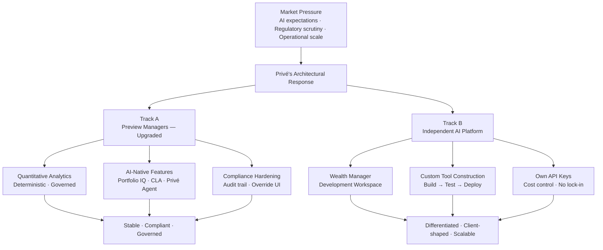
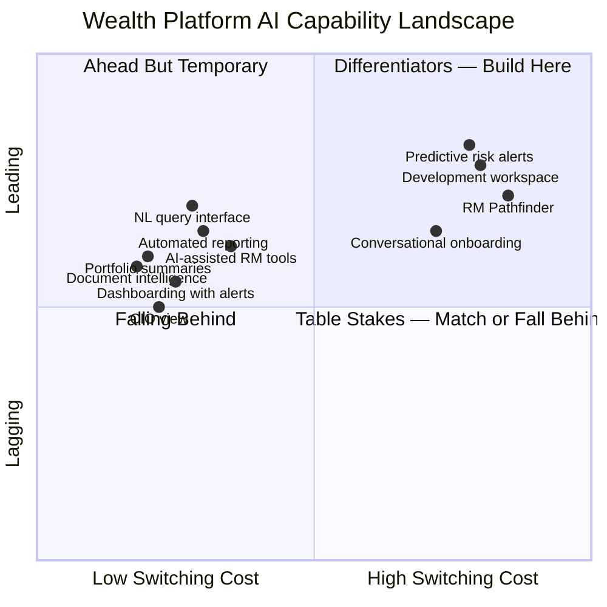
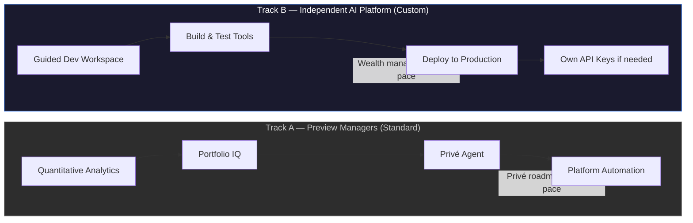
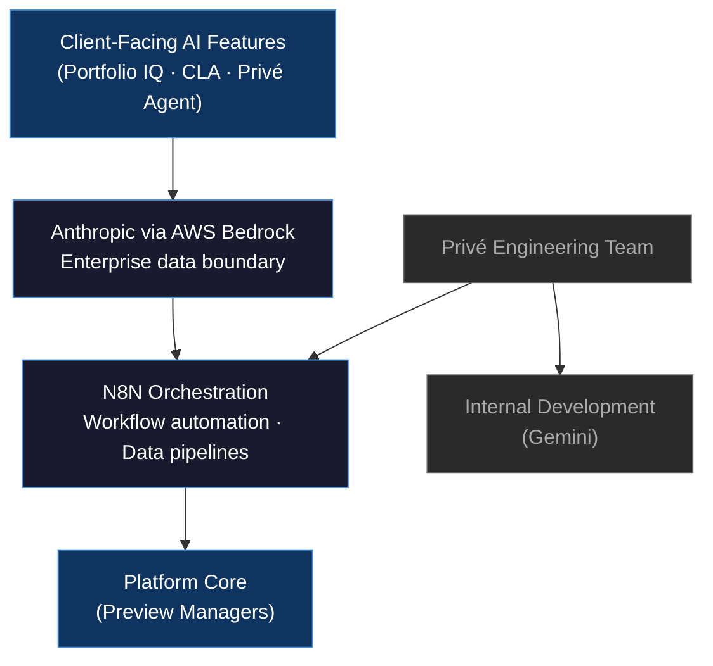
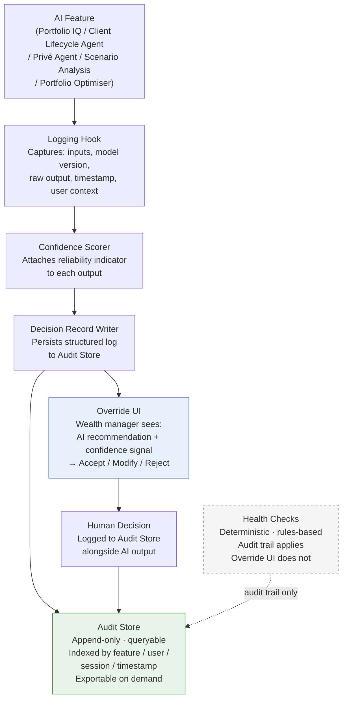

# Section 01: Framing
**Slides:** 1–2
**Purpose:** Set tone and give the audience a story map before the content begins.

---

## Slide 1: The Intelligent Wealth Platform
**Type:** Title | **Section:** Framing
**Intent:** Set the register: this is a strategic platform conversation, not a product demo — the client should sense they are being shown where the market is going, not what Privé built last quarter.

### Layout

```
┌─────────────────────────────────────────────────────────────────────┐
│                                                                     │
│                                                                     │
│                                                                     │
│         ┌───────────────────────────────────────────────┐          │
│         │                                               │          │
│         │     Building the Intelligent Wealth           │          │
│         │     Platform                                  │          │
│         │                                               │          │
│         │     ─────────────────────────────             │          │
│         │                                               │          │
│         │     Privé AI Solutions                        │          │
│         │     [Client Name]  ·  [Date]                  │          │
│         │                                               │          │
│         └───────────────────────────────────────────────┘          │
│                                                                     │
│                                              [Privé logo]           │
│                                                                     │
└─────────────────────────────────────────────────────────────────────┘
```

### Content

**Headline:** The wealth platform of the next five years looks nothing like the one you operate today.

**Body:**

This conversation is about where the market is heading — and what it takes to be positioned ahead of it rather than catching up to it.

We are not here to walk through a feature list. We are here to share a strategic view of how AI changes the architecture of wealth management platforms, where the competitive dividing lines are forming, and what a credible, compliant response looks like for institutions operating at your scale.

**Speaker notes:**

Open with silence — let the title land before you speak. The framing line ("not a product demo") should be said aloud in your own words: "We are not here to show you what we shipped last quarter. We want to talk about where this market is going." This sets a different register from a vendor pitch and signals that the conversation will be substantive. If you know the client's current platform situation, reference it briefly here — it shows you did the work before the meeting.

---

## Slide 2: What We Will Cover Today
**Type:** Agenda | **Section:** Framing
**Intent:** Give the client a map of the deck structured as a story — pressure, strategic response, product detail, compliance posture, proof, and path forward — not a feature inventory.

### Layout

```
┌─────────────────────────────────────────────────────────────────────┐
│  What We Will Cover Today                                           │
├─────────────────────────────────────────────────────────────────────┤
│                                                                     │
│   The story we are going to tell:                                   │
│                                                                     │
│   ┌──────────────────────────────────────────────────────────┐     │
│   │                                                          │     │
│   │  01  ▶  THE PRESSURE          What wealth managers       │     │
│   │         YOU ARE NAVIGATING    are actually dealing with  │     │
│   │                                                          │     │
│   │  02  ▶  THE STRATEGIC         Why bolt-on AI fails       │     │
│   │         REFRAME               and what architecture      │     │
│   │                               actually solves            │     │
│   │                                                          │     │
│   │  03  ▶  THE PLATFORM          A dual-track response      │     │
│   │         IN DETAIL             — compliance hardened      │     │
│   │                               and genuinely new          │     │
│   │                                                          │     │
│   │  04  ▶  COMPLIANCE            How governance is built    │     │
│   │         POSTURE               into the platform,         │     │
│   │                               not bolted onto it         │     │
│   │                                                          │     │
│   │  05  ▶  WHAT IS LIVE          Production reality,        │     │
│   │         TODAY                 not a roadmap slide        │     │
│   │                                                          │     │
│   │  06  ▶  THE PATH              A concrete pilot ask       │     │
│   │         FORWARD               and a decision to make     │     │
│   │                                                          │     │
│   └──────────────────────────────────────────────────────────┘     │
│                                                                     │
└─────────────────────────────────────────────────────────────────────┘
```

### Content

**Headline:** Six chapters, one argument — the institutions that architect for AI now will not wait for the ones that don't.

**Body:**

01. **The pressure you are navigating** — We open in your world: competitive, regulatory, and operational. We are not going to tell you things you do not already know. We are going to name them precisely.

02. **The strategic reframe** — The problem is not AI availability. It is AI architecture. We will explain why that distinction changes what you should be evaluating in a platform partner.

03. **The platform in detail** — Two tracks: a hardened upgrade to the core wealth management platform, and an independent AI environment where your wealth managers build and own their own tools.

04. **Compliance posture** — MAS, SFC, FCA, MiFID II mapped against platform capabilities. Human oversight is not a claim — it is a built system with an audit trail you can show a regulator.

05. **What is live today** — A clean line between what is in production with institutional clients now, and what is in system integration testing. No conflation.

06. **The path forward** — A scoped pilot proposal, two tracks, and three decisions we would like to leave this meeting with.

**Speaker notes:**

Walk each chapter as a story beat, not a slide count — clients read agendas and tune out if it sounds like "here are our twenty-seven slides." The framing to use out loud: "Think of this as a six-chapter conversation. We start in your world and we end with a specific ask." Pause after you say "what is live today" — it signals that you are going to draw a clear line between reality and roadmap, which is unusual enough that it earns attention. If the client has a particular pressure point you learned in pre-meeting discovery, you can say "we will spend extra time on chapter four — I know that is a live question for your team."

---
# Section 02: Pain
**Slides:** 3–4
**Purpose:** Ground the deck in the client's operating reality — regulatory pressure, expectation gaps, and the limits of platforms built before AI was expected. Earns the right to present a point of view.

---

## Slide 3: The Pressure Wealth Managers Are Navigating
**Type:** Content | **Section:** Pain
**Intent:** Open in the client's world: competing for AUM in a market where digital sophistication is assumed, regulatory scrutiny rising across MAS/SFC/FCA, and operational models built on manual workflows that cannot scale. Name the pressure without dramatising it.

### Layout

```
┌─────────────────────────────────────────────────────────────────────┐
│  The Pressure Wealth Managers Are Navigating                        │
├──────────────────────────┬──────────────────────────────────────────┤
│                          │                                          │
│  AUM COMPETITION         │  REGULATORY SCRUTINY                    │
│  ─────────────────       │  ─────────────────────                  │
│  Digital capability is   │  MAS FEAT Principles                    │
│  no longer a differenti- │  SFC AI Circular (2023)                 │
│  ator. It is the baseline│  FCA Consumer Duty                      │
│  expectation for a seat  │                                         │
│  at the table.           │  Three regimes. One shared              │
│                          │  requirement: explainable,              │
│                          │  auditable AI decisions.                │
├──────────────────────────┴──────────────────────────────────────────┤
│                                                                     │
│  OPERATIONAL REALITY                                                │
│  ───────────────────                                                │
│  → Asset onboarding: manual data entry across disconnected systems  │
│  → Fund document updates: pulled by operations, not automated       │
│  → Portfolio health checks: analyst time, not platform output       │
│  → Client reporting: assembled by hand for each relationship        │
│                                                                     │
│  Manual workflows do not fail quietly. They cap capacity.           │
│                                                                     │
└─────────────────────────────────────────────────────────────────────┘
```

### Content

**Headline:** The market has moved. Most platforms have not.

**Body:**

Three pressures are compressing wealth managers simultaneously — and they do not each have a separate solution.

**AUM competition**
Clients at the institutional tier now arrive with expectations shaped by consumer-grade digital experiences and best-in-class private banking interfaces. A platform that cannot surface proactive insights or support self-serve data access is not competitive. It is a liability.

**Regulatory scrutiny**
MAS FEAT Principles, the SFC's 2023 AI circular, and the FCA's Consumer Duty framework share a common thread: AI-assisted decisions must be explainable, human-overseen, and auditable on demand. Firms that cannot demonstrate that posture are exposed — not at some future audit date, but now.

**Operational capacity**
Asset onboarding, fund document ingestion, portfolio health monitoring, and client reporting are still largely manual at most firms. The consequence is not just inefficiency. It is a hard ceiling on the number of relationships a wealth manager can service without degrading quality.

These three pressures share a structural cause: platforms designed for a pre-AI operating model are being asked to support an AI-era mandate.

**Speaker notes:**
We are not here to tell you the industry is changing — you already know that, and you are navigating it every day. What we want to do is be specific about what that pressure actually looks like operationally, because the solution depends on understanding the source. The three things compressing wealth managers right now are not separate problems that need three separate tools. They are symptoms of the same structural gap: the platform underneath the business was not designed for this environment. That is where we want to start.

---

## Slide 4: What Clients and RMs Now Expect From a Platform
**Type:** Content | **Section:** Pain
**Intent:** Make the expectation gap concrete: institutional clients at the Citi and UOB tier expect proactive portfolio intelligence, self-serve data access, and audit-ready AI outputs — a standard most wealth platforms were not designed to meet.

### Layout

```
┌─────────────────────────────────────────────────────────────────────┐
│  What Clients and RMs Now Expect From a Platform                    │
├─────────────────────────────────────────────────────────────────────┤
│                                                                     │
│  EXPECTATION                      WHAT IT REQUIRES                 │
│  ─────────────────────────────────────────────────────────────────  │
│                                                                     │
│  Proactive portfolio intelligence  Platform surfaces alerts and     │
│  — not weekly PDF reports          insights without RM initiation   │
│                                                                     │
│  Self-serve data access            Clients query their own          │
│  — not requests to operations      portfolios in real time          │
│                                                                     │
│  Audit-ready AI outputs            Every AI-assisted recommendation │
│  — not reconstructed logs          carries a structured, exportable │
│                                    record at the point of creation  │
│                                                                     │
│  RM tools that surface signals     Platform connects behavioural    │
│  — not dashboards that report      signals to relationship actions  │
│                                                                     │
├─────────────────────────────────────────────────────────────────────┤
│                                                                     │
│  Most wealth platforms were designed to display data.               │
│  The expectation now is that the platform does the first layer      │
│  of thinking — and shows its work.                                  │
│                                                                     │
└─────────────────────────────────────────────────────────────────────┘
```

### Content

**Headline:** The platform is expected to think — not just display.

**Body:**

The expectation gap at the institutional tier is specific. It is not about aesthetics or mobile experience. It is about what the platform does without being asked.

**Proactive portfolio intelligence**
Clients expect to be told when something in their portfolio warrants attention — before they ask. A system that requires a wealth manager to run a manual health check and then write a summary has already failed that expectation.

**Self-serve data access**
End clients and RMs increasingly expect to query portfolio data themselves, in natural language, without routing a request through operations. This is not a convenience feature. It is a relationship management tool — the speed of a response to a client question is itself a signal of capability.

**Audit-ready AI outputs**
As regulators formalise AI governance requirements, clients and compliance teams expect that any AI-assisted recommendation arrives with a structured, portable record — what the model received, what it produced, what human decision was made on top of it. Reconstructing that record after the fact is not an acceptable posture.

**RM workflow intelligence**
Relationship managers expect the platform to surface signals — which clients are showing risk behaviour, which relationships are approaching a trigger event, which portfolios are drifting from mandate. Not a longer dashboard. A shorter action list.

The gap is not that platforms lack data. It is that platforms were designed to hold data, not to act on it.

**Speaker notes:**
The institutions that are winning AUM at this tier are not winning on product breadth. They are winning because their platform makes the RM sharper and makes the client feel anticipated rather than serviced. That is a very specific capability requirement — and it is one that most platforms in production today were not architected to meet. The question we hear most often is not "can your platform do AI?" It is "can your platform do AI in a way we can actually explain to our compliance team and to our clients?" Those are two different problems, and they both need to be solved at the architecture level, not the feature level.

---
---
# Section 3: Insight — Slides 5–6

**Narrative role:** The insight section is the intellectual pivot of the deck. It reframes the problem the client already recognises — AI is hard to get right — into a more precise diagnosis: the issue is not a shortage of AI features, it is how those features are architected and governed. Slide 5 names the structural failure mode. Slide 6 introduces the conceptual distinction that underpins everything Privé does differently.

---

## Slide 5: Why AI Additions to Wealth Platforms Often Fall Short
**Type:** Content | **Section:** Insight
**Intent:** Reframe the problem: bolt-on AI creates a compliance patchwork — uneven governance, disconnected data layers, and no clear line between rules-based outputs and generative AI. The issue is not AI availability; it is AI architecture.

### Layout

```
┌─────────────────────────────────────────────────────────────────────┐
│  Why AI Additions to Wealth Platforms Often Fall Short              │
├─────────────────────────────────────────────────────────────────────┤
│                                                                     │
│  The problem is not a shortage of AI features.                      │
│  It is how those features are bolted on.                            │
│                                                                     │
│  ┌──────────────────────┐  ┌──────────────────────┐                │
│  │  BOLT-ON AI          │  │  ARCHITECTED AI       │               │
│  │                      │  │                       │               │
│  │ ▶ Features added     │  │ ▶ Governance designed │               │
│  │   post-hoc           │  │   at the platform     │               │
│  │                      │  │   layer               │               │
│  │ ▶ Each module with   │  │                       │               │
│  │   its own audit      │  │ ▶ Unified data layer  │               │
│  │   trail (or none)    │  │   with consistent     │               │
│  │                      │  │   lineage             │               │
│  │ ▶ No separation of   │  │                       │               │
│  │   deterministic vs   │  │ ▶ Explicit separation │               │
│  │   generative output  │  │   of output types     │               │
│  └──────────────────────┘  └──────────────────────┘               │
│                                                                     │
│  Compliance risk does not come from using AI.                       │
│  It comes from not knowing which kind of AI produced a given output.│
│                                                                     │
└─────────────────────────────────────────────────────────────────────┘
```

### Content

**Headline:** The compliance risk in wealth AI is not feature risk — it is architecture risk.

**Body:**

When wealth platforms add AI incrementally — a summarisation tool here, a screening assistant there — three structural problems emerge:

- **Uneven governance.** Each feature arrives with its own (or absent) audit mechanism. There is no consistent standard for what gets logged, reviewed, or overridden.
- **Disconnected data layers.** AI modules pulling from different data sources produce outputs that cannot be reconciled or traced back to a single source of truth — a problem when a regulator asks why a portfolio flag was raised.
- **No separation of output types.** The most consequential gap: platforms present deterministic, rules-based outputs and generative AI outputs side by side, with no signal to the wealth manager — or the client — about which type of reasoning produced the result. That distinction has direct regulatory and liability implications.

The question for any wealth platform is not "do we have AI?" It is: "can we account for every AI output, and do our clients know what kind of output they are acting on?"

**Speaker notes:**
Most wealth platforms we speak to have AI — but it has arrived as a series of additions rather than a considered architecture. The consequence is a compliance patchwork: different audit standards for different features, data that cannot be reconciled across modules, and — critically — no clear line between outputs a model computed deterministically and outputs a language model generated. That last gap is where regulatory exposure concentrates. Regulators under MAS, SFC, and FCA are not asking whether you use AI. They are asking whether you can explain, reproduce, and override what it produced. Bolt-on architecture makes that question difficult to answer.

---

## Slide 6: A Distinction That Matters: Quantitative Analytics vs. Generative AI
**Type:** Content | **Section:** Insight
**Intent:** Correct a common conflation that matters commercially and regulatorily: Portfolio Optimiser, Health Checks, and Scenario Analysis are deterministic, rules-based quantitative analytics. Generative AI — with its different governance requirements — applies only to Portfolio IQ use cases, the Client Lifecycle Agent, and Privé Agent capabilities. Clients need to know which type of output they are acting on.

### Layout

```
┌─────────────────────────────────────────────────────────────────────┐
│  A Distinction That Matters: Quantitative Analytics vs. Generative AI│
├─────────────────────────────────────────────────────────────────────┤
│                                                                     │
│  These are not the same thing. Calling both "AI" creates            │
│  commercial and regulatory confusion.                               │
│                                                                     │
│  ┌───────────────────────────────┐  ┌──────────────────────────┐   │
│  │  QUANTITATIVE ANALYTICS       │  │  GENERATIVE AI           │   │
│  │  Deterministic · Rules-based  │  │  LLM-powered · Inferential│  │
│  ├───────────────────────────────┤  ├──────────────────────────┤   │
│  │                               │  │                          │   │
│  │  Portfolio Optimiser          │  │  Portfolio IQ            │   │
│  │  → Constraint-based           │  │  → LLM-generated         │   │
│  │    allocation; same inputs     │  │    commentary, narrative │   │
│  │    always produce same output  │  │    insights, synthesis   │   │
│  │                               │  │                          │   │
│  │  Health Checks                │  │  Client Lifecycle Agent  │   │
│  │  → Rule-triggered flags;      │  │  → AI-driven engagement; │   │
│  │    fully auditable without     │  │    outputs vary by model │   │
│  │    an LLM governance layer     │  │    and prompt context    │   │
│  │                               │  │                          │   │
│  │  Scenario Analysis            │  │  Privé Agent             │   │
│  │  → Parametric modelling;      │  │  → Natural language      │   │
│  │    reproducible under any      │  │    interface; generative │   │
│  │    audit standard              │  │    interpretation        │   │
│  │                               │  │                          │   │
│  │  Governance requirement:       │  │  Governance requirement: │   │
│  │  Standard model validation    │  │  LLM oversight layer:    │   │
│  │  and audit logging             │  │  logging, confidence     │   │
│  │                               │  │  scoring, human override  │   │
│  └───────────────────────────────┘  └──────────────────────────┘   │
│                                                                     │
│  A wealth manager acting on a Portfolio Optimiser output            │
│  and one acting on Portfolio IQ commentary are taking on            │
│  different regulatory obligations. They should know which is which. │
│                                                                     │
└─────────────────────────────────────────────────────────────────────┘
```

### Content

**Headline:** Not all platform "AI" is the same — and the difference is a regulatory and commercial fact, not a technical footnote.

**Body:**

The wealth technology market routinely markets quantitative analytics tools as AI. This creates a conflation that matters in two directions:

**What is deterministic quantitative analytics (not generative AI):**

| Feature | How it works | Governance implication |
|---|---|---|
| Portfolio Optimiser | Constraint-based allocation model; same inputs always produce the same output | Auditable and reproducible without an LLM governance layer |
| Health Checks | Rule-triggered flags against portfolio parameters | Fully explainable to a regulator as a rules-based system |
| Scenario Analysis | Parametric modelling across defined stress scenarios | Reproducible under any audit standard; no stochastic output |

**What is generative AI (and requires an LLM governance layer):**

| Feature | How it works | Governance implication |
|---|---|---|
| Portfolio IQ | LLM-generated portfolio commentary, narrative insights, recommendation synthesis | Outputs vary; requires logging, confidence scoring, and human override capability |
| Client Lifecycle Agent | AI-driven client engagement and communication automation | Generative output requires oversight and audit trail per FCA/MAS/SFC expectations |
| Privé Agent | Natural language interface across platform; LLM interprets and executes | Generative interpretation layer requires full LLM governance stack |

The commercial implication: vendors who call all of this "AI" uniformly invite clients to apply the same governance standard to both categories — either under-governing the generative tools or over-engineering the quantitative ones. Both are costly errors.

**Speaker notes:**
This is a distinction we see collapsed repeatedly in the market, and it matters in a specific way. Portfolio Optimiser, Health Checks, and Scenario Analysis are deterministic — run them twice with the same inputs and you get the same output. A regulator can examine, reproduce, and challenge that output using standard model validation procedures. No language model governance layer required. Portfolio IQ, the Client Lifecycle Agent, and Privé Agent are generative — their outputs are shaped by an LLM and will vary based on model state, prompt context, and retrieval. Those outputs require a different governance architecture: logging every invocation, attaching a confidence signal, creating a structured decision record, and giving the wealth manager an explicit override mechanism. Privé treats these as two distinct categories because they are. Conflating them is not just a technical imprecision — it is a compliance risk for any institution that adopts the platform and then has to explain its AI governance to a regulator.

---
# Section 04: Bridge
**Slides 7–8**
**Narrative function:** Transition from the diagnostic (what is broken about bolt-on AI) to the strategic response (how Privé has chosen to build). These two slides reframe the conversation from "what does Privé offer?" to "why is Privé's architecture the right bet for where wealth management is heading?"

---

## Slide 7: Privé's Response: A Dual-Track Product Strategy
**Type:** Diagram | **Section:** Bridge
**Intent:** Introduce the two-track structure — Track A (upgrading Preview Managers with proven quantitative analytics, incremental AI features, and compliance hardening) and Track B (an independent AI platform for wealth manager-driven construction) — as a deliberate architecture, not a product roadmap.

### Layout

```
┌─────────────────────────────────────────────────────────────────────────┐
│  TWO TRACKS. ONE DELIBERATE ARCHITECTURE.                               │
├─────────────────────────────────────────────────────────────────────────┤
│                                                                         │
│  ┌──────────────────────────────┐  ┌──────────────────────────────┐    │
│  │        TRACK A               │  │        TRACK B               │    │
│  │   Preview Managers           │  │   Independent AI Platform    │    │
│  │   — Upgraded                 │  │   — Purpose-Built            │    │
│  ├──────────────────────────────┤  ├──────────────────────────────┤    │
│  │ Quantitative analytics       │  │ Wealth manager-driven        │    │
│  │  · Portfolio Optimiser       │  │  construction environment    │    │
│  │  · Health Checks             │  │                              │    │
│  │  · Scenario Analysis         │  │ Build → Test → Deploy        │    │
│  │  (deterministic, governed)   │  │  custom AI tools             │    │
│  ├──────────────────────────────┤  │  without a product request   │    │
│  │ AI-native features           │  │                              │    │
│  │  · Portfolio IQ              │  │ Own API keys for             │    │
│  │  · Client Lifecycle Agent    │  │  AI-intensive products       │    │
│  │  · Privé Agent (NL)          │  │                              │    │
│  ├──────────────────────────────┤  │ Clients shift from           │    │
│  │ Compliance hardening         │  │  consumers → co-creators     │    │
│  │  · Governance layer          │  │                              │    │
│  │  · Audit trail               │  └──────────────────────────────┘    │
│  │  · Platform automation       │                                       │
│  └──────────────────────────────┘                                       │
│                                                                         │
│  Track A stabilises and governs.  Track B differentiates and scales.   │
└─────────────────────────────────────────────────────────────────────────┘
```

### Content

**Headline:** Two tracks, built separately, for a reason — one governs the present, one owns the future.

**Body:**

Most platform vendors respond to AI pressure by shipping features. Privé's response is architectural: two parallel tracks with distinct purposes, risk profiles, and timelines.

**Track A — Upgrade the existing platform (Preview Managers)**
- Quantitative analytics hardened for production: Portfolio Optimiser, Health Checks, Scenario Analysis — deterministic and audit-ready, not generative AI
- AI-native features added with human oversight built in from day one: Portfolio IQ (LLM-generated insights), Client Lifecycle Agent, Privé Agent natural language interface
- Compliance layer: governance, audit trail, and override UI running across all features
- Platform automation: asset onboarding and fund document updates converted from manual to governed, automated flows

**Track B — Build the independent AI platform**
- A separate environment — not a feature, not a module — purpose-built for wealth managers to construct, test, and deploy their own AI-powered tools
- No product cycle dependency: wealth managers build when they need to, not when engineering ships
- Clients can supply their own API keys for AI-intensive use cases — cost control and customisation without lock-in
- The distinction that matters: Track B makes clients co-creators of the platform, not consumers of it

**The architectural logic:** Keeping the tracks separate protects Track A's stability and compliance posture while giving Track B the freedom to move at the pace of client demand. A single platform serving both would force a governance tradeoff that hurts both.

**Speaker notes:**
The natural question here is "why two tracks?" — the answer is risk separation, not resource allocation. Track A has to be regulator-ready, auditable, and stable. Track B has to be fast, flexible, and client-shaped. Those two requirements cannot live in the same codebase without one compromising the other. What you're looking at isn't a product roadmap — it's a deliberate architecture that lets Privé run both without either constraining the other. Track B in particular is where the switching cost gets built: once a wealth manager has built tooling on this platform, that's not a feature you can poach with a competitor demo.

---



---

## Slide 8: Where the Market Is Moving: Table Stakes vs. Differentiators
**Type:** Diagram | **Section:** Bridge
**Intent:** Present the four-quadrant market framework. Table stakes (expected within 12–18 months, offered by competitors): dashboarding with alerts, portfolio summaries, CIO view, automated client reporting, document intelligence, AI-assisted RM tools, NL query interface. Differentiators (build switching costs, early-mover advantage): development workspace for wealth managers to build custom tools, conversational onboarding, RM Pathfinder, predictive client risk alerts. Client should see that Privé is building into the differentiator column, not just catching up.

### Layout

```
┌─────────────────────────────────────────────────────────────────────────┐
│  THE MARKET IS SORTING. WHICH COLUMN DO YOU WANT TO BE IN?             │
├───────────────────────────┬─────────────────────────────────────────────┤
│    TABLE STAKES           │    DIFFERENTIATORS                          │
│    (12–18 months)         │    (build switching cost now)               │
│    Competitors offer this │    Early movers own this                    │
├───────────────────────────┼─────────────────────────────────────────────┤
│                           │                                             │
│  · Dashboarding           │  · Wealth manager development               │
│    with alerts            │    workspace — build custom tools           │
│                           │                                             │
│  · Portfolio summaries    │  · Conversational onboarding                │
│                           │                                             │
│  · CIO view               │  · RM Pathfinder                           │
│                           │                                             │
│  · Automated client       │  · Predictive client risk alerts            │
│    reporting              │                                             │
│                           │                                             │
│  · Document intelligence  │                                             │
│                           │                                             │
│  · AI-assisted RM tools   │                                             │
│                           │                                             │
│  · NL query interface     │                                             │
│                           │                                             │
├───────────────────────────┼─────────────────────────────────────────────┤
│  Match these or fall      │  ◀── Privé is building here                 │
│  behind. No margin here.  │       This is where the bet is.             │
└───────────────────────────┴─────────────────────────────────────────────┘
```

### Content

**Headline:** Table stakes buy you a seat. Differentiators determine who stays at the table.

**Body:**

The wealth platform AI market is sorting into two columns. The left column is where every credible competitor will be within 12–18 months. The right column is where real switching cost gets built — and where most vendors are not yet playing.

**Table stakes — necessary but not sufficient:**

| Capability | Why it's commoditising |
|---|---|
| Dashboarding with alerts | Offered by Addepar, Masttro, and most incumbents |
| Portfolio summaries | NL generation is now a wrapper, not a feature |
| CIO view | Standard in institutional platforms |
| Automated client reporting | Straight-line AI application to existing reporting pipelines |
| Document intelligence | Generic LLM capability, low differentiation |
| AI-assisted RM tools | Every vendor is shipping some version of this |
| NL query interface | Table-stakes within 12 months across the category |

Privé delivers these. They matter for retention. They do not build switching cost.

**Differentiators — where early movers build durable advantage:**

- **Wealth manager development workspace:** The ability for RMs and wealth managers to build, test, and deploy their own AI-powered tools — without a product request — is structurally new. No major competitor has shipped this at the institutional level.
- **Conversational onboarding:** Reducing client onboarding friction through AI-driven guided flows compresses a multi-week process into a structured, auditable conversation.
- **RM Pathfinder:** Next-best-action intelligence for relationship managers — surfacing which clients to engage, when, and with what — built on live portfolio and behavioural signals.
- **Predictive client risk alerts:** Forward-looking, signal-based alerts that surface client risk before it crystallises — not a dashboard refresh, but a proactive intelligence layer.

**Where Privé is investing:** The differentiator column. Table stakes are being built because they must be. The product bet is on the right side of this framework.

**Speaker notes:**
This framework is the honest version of the competitive question. If you ask any wealth platform vendor where they're investing, they'll point you at dashboards and NL interfaces — because that's where client demand is loudest right now. The problem is that by the time clients are asking for it loudly, competitors are already shipping it. The differentiators on the right are quieter asks today, but they're the ones that create the integration depth that makes switching painful. The development workspace is the clearest example — once a wealth manager has built proprietary tooling on Privé's platform, that's not a feature you can replicate with a demo. Privé's decision to build Track B before clients are demanding it universally is the early-mover call this slide is making.

---



---

*Section 04 complete. Slides 7–8 written.*
# Section 05: Track A — Slides 9–13

---

## Slide 9: Track A: What the Upgraded Preview Managers Platform Delivers
**Type:** Content | **Section:** Track A
**Intent:** Describe the Track A scope as a coherent upgrade story — hardened quantitative analytics with explicit governance, AI-native features with human oversight built in, and a platform automation layer that reduces the operational burden wealth managers carry today.

### Layout

```
┌─────────────────────────────────────────────────────────────────────┐
│  Track A: The Upgraded Preview Managers Platform                    │
├─────────────────────────────────────────────────────────────────────┤
│                                                                     │
│  Three layers, one coherent upgrade:                                │
│                                                                     │
│  ┌───────────────────────┐  ┌────────────────────────────────────┐  │
│  │ QUANTITATIVE          │  │ AI-NATIVE FEATURES                 │  │
│  │ ANALYTICS             │  │                                    │  │
│  │                       │  │ Portfolio IQ                       │  │
│  │ Portfolio Optimiser   │  │ Client Lifecycle Agent             │  │
│  │ Health Checks         │  │ Privé Agent                        │  │
│  │ Scenario Analysis     │  │                                    │  │
│  │                       │  │ Human oversight built in           │  │
│  │ Deterministic.        │  │ Governance layer active            │  │
│  │ Auditable. Live.      │  │                                    │  │
│  └───────────────────────┘  └────────────────────────────────────┘  │
│                                                                     │
│  ┌─────────────────────────────────────────────────────────────┐    │
│  │ PLATFORM AUTOMATION                                         │    │
│  │ Asset onboarding · Fund document updates · Data freshness   │    │
│  │ Manual workflows replaced with auditable, automated flows   │    │
│  └─────────────────────────────────────────────────────────────┘    │
│                                                                     │
└─────────────────────────────────────────────────────────────────────┘
```

### Content

**Headline:** Track A is not a feature drop — it is a platform architecture upgrade with three distinct capability layers.

**Body:**

Track A upgrades the existing Preview Managers platform across three layers, each with a distinct role:

- **Deterministic Quantitative Analytics** — Portfolio Optimiser, Health Checks, and Scenario Analysis. Rules-based, reproducible, explainable. Live with institutional clients today.
- **AI-Native Features** — Portfolio IQ, Client Lifecycle Agent, and Privé Agent. Generative AI capabilities with a purpose-built human oversight and governance layer. Designed to meet regulatory requirements from the ground up, not retrofitted.
- **Platform Automation** — Asset onboarding, fund document updates, data freshness signalling. Manual operational processes replaced with validated, automated flows. No AI involved — pure rules-based automation.

The layers are designed to be independent: quantitative analytics does not require the AI governance layer. Automation does not depend on AI features being active. Each layer delivers standalone value and compounds when operating together.

**Speaker notes:**
The architecture choice here is deliberate — three layers means three different accountability models, and clients can engage with each independently. The quantitative analytics layer is the most production-hardened and requires no AI governance conversation to deploy. The AI-native layer carries additional compliance requirements, which are addressed in the compliance section later in the deck. Platform automation is often the fastest operational win — it removes manual work without touching the client-facing experience at all.

---

## Slide 10: Deterministic Quantitative Analytics: The Three Live Features
**Type:** Content | **Section:** Track A
**Intent:** Name and describe Portfolio Optimiser, Health Checks, and Scenario Analysis with precision — rules-based, deterministic, no generative output. Explain why that distinction is a feature, not a limitation: it means outputs are auditable, reproducible, and explainable to regulators without an AI governance layer.

### Layout

```
┌─────────────────────────────────────────────────────────────────────┐
│  Deterministic Quantitative Analytics — Three Live Features         │
├─────────────────────────────────────────────────────────────────────┤
│                                                                     │
│  ┌──────────────────────┐ ┌─────────────────────┐ ┌─────────────┐  │
│  │ PORTFOLIO OPTIMISER  │ │ HEALTH CHECKS        │ │ SCENARIO    │  │
│  │                      │ │                      │ │ ANALYSIS    │  │
│  │ Constrained          │ │ Rules-based signal   │ │             │  │
│  │ optimisation         │ │ detection against    │ │ Forward-    │  │
│  │ algorithm            │ │ live portfolio data  │ │ looking     │  │
│  │                      │ │                      │ │ what-if     │  │
│  │ Rebalancing recs     │ │ Flags: drift,        │ │ simulations │  │
│  │ vs. client risk      │ │ threshold breaches,  │ │             │  │
│  │ profile and mandate  │ │ mandate violations   │ │ Model-      │  │
│  │                      │ │                      │ │ driven      │  │
│  │ Same inputs →        │ │ No LLM involved      │ │ outcome     │  │
│  │ same output.         │ │                      │ │ projection  │  │
│  │ Always.              │ │                      │ │             │  │
│  └──────────────────────┘ └─────────────────────┘ └─────────────┘  │
│                                                                     │
│  ▶ No generative output. No AI governance layer required.           │
│    Outputs are auditable, reproducible, and regulator-explainable.  │
│                                                                     │
└─────────────────────────────────────────────────────────────────────┘
```

### Content

**Headline:** Deterministic means auditable — same inputs, same output, every time, with no AI governance layer required.

**Body:**

**Portfolio Optimiser**
Constrained optimisation algorithm that surfaces rebalancing recommendations against a client's risk profile and mandate. The algorithm is deterministic: given identical portfolio data and mandate parameters, it will produce an identical output. No inference, no generation, no probabilistic output. A regulator asking "why did this system recommend reducing Equity X by 4.2%" gets a complete, traceable answer from the algorithm logic alone.

**Health Checks**
Rules-based signal detection running against live portfolio data. Flags portfolio drift, threshold breaches, and mandate violations as they occur. There is no LLM in this feature — detection logic is explicit, version-controlled, and independently auditable. Every flag can be traced to a specific rule and the data point that triggered it.

**Scenario Analysis**
Forward-looking what-if simulations across asset classes. Model-driven outcome projection using defined parameters. Deterministic — the same scenario inputs produce the same projected outcomes. Wealth managers can run multiple scenarios, compare outputs, and present the basis for a recommendation without any AI audit trail.

**Why determinism is a feature, not a limitation:**
These tools can be deployed, demonstrated to regulators, and integrated into client-facing workflows without engaging the firm's AI governance process. That is a meaningful commercial and operational advantage — particularly for institutions where internal AI approval cycles are measured in months, not weeks.

**Speaker notes:**
The distinction we are drawing here is not semantic — it has real compliance consequences. MAS, FCA, and SFC guidelines on AI in financial services apply to systems that generate probabilistic outputs, make inferences, or use machine learning. These three features do none of that. They execute defined algorithms against structured data. That means they sit outside most AI governance frameworks entirely and can move to production significantly faster than generative AI features. For clients at institutions with active internal AI governance reviews, this is a meaningful unlock.

---

## Slide 11: AI-Native Features: Portfolio IQ and the Client Lifecycle Agent
**Type:** Content | **Section:** Track A
**Intent:** Describe the genuinely generative AI features: Portfolio IQ (LLM-generated portfolio commentary, narrative insights, recommendation synthesis) and Client Lifecycle Agent (AI-driven client engagement automation). Distinguish from the quantitative tools — these carry different governance requirements, which are addressed in the compliance section.

### Layout

```
┌─────────────────────────────────────────────────────────────────────┐
│  AI-Native Features — Generative AI with Governance Built In        │
├──────────────────────────────────────┬──────────────────────────────┤
│  PORTFOLIO IQ                        │  CLIENT LIFECYCLE AGENT      │
│  LLM-generated portfolio intelligence│  AI-driven client engagement │
├──────────────────────────────────────┼──────────────────────────────┤
│                                      │                              │
│  UC-1: Portfolio Summary             │  CRM-integrated engagement   │
│  UC-2: CIO View                      │  automation                  │
│  UC-3: AI Insights                   │                              │
│  UC-4: Risk Insights                 │  Proactive opportunity        │
│  UC-5: Composition Insights          │  identification              │
│                                      │                              │
│  LLM generates natural language      │  Product proposal drafting   │
│  output from live portfolio data     │  surfaced to RM for review   │
│                                      │                              │
│  → In SIT. Audit trail active.       │  → Differentiator capability │
│    Override UI: accept/modify/reject │    Forward-looking roadmap   │
│                                      │                              │
├──────────────────────────────────────┴──────────────────────────────┤
│  ▶ These features call LLMs. Different governance tier applies.      │
│    Human oversight architecture — detailed in compliance section.   │
└─────────────────────────────────────────────────────────────────────┘
```

### Content

**Headline:** Portfolio IQ and the Client Lifecycle Agent are genuine generative AI — and are governed accordingly.

**Body:**

**Portfolio IQ — Five Use Cases, All LLM-Generated**

Portfolio IQ calls a large language model to generate natural language output from live portfolio data. There is no pre-written template — the system produces original narrative each time, grounded in the underlying data.

- **UC-1: Portfolio Summary** — Plain-language summary of current portfolio composition and performance
- **UC-2: CIO View** — Strategic framing of the portfolio against current market conditions, reflecting CIO positioning
- **UC-3: AI Insights** — Synthesised observations across portfolio holdings, surfacing patterns and anomalies
- **UC-4: Risk Insights** — Narrative articulation of risk exposure, concentration, and mandate-relative positioning
- **UC-5: Composition Insights** — Asset class and sector-level analysis presented in accessible language for client review

Portfolio IQ is in system integration testing (SIT). The audit trail infrastructure — logging hook, confidence scorer, decision record, audit store — is active. Wealth managers have explicit accept, modify, or reject control over every output before it is surfaced to a client.

**Client Lifecycle Agent — AI-Driven Engagement Automation**

The Client Lifecycle Agent applies AI to client relationship management: identifying engagement opportunities, surfacing product proposals, and drafting outreach — all integrated with the CRM and routed through the RM before reaching a client. This capability is positioned as a forward-looking differentiator on the platform roadmap, not a feature currently in production.

**Governance note:** Both features invoke LLMs and carry different regulatory requirements than the deterministic quantitative analytics tools. The compliance architecture covering these features — including the human oversight layer and audit record structure — is covered in detail in the compliance section.

**Speaker notes:**
The governance tier separation is not a caveat — it is part of the design. We built the compliance layer specifically because these features generate probabilistic outputs and require it. Portfolio IQ is in SIT right now, which means the governance infrastructure is being stress-tested, not planned. The Client Lifecycle Agent is a differentiator capability we are building toward — we are naming it explicitly because it represents the direction of the platform, and clients who engage now have the opportunity to shape what that looks like for their context.

---

## Slide 12: Privé Agent: Natural Language Intelligence Across the Platform
**Type:** Content | **Section:** Track A
**Intent:** Present the Privé Agent capability — natural language interface and task-execution layer built into the platform. Position it as the connective tissue between wealth manager workflows and platform intelligence, enabling RMs to query, act, and escalate without leaving their working context.

### Layout

```
┌─────────────────────────────────────────────────────────────────────┐
│  Privé Agent — Natural Language Across the Platform                 │
├─────────────────────────────────────────────────────────────────────┤
│                                                                     │
│  RM asks a question in plain language                               │
│                                                                     │
│  ┌─────────────────────────────────────────────────────────────┐    │
│  │ "Show me clients with equity concentration above mandate     │    │
│  │  and flag any with a review due this quarter."              │    │
│  └──────────────────────┬──────────────────────────────────────┘    │
│                         │                                           │
│                         ▼                                           │
│  ┌──────────────────────────────────────────────────────────────┐   │
│  │  PRIVÉ AGENT                                                 │   │
│  │                                                              │   │
│  │  Interprets intent → Queries platform data                   │   │
│  │  → Returns structured result → Executes task if instructed   │   │
│  └──────────────────────┬─────────────────────────────────────-┘   │
│                         │                                           │
│         ┌───────────────┼───────────────┐                           │
│         ▼               ▼               ▼                           │
│   ┌──────────┐   ┌──────────────┐  ┌───────────────┐               │
│   │ Portfolio│   │ Health Check │  │ Task execution│               │
│   │ data     │   │ flags        │  │ (schedule,    │               │
│   │          │   │              │  │  flag, draft) │               │
│   └──────────┘   └──────────────┘  └───────────────┘               │
│                                                                     │
│  ▶ RM stays in working context. No system switching required.       │
└─────────────────────────────────────────────────────────────────────┘
```

### Content

**Headline:** Privé Agent is the natural language layer that connects wealth manager intent to platform intelligence and action.

**Body:**

Privé Agent is a generative AI capability built into the platform that allows relationship managers to interact with platform data and functions in plain language — without navigating between screens, running reports manually, or switching context.

**What it enables:**

- **Query** — Ask plain-language questions across portfolio data, client records, health check flags, and scenario outputs. The agent interprets intent, queries the relevant data layer, and returns a structured result.
- **Act** — Instruct the agent to execute tasks: schedule a review, flag a client for follow-up, draft a portfolio summary for RM review. Actions are logged and attributed.
- **Escalate** — Where the agent surfaces an output that requires RM judgment, it presents the result with a clear escalation path — not a silent recommendation.

**Why this matters operationally:**

The friction in most wealth manager workflows is not data access — it is context-switching. An RM working a client review should not need to open four separate screens to answer a mandate compliance question. Privé Agent reduces that to a single natural language query inside the working context the RM already occupies.

Privé Agent is a generative AI feature. It operates within the same governance architecture as Portfolio IQ — every interaction is logged, and task execution actions produce an auditable record.

**Speaker notes:**
The value of Privé Agent is not the novelty of natural language interfaces — that expectation is now table stakes. The value is that this is built into the platform natively, which means it has access to live portfolio data, health check signals, and client records in the same session. An externally bolted-on chat interface does not have that. The task-execution layer is what makes this genuinely useful — querying is convenience, acting is productivity. And because every action is logged, the RM is not trading operational speed for audit risk.

---

## Slide 13: Platform Automation: Removing the Manual Layer
**Type:** Content | **Section:** Track A
**Intent:** Show what automation delivers operationally: asset onboarding, fund document updates, and data freshness checks — the manual processes that consume wealth manager and operations time — converted to automated, auditable flows with no change to the client-facing experience.

### Layout

```
┌─────────────────────────────────────────────────────────────────────┐
│  Platform Automation — Three Manual Processes, Automated            │
├─────────────────────────────────────────────────────────────────────┤
│                                                                     │
│  ┌─────────────────────────────────────────────────────────────┐    │
│  │  BEFORE                    │  AFTER                         │    │
│  ├────────────────────────────┼────────────────────────────────┤    │
│  │                            │                                │    │
│  │  Asset onboarding:         │  Validated automated intake    │    │
│  │  Manual field entry,       │  with structured validation    │    │
│  │  error-prone, untracked    │  and full audit trail          │    │
│  │                            │                                │    │
│  │  Fund document updates:    │  Automated freshness detection │    │
│  │  Manual monitoring of      │  against external sources;     │    │
│  │  external sources,         │  platform flags when document  │    │
│  │  inconsistent cadence      │  version changes               │    │
│  │                            │                                │    │
│  │  Data freshness checks:    │  Platform-level metadata flag; │    │
│  │  Manual lookup to confirm  │  last-updated signal surfaced  │    │
│  │  when data was last        │  inline — no lookup required   │    │
│  │  refreshed                 │                                │    │
│  │                            │                                │    │
│  └─────────────────────────────────────────────────────────────┘    │
│                                                                     │
│  ▶ Rules-based automation. No AI. Client experience unchanged.      │
│    Operations team load reduced. Audit trail created automatically. │
│                                                                     │
└─────────────────────────────────────────────────────────────────────┘
```

### Content

**Headline:** The highest-friction operational tasks are not complex — they are repetitive. Automation eliminates them without touching the client experience.

**Body:**

Platform automation in Track A targets three specific manual processes that consume operations and wealth manager time at consistent, predictable points in the workflow. None of these use AI — they are rules-based, deterministic automation flows.

**Asset Onboarding**
Manual field entry for new asset onboarding — historically error-prone and reliant on individual operator attention — is replaced by a validated automated intake flow. Each onboarding event is logged with a complete audit trail. Errors are caught at intake, not discovered downstream.

**Fund Document Updates**
Fund documents change. Keeping platform records current against external sources was a manual monitoring task with no consistent cadence. Automated freshness detection checks external document sources and flags the platform when a version change is detected. Operations teams are notified; no manual polling required.

**Data Freshness Signals**
Confirming when data was last refreshed previously required a manual lookup — a small friction that compounds across dozens of daily decisions. A platform-level metadata flag now surfaces the last-updated signal inline, at the point of use, without requiring the RM or operations team to leave their current context.

**What changes and what does not:**
These automation flows are invisible to the end client. The client-facing experience is unchanged. What changes is the operational layer beneath it: less manual work, fewer error vectors, and an automatic audit record for each process event.

**Speaker notes:**
Automation is often underestimated in a pitch context because it is not a headline capability — but it is frequently the highest-value near-term unlock for operations teams. These three flows map directly to tasks that wealth managers and operations staff describe as consistent points of friction. The fact that none of these require AI is a feature in this context: they can be deployed, audited, and demonstrated to internal risk teams without an AI governance review. For clients who are earlier in their AI adoption journey, platform automation is often the fastest path to measurable operational impact.

---
# Section 06: Track B — Slides 14–16

**Narrative position:** The independent AI platform is the primary differentiator. This section turns Track B from an abstract concept into something the client can picture, evaluate commercially, and benchmark against what competitors offer.

---

## Slide 14: Track B: The Independent AI Platform
**Type:** Diagram | **Section:** Track B
**Intent:** Introduce the independent AI platform as the primary differentiator — a separate, purpose-built environment where wealth managers construct, test, and deploy custom AI-powered tools without filing a feature request or waiting for a product cycle. This is the USP that builds real switching cost.

### Layout

```
┌─────────────────────────────────────────────────────────────────────┐
│  TRACK B: THE INDEPENDENT AI PLATFORM                               │
│  A purpose-built environment. Separate. Wealth manager-controlled.  │
├───────────────────────────┬─────────────────────────────────────────┤
│  TRACK A                  │  TRACK B                                │
│  Preview Managers         │  Independent AI Platform                │
│  (Standard platform)      │  (Custom development environment)       │
│                           │                                         │
│  Quantitative analytics   │  Build custom analytics views           │
│  Portfolio IQ             │  Create bespoke reporting templates      │
│  Privé Agent              │  Deploy proprietary scoring models       │
│  Platform automation      │  Automate firm-specific workflows        │
│                           │                                         │
│  Managed by Privé         │  Constructed by wealth managers         │
│  Product cycle: Privé     │  Product cycle: yours                   │
└───────────────────────────┴─────────────────────────────────────────┘

          ▼ No feature request. No wait. No dependency on Privé's roadmap.
```



### Content

**Headline:** Track B is not a feature — it is a separate platform where wealth managers build their own.

**Body:**

- Track A upgrades the existing platform. Track B is architecturally independent — a purpose-built environment with its own development workspace, testing layer, and deployment pipeline.
- Wealth managers do not wait for Privé's product cycle. They construct tools, test them, and deploy them on their own timeline.
- For AI-intensive use cases — such as Nexus-tier enterprise clients — firms can supply their own API keys, giving them direct control over token costs and model access.
- The result is not just a better platform. It is a platform where your firm's proprietary tools live — tools a competitor cannot replicate by switching vendors.

**Speaker notes:**
Track B answers a question every sophisticated client eventually asks: what happens when the standard platform does not do what we need? Most vendors say file a feature request. We built a different answer. This is a separate, independent platform — not a developer console bolted onto the side of Track A. Wealth managers can construct tools here that are unique to their firm. Once they have built them, those tools create real switching cost — not because we locked the client in, but because they built something worth keeping.

---

## Slide 15: What Wealth Managers Can Build — and Why That Matters
**Type:** Content | **Section:** Track B
**Intent:** Make the independent platform tangible: custom analytics views, bespoke client reporting templates, workflow automations, and proprietary scoring models — constructed by wealth managers through a guided development workspace. Position this as a shift from platform consumer to platform co-creator.

### Layout

```
┌─────────────────────────────────────────────────────────────────────┐
│  WHAT WEALTH MANAGERS CAN BUILD                                     │
│  From platform consumer → platform co-creator                       │
├──────────────────────┬──────────────────────┬───────────────────────┤
│  Custom Analytics    │  Client Reporting    │  Workflow Automation  │
│  Views               │  Templates           │                       │
│                      │                      │                       │
│  Build views that    │  Generate bespoke    │  Automate sequences   │
│  reflect your risk   │  reports in your     │  specific to your     │
│  framework, not      │  firm's format,      │  operational model —  │
│  Privé's defaults    │  language, and tone  │  not generic flows    │
├──────────────────────┴──────────────────────┴───────────────────────┤
│  Proprietary Scoring Models                                          │
│  Build client risk, opportunity, or engagement scores using your    │
│  own criteria — housed on the platform, not in a spreadsheet        │
├─────────────────────────────────────────────────────────────────────┤
│  All built through a guided development workspace                   │
│  No vendor dependency. No feature queue. No shared roadmap.         │
└─────────────────────────────────────────────────────────────────────┘
```

### Content

**Headline:** Four things wealth managers can build today — none of which require a feature request.

**Body:**

| What you can build | What it replaces | Why it matters |
|----|----|----|
| Custom analytics views | Adapting your process to Privé's default views | Your risk lens, your data hierarchy — built into the platform |
| Bespoke client reporting templates | Generic platform output reformatted offline | Reports in your format, your language, issued directly from the platform |
| Workflow automations | Manual operational sequences run outside the platform | Firm-specific processes automated with full audit trail |
| Proprietary scoring models | Scoring logic maintained in spreadsheets or siloed tools | Your methodology housed on the platform, not in a file someone owns |

- These are not configurations or toggles — they are tools that wealth managers construct through a guided development workspace, with testing before deployment.
- The shift this represents: from selecting features a vendor offers, to building tools a vendor enables.
- A firm that has built four proprietary tools on this platform has, in practice, built part of its operating model here. That is switching cost that was earned, not manufactured.

**Speaker notes:**
The guided development workspace is the mechanism that makes this real. It is not a blank code editor dropped in front of a wealth manager. It is a structured environment where they can construct tools — analytics views, reporting templates, scoring models, workflow automations — test them against real data, and deploy them without a Privé engineer in the loop. The transition we are describing is meaningful: from being a consumer of what the platform offers, to being a builder of what the platform does. That shift changes how the firm relates to the platform — and it changes what it would cost to leave it.

---

## Slide 16: Why a Separate Platform Is the Right Architecture
**Type:** Content | **Section:** Track B
**Intent:** Explain the rationale without technical jargon: a single platform serving both standard and custom AI use cases creates stability and governance tradeoffs. A separate AI platform lets wealth managers move at their own pace, with their own API keys where needed, without exposing the core platform to custom development risk.

### Layout

```
┌─────────────────────────────────────────────────────────────────────┐
│  WHY A SEPARATE PLATFORM IS THE RIGHT ARCHITECTURE                  │
│  Two reasons — one for the client, one for the platform             │
├──────────────────────────────┬──────────────────────────────────────┤
│  SINGLE PLATFORM             │  SEPARATE PLATFORM                   │
│  (what most vendors do)      │  (what Privé built)                  │
│                              │                                      │
│  Custom development shares   │  Custom development runs in its      │
│  infrastructure with         │  own environment — isolated from     │
│  standard AI features        │  core platform stability             │
│                              │                                      │
│  Governance applies to       │  Governance applies where it         │
│  everything or nothing       │  should — standard AI features       │
│  — blurring the audit trail  │  carry their own audit layer;        │
│                              │  custom tools carry theirs           │
│  Vendor controls pace        │  Wealth manager controls pace        │
│  of custom development       │  of custom development               │
│                              │                                      │
│  One API key pool            │  Own API keys available for          │
│  — cost absorbed centrally   │  enterprise/AI-heavy clients         │
└──────────────────────────────┴──────────────────────────────────────┘

      ▶ Separation is not complexity — it is the architecture of safety and control.
```

### Content

**Headline:** Mixing standard and custom AI on one platform creates the exact governance risk regulators are already asking about.

**Body:**

- When custom AI development runs inside the same environment as production client-facing features, any instability in a custom tool — a workflow that loops, a scoring model with unexpected outputs — can affect the broader platform. Separation eliminates that exposure.
- Governance clarity follows the same logic: Track A features carry a defined, auditable AI governance layer. Track B tools carry their own governance — isolated, not shared. Regulators can see exactly what applies to which output.
- Wealth managers move at their own pace without being slowed by platform-wide change controls or accelerated by Privé's release cycle. The two tracks do not block each other.
- For enterprise and AI-intensive clients — particularly where usage volume makes token costs material — Track B supports client-supplied API keys. This is structured cost architecture: clients who need scale do not subsidise it through opaque platform pricing.
- The architecture is deliberate. It is not two products — it is one platform strategy with two operating modes, designed to serve different risk and governance profiles cleanly.

**Speaker notes:**
The question we anticipated is: why not just add a custom development layer to the existing platform? The answer is governance and stability. A platform that mixes standard production AI features with experimental custom tools creates a blurred audit trail and shared failure risk — exactly what regulators at MAS, SFC, and FCA are scrutinising. Separation keeps those concerns cleanly apart. It also gives wealth managers something they rarely have: genuine autonomy over their own development timeline, without waiting on a shared roadmap or a vendor's change management process. And for clients where AI usage is significant — Nexus-tier engagements — the ability to supply their own API keys means token costs are transparent, manageable, and theirs to optimise.

---
# Section 07: Architecture
## Slides 17 and 23

---

## Slide 17: The AI Stack Behind the Platform
**Type:** Diagram | **Section:** Architecture
**Intent:** Present the confirmed stack: Anthropic via AWS Bedrock for client-facing AI features; Gemini for internal development; N8N for workflow orchestration. Flag transparently that stack standardisation is an active open item due to existing technical debt. Transparency here is a credibility signal — it shows Privé operates like a mature technology organisation.

### Layout

```
┌─────────────────────────────────────────────────────────────────────┐
│  THE AI STACK BEHIND THE PLATFORM                                   │
│  Three layers. Two providers. One orchestration engine.             │
├─────────────────────────────────────────────────────────────────────┤
│                                                                     │
│   CLIENT-FACING AI                                                  │
│  ┌──────────────────────────────────────────────────────────────┐  │
│  │  Anthropic (Claude) via AWS Bedrock                          │  │
│  │  Portfolio IQ · Client Lifecycle Agent · Privé Agent         │  │
│  │  Enterprise data boundary · No model training on client data │  │
│  └──────────────────────────────────────────────────────────────┘  │
│                          │                                          │
│                          ▼                                          │
│   ORCHESTRATION                                                     │
│  ┌──────────────────────────────────────────────────────────────┐  │
│  │  N8N                                                         │  │
│  │  Workflow automation · Asset onboarding · Data pipelines     │  │
│  └──────────────────────────────────────────────────────────────┘  │
│                                                                     │
│   INTERNAL DEVELOPMENT                                              │
│  ┌──────────────────────────────────────────────────────────────┐  │
│  │  Gemini                                                      │  │
│  │  Internal tooling · Developer workflows · Build acceleration │  │
│  └──────────────────────────────────────────────────────────────┘  │
│                                                                     │
│  ┌──────────────────────────────────────────────────────────────┐  │
│  │  NOTE  Stack standardisation is an active internal workstream│  │
│  │  — technical debt is being resolved deliberately, not        │  │
│  │  deferred. Client-facing stack is stable and fixed.          │  │
│  └──────────────────────────────────────────────────────────────┘  │
└─────────────────────────────────────────────────────────────────────┘
```

### Content

**Headline:** Client-facing AI runs on Anthropic via AWS Bedrock — the boundary between what clients touch and how we build internally is deliberate.

**Body:**

**Client-facing layer — Anthropic via AWS Bedrock**
- All generative AI features client-facing (Portfolio IQ, Client Lifecycle Agent, Privé Agent) run on Claude models delivered via AWS Bedrock
- AWS Bedrock provides an enterprise data boundary: client data is not used to train or fine-tune models
- Model provider selection at this layer was driven by compliance posture and data handling commitments, not feature benchmarks

**Orchestration — N8N**
- Workflow automation layer that connects platform events to actions: asset onboarding, fund document updates, data freshness pipelines
- Sits between the platform core and the AI layer — not client-visible, but responsible for the operational reliability of automated features

**Internal development — Gemini**
- Used for internal developer workflows, tooling, and build acceleration
- Kept separate from client-facing AI deliberately — different governance requirements, different data exposure profile

**Open item — stack standardisation**
- Privé currently maintains two model providers (Anthropic for production, Gemini for internal) as a result of legacy technical debt
- Stack consolidation is an active internal workstream — not a gap, a managed transition
- Client-facing stack is stable; the open item is on the internal side only

### Diagram



**Speaker notes:**
The stack here is not aspirational — it is what is in production today. Client-facing AI runs through AWS Bedrock because it gives us the enterprise data boundary that institutional clients require: your data does not leave the boundary, and it does not train the model. N8N sits below the AI layer handling orchestration — the plumbing that makes automation reliable. We use Gemini internally for developer tooling, which creates two providers in the current architecture. We are being transparent about that because the consolidation work is underway — the client-facing stack is already stable, and we are not going to pretend the internal picture is cleaner than it is.

---

## Slide 23: Build-First: Why Privé Owns Its Core AI Infrastructure
**Type:** Content | **Section:** Architecture
**Intent:** State the build-first stance and what it means for clients: governance, compliance architecture, and audit infrastructure are owned and developed internally — not licensed from a third party who can change terms, deprecate an API, or fail to meet a regulator's requirements. Third-party providers are used as interim bridges, not permanent dependencies.

### Layout

```
┌─────────────────────────────────────────────────────────────────────┐
│  BUILD-FIRST: WHY PRIVÉ OWNS ITS CORE AI INFRASTRUCTURE            │
│  Compliance infrastructure you license can be taken away.           │
│  Ours cannot.                                                       │
├──────────────────────────────┬──────────────────────────────────────┤
│                              │                                      │
│  WHAT PRIVÉ BUILDS           │  WHAT THAT MEANS FOR YOU            │
│  INTERNALLY                  │                                      │
│                              │                                      │
│  · Audit trail layer         │  · No vendor can deprecate your     │
│  · Governance architecture   │    compliance posture               │
│  · Compliance infrastructure │  · No licence renewal that puts     │
│  · Override and logging UI   │    your audit trail at risk         │
│  · Decision record schema    │  · No third-party terms change      │
│                              │    that affects your regulator      │
│  Currently: SIT phase        │    submission                       │
│                              │                                      │
│  WHAT WE USE THIRD PARTIES   │  Third-party providers are used     │
│  FOR (INTERIM)               │  as model delivery infrastructure   │
│                              │  — not as compliance infrastructure  │
│  · Model delivery            │                                      │
│    (Anthropic via Bedrock)   │  The distinction matters when a     │
│  · Internal tooling          │  regulator asks who owns the        │
│    (Gemini)                  │  governance layer.                  │
│  · Workflow automation       │                                      │
│    (N8N)                     │  The answer is: Privé does.         │
│                              │                                      │
└──────────────────────────────┴──────────────────────────────────────┘
```

### Content

**Headline:** The compliance architecture is not a licensed product — it is built and owned by Privé, which means no third party can change its terms, deprecate it, or fail to meet a regulator's requirements on your behalf.

**Body:**

**What build-first means in practice**

Privé's product backlog prioritises internal development for anything that sits in the governance, compliance, or audit layer of the platform. This is not a philosophical preference — it is a risk management decision with direct implications for clients.

The foundational compliance infrastructure currently in SIT (System Integration Testing) phase includes:
- Audit trail layer — structured, immutable log of every AI invocation
- Decision record schema — captures AI output, confidence signal, and human decision in a single linked record
- Override and logging UI — gives wealth managers explicit accept/modify/reject control with a logged rationale
- Governance architecture — the rules and enforcement layer that determines which AI features require human oversight and at what threshold

**Why this matters to institutional clients**

Licensed compliance tooling carries three risks that internal builds do not:
1. **Deprecation risk** — a third-party vendor can sunset an API or change a feature with notice periods that do not align to regulatory audit cycles
2. **Terms risk** — licence terms can change in ways that affect how data is handled, stored, or accessed by the vendor
3. **Accountability gap** — when a regulator asks who owns the governance layer, the answer cannot be "our vendor does"

With Privé's build-first approach, the answer is unambiguous: Privé owns the compliance infrastructure end to end.

**Where third parties sit**

Third-party providers — Anthropic via AWS Bedrock for model delivery, N8N for orchestration — are used as infrastructure bridges, not as compliance dependencies. If a model provider changes their terms or is replaced, the governance and audit layer is unaffected. The compliance posture travels with the platform, not with any single vendor.

**Speaker notes:**
The question we hear from compliance and risk teams at institutional clients is: what happens to your audit trail if Anthropic changes something? The answer is that the audit infrastructure does not sit inside Anthropic — it sits inside Privé. We use Bedrock for model delivery, but the layer that logs decisions, attaches confidence scores, and produces the audit record is ours. That layer is currently in SIT, which means it is not yet in production — we are telling you that explicitly. What is already in production is the architecture decision: compliance infrastructure is built internally, and that does not change regardless of what any model provider does.
```

---
---
# Section 08: Compliance
## Slides 18–20

---

## Slide 18: Compliance Mapping: MiFID II, FCA, SFC, and MAS
**Type:** Table | **Section:** Compliance
**Intent:** Map platform capabilities to the four regulatory regimes across a single table. Lead with the common thread: MAS, SFC, and FCA all share one central requirement — human oversight of AI decisions. Show how Privé's architecture satisfies that requirement and where each feature sits against each regime.

### Layout

```
┌──────────────────────────────────────────────────────────────────────────────────┐
│  Compliance Mapping: MiFID II, FCA, SFC, and MAS                                 │
│                                                                                  │
│  One platform. Four regulatory regimes. A single common requirement:             │
│  human oversight of AI decisions.                                                │
│                                                                                  │
├──────────────────────────┬────────────┬────────────┬────────────┬────────────────┤
│ Platform Capability      │ MiFID II   │ FCA        │ SFC (HK)   │ MAS (SG)       │
├──────────────────────────┼────────────┼────────────┼────────────┼────────────────┤
│ Override UI              │ —          │ ✓ required │ ✓ required │ ✓ required     │
│ (Accept/Modify/Reject)   │            │ (AI in     │ (AI in     │ (Accountability│
│                          │            │  reg. act.)│  inv. mgmt)│  Principle)    │
├──────────────────────────┼────────────┼────────────┼────────────┼────────────────┤
│ Audit Store              │ ✓ required │ ✓ required │ ✓ required │ ✓ required     │
│ (immutable, exportable)  │ (suitabil. │ (Consumer  │ (AI rec.   │ (Transparency  │
│                          │  records)  │  Duty)     │  records)  │  Principle)    │
├──────────────────────────┼────────────┼────────────┼────────────┼────────────────┤
│ Confidence Scorer        │ ✓ supports │ ✓ supports │ ✓ supports │ ✓ supports     │
│                          │ best exec. │ explainab. │ explainab. │ Fairness /     │
│                          │ evidence   │ expectat.  │ expectat.  │ Ethics Princ.  │
├──────────────────────────┼────────────┼────────────┼────────────┼────────────────┤
│ Logging Hook             │ ✓ supports │ ✓ supports │ ✓ supports │ ✓ supports     │
│ (model version,          │ audit trail│ audit trail│ AI rec.    │ Accountability │
│  inputs, timestamp)      │            │            │ records    │ Principle      │
├──────────────────────────┼────────────┼────────────┼────────────┼────────────────┤
│ Deterministic analytics  │ ✓ inherent │ ✓ inherent │ ✓ inherent │ ✓ inherent     │
│ (Portfolio Optimiser,    │ (reproduc. │ (reproduc. │ (reproduc. │ (reproduc.     │
│  Health Checks,          │  outputs)  │  outputs)  │  outputs)  │  outputs)      │
│  Scenario Analysis)      │            │            │            │                │
├──────────────────────────┼────────────┼────────────┼────────────┼────────────────┤
│ Generative AI features   │ ✓ via      │ ✓ via      │ ✓ via      │ ✓ via          │
│ (Portfolio IQ, Client    │ governance │ governance │ governance │ governance     │
│  Lifecycle Agent,        │ layer      │ layer      │ layer      │ layer          │
│  Privé Agent)            │            │            │            │                │
└──────────────────────────┴────────────┴────────────┴────────────┴────────────────┘

  Note: Override UI applies to generative AI features + Scenario Analysis + Portfolio
  Optimiser. Health Checks are deterministic threshold monitors — no override required.
```

### Content

**Headline:** MAS, SFC, and FCA converge on one requirement — human oversight of AI decisions. The platform is built to satisfy that requirement across all four regimes.

**Body:**

The common thread across three of the four regimes:

- **MAS (Singapore) — FEAT Principles:** Firms must document how AI models affect client decisions. Accountability and Transparency require demonstrable human oversight and override capability.
- **SFC (Hong Kong) — AI Circular:** AI used in investment advice or portfolio management requires human review before action. Firms must maintain records of AI-generated recommendations and the human decisions taken on them.
- **FCA (UK/Europe) — AI Update + Consumer Duty:** Audit trail required for AI touching regulated activities. Explainability expected. Consumer Duty raises the bar on AI-driven client-facing outputs.
- **MiFID II (EU):** Best execution documentation, suitability records, and audit trail for investment recommendations — regime is pre-AI but maps directly onto Privé's structured logging architecture.

Key scoping point: deterministic analytics (Portfolio Optimiser, Health Checks, Scenario Analysis) produce reproducible, rules-based outputs that are inherently auditable. The full governance layer — including Override UI — applies to generative AI features. Health Checks operate as threshold monitors and do not require override capability.

**Speaker notes:**
The table is not a compliance claim — it is a capability map. What matters to this audience is not that Privé has read the regulations, but that the platform architecture was designed with them in mind. The Override UI and Audit Store are not add-ons; they are structural. MAS, SFC, and FCA are all moving in the same direction — human accountability for AI outputs — and Privé's governance layer satisfies that requirement today, not on a roadmap.

---

## Slide 19: How Human Oversight Works in the Platform
**Type:** Diagram | **Section:** Compliance
**Intent:** Walk through the governance architecture in client language: Logging Hook captures every AI invocation; Confidence Scorer attaches a reliability signal; Decision Record Writer creates a structured log; Audit Store holds an immutable, queryable record; Override UI gives the wealth manager explicit accept/modify/reject control. Clarify scope: this layer applies to the generative AI features and to Scenario Analysis and Portfolio Optimiser — Health Checks are deterministic and do not require override capability.

### Layout

```
┌──────────────────────────────────────────────────────────────────────────────────┐
│  How Human Oversight Works in the Platform                                       │
│                                                                                  │
│  Five components. One governance loop.                                           │
│                                                                                  │
│  ┌───────────────┐    ┌───────────────┐    ┌──────────────────┐                 │
│  │  AI Feature   │───▶│ Logging Hook  │───▶│ Confidence       │                 │
│  │  (generative) │    │               │    │ Scorer           │                 │
│  │               │    │ Captures:     │    │                  │                 │
│  │  • Portfolio  │    │ • Inputs      │    │ Attaches         │                 │
│  │    IQ         │    │ • Model ver.  │    │ reliability      │                 │
│  │  • Client     │    │ • Raw output  │    │ indicator to     │                 │
│  │    Lifecycle  │    │ • Timestamp   │    │ each output      │                 │
│  │    Agent      │    │ • User ctx    │    │                  │                 │
│  │  • Privé      │    │               │    │                  │                 │
│  │    Agent      │    │               │    │                  │                 │
│  │  • Scenario   │    │               │    │                  │                 │
│  │    Analysis   │    └───────────────┘    └──────────────────┘                 │
│  │  • Portfolio  │              │                    │                           │
│  │    Optimiser  │              └────────────────────┘                           │
│  └───────────────┘                        │                                      │
│                                           ▼                                      │
│  ┌───────────────┐    ┌───────────────────────────────┐                         │
│  │  Override UI  │◀───│   Decision Record Writer       │                         │
│  │               │    │                               │                         │
│  │  Wealth mgr   │    │   Persists structured log     │                         │
│  │  sees AI rec. │    │   to Audit Store              │                         │
│  │  + confidence │    └───────────────────────────────┘                         │
│  │               │                    │                                          │
│  │  ┌─────────┐  │                    ▼                                          │
│  │  │ Accept  │  │    ┌───────────────────────────────┐                         │
│  │  ├─────────┤  │    │   Audit Store                 │                         │
│  │  │ Modify  │  │    │                               │                         │
│  │  ├─────────┤  │    │   Append-only, queryable      │                         │
│  │  │ Reject  │  │    │   Indexed by feature / user   │                         │
│  │  └─────────┘  │    │   / session / timestamp       │                         │
│  │               │    │   Exportable on demand        │                         │
│  │  Human dec.   │───▶│                               │                         │
│  │  logged here  │    └───────────────────────────────┘                         │
│  └───────────────┘                                                               │
│                                                                                  │
│  Health Checks = deterministic, rules-based. Audit trail applies.               │
│  Override UI does not — no AI-generated recommendation is produced.              │
└──────────────────────────────────────────────────────────────────────────────────┘
```

### Content

**Headline:** Every AI-generated output passes through five governance components before it becomes a wealth manager decision.

**Body:**

The governance layer operates as a closed loop — no AI output reaches a wealth manager without passing through it:

1. **Logging Hook (backend):** Intercepts every model call. Records inputs, model version, raw output, confidence score, timestamp, and authenticated user context before anything else happens.

2. **Confidence Scorer (model layer):** Attaches a reliability indicator to each output. The wealth manager sees this signal alongside the recommendation — not buried in a log.

3. **Decision Record Writer:** Takes the logged invocation and the confidence signal and persists a structured record to the Audit Store.

4. **Audit Store (data layer):** Append-only. Cannot be edited or deleted. Queryable and indexed by feature, user, session, and timestamp. Exportable in full for regulatory audit.

5. **Override UI:** The wealth manager sees the AI recommendation, the confidence signal, and three explicit actions: Accept, Modify, or Reject. The human decision — whatever it is — is written back to the Audit Store alongside the original AI output.

**Scope clarification:**
This full loop — including the Override UI — applies to all generative AI features (Portfolio IQ, Client Lifecycle Agent, Privé Agent) and to Scenario Analysis and Portfolio Optimiser. Health Checks are deterministic, threshold-based monitoring tools. They produce no AI-generated recommendation, so the Override UI does not apply. The Audit Store still captures Health Check activity.

**Speaker notes:**
The key point for a compliance-oriented audience is that the human decision is never implicit. The wealth manager cannot receive an AI recommendation and act on it without the platform recording what they chose to do. That log — the original AI output, the confidence signal, and the human decision — is what a regulator asks for, and it exists on demand rather than being reconstructed after the fact. Regulators under MAS, SFC, and FCA are asking this exact question: show me that a human reviewed the AI output before action was taken. This architecture answers that question structurally.

### Governance Architecture — Mermaid



---

## Slide 20: What Your Audit Trail Looks Like in Practice
**Type:** Content | **Section:** Compliance
**Intent:** Translate the governance architecture into what institutional clients actually need to show a regulator: every AI-assisted recommendation produces a structured, exportable record; human decisions are logged alongside the AI output; the audit package is available on demand, not reconstructed after the fact.

### Layout

```
┌──────────────────────────────────────────────────────────────────────────────────┐
│  What Your Audit Trail Looks Like in Practice                                    │
│                                                                                  │
│  When a regulator asks for evidence of human oversight, this is what you hand   │
│  them — on demand, not reconstructed.                                            │
│                                                                                  │
│  ┌──────────────────────────────────────────────────────────────────────────┐   │
│  │  EXAMPLE AUDIT RECORD — Portfolio IQ Recommendation                      │   │
│  │                                                                          │   │
│  │  Timestamp:        2026-06-26T09:14:33Z                                  │   │
│  │  Feature:          Portfolio IQ — Rebalancing Commentary                 │   │
│  │  User:             RM ID #4821 (authenticated session)                   │   │
│  │  Client:           [Client reference — anonymised here]                  │   │
│  │  Model version:    anthropic.claude-3-5-sonnet-20241022-v2:0             │   │
│  │  AI output:        [Structured recommendation text — full record]        │   │
│  │  Confidence score: 0.87                                                  │   │
│  │  Human decision:   Modified                                              │   │
│  │  RM annotation:    "Adjusted allocation — client risk tolerance update"  │   │
│  │  Final output:     [Modified recommendation — full record]               │   │
│  │  Record status:    Immutable · Exportable                                │   │
│  └──────────────────────────────────────────────────────────────────────────┘   │
│                                                                                  │
│  What this gives you:                                                            │
│                                                                                  │
│  ▶ Every AI-assisted recommendation → structured, exportable record              │
│  ▶ Human decision logged alongside AI output — not inferred, not implied        │
│  ▶ Full audit package available on demand — per feature, per RM, per session    │
│  ▶ No reconstruction — the record exists at the moment the decision is made     │
│                                                                                  │
└──────────────────────────────────────────────────────────────────────────────────┘
```

### Content

**Headline:** Every AI-assisted decision leaves a complete, exportable record — the human choice logged next to the AI output, available the moment a regulator asks for it.

**Body:**

What the audit trail contains for each AI-assisted recommendation:

- **AI output:** The full text of the AI-generated recommendation, as produced by the model at that moment.
- **Model version:** The specific model that generated the output — version-pinned, not a generic reference.
- **Confidence signal:** The reliability indicator attached by the Confidence Scorer at the time of generation.
- **Authenticated user context:** The RM who received the recommendation, their session, and the client context.
- **Human decision:** Accept, Modify, or Reject — recorded explicitly, not inferred from subsequent action.
- **RM annotation (where provided):** Free-text rationale the RM can attach to a modification or rejection.
- **Timestamp:** UTC-stamped at the moment of AI generation and again at the moment of human decision.
- **Record status:** Append-only. Cannot be edited after writing.

**What this means operationally for institutional clients:**

- Regulator requests an evidence package for AI-assisted investment recommendations → exported directly from the Audit Store, no manual assembly.
- Internal compliance review of RM AI usage → queryable by feature, RM, client, date range, or decision type (Accept / Modify / Reject).
- Post-incident review → the exact AI output, confidence level, and human decision for any session are available without relying on RM recall.
- The record exists at the moment the decision is made. It is not a summary reconstructed afterward.

**Scope note:** This applies to generative AI features (Portfolio IQ, Client Lifecycle Agent, Privé Agent) and to Scenario Analysis and Portfolio Optimiser. Health Check activity is also logged, but as a deterministic threshold event — no AI recommendation record is produced because no AI recommendation is generated.

**Speaker notes:**
The distinction that matters most to compliance teams at Citi and UOB tier institutions is "available on demand" versus "reconstructed after the fact." Reconstructed records carry legal risk and examiner scepticism. The Privé Audit Store produces the record at the moment the decision is made — the AI output and the human response are written simultaneously. That is the architecture regulators want to see under MAS, SFC, and FCA, and it is what this platform delivers today. The query interface means compliance teams can pull an audit package in minutes without involving engineering.
```
---
# Storyboard Section 09 — Commercial
**Slides:** 21
**Section theme:** Token Cost Management — honest, structured cost architecture as a credibility signal
**Audience:** Wealth managers and institutional clients at banks including Citi and UOB

---

## Slide 21: Token Cost Management: How We Handle AI Pricing at Scale
**Type:** Content | **Section:** Commercial
**Intent:** Address cost structure honestly: usage has scaled from USD 15/month to USD 600/month as AI adoption grows, driven primarily by AI-assisted development tools. Strategy: build small, measure token costs before setting commercial pricing, and offer enterprise clients the option to supply their own API keys for AI-intensive products. This is structured cost architecture, not a pricing caveat.

### Layout

```
┌─────────────────────────────────────────────────────────────────────────────┐
│  AI COST ARCHITECTURE: HOW PRIVÉ HANDLES TOKEN PRICING AT SCALE             │
│  We don't pass on unplanned usage costs. Here's the structure behind that.  │
├───────────────────────────┬─────────────────────────────────────────────────┤
│  INTERNAL GROWTH SIGNAL   │  COMMERCIAL PRICING APPROACH                    │
│                           │                                                 │
│  Jan 2026:  USD 15/mo     │  Build small → measure → price                 │
│       ↓                   │                                                 │
│  Jun 2026:  USD 600/mo    │  No pricing commitment until token              │
│                           │  behaviour is understood at scale               │
│  40x in 5 months          │                                                 │
│  (driven by dev tooling)  │                                                 │
├───────────────────────────┴─────────────────────────────────────────────────┤
│  CLIENT TIER STRUCTURE                                                       │
├──────────────────────────────┬──────────────────────────────────────────────┤
│  ENTERPRISE / AI-INTENSIVE   │  TIER 3 / SMALLER CLIENTS                   │
│  (e.g. Nexus platform)       │                                              │
│                              │                                              │
│  ▶ Client supplies own       │  ▶ Privé bears token cost                   │
│    API keys                  │                                              │
│  ▶ Client controls usage     │  ▶ Active testing underway to               │
│    and cost directly         │    build commercial model                   │
│  ▶ No overage surprise       │    before committing pricing                │
│    from Privé side           │                                              │
└──────────────────────────────┴──────────────────────────────────────────────┘
```

### Content

**Headline:** Privé has done the cost architecture work so clients don't inherit the uncertainty.

**Body:**

**What the internal trajectory tells us:**
- Token costs grew from USD 15/month in January 2026 to USD 600/month by June 2026 — a 40x increase over five months
- This growth was driven primarily by AI-assisted development tooling, not client-facing features
- The trajectory is a signal, not a problem: it shows what rapid AI adoption looks like internally, and it informs how Privé thinks about commercial pricing before committing to clients

**How this translates into commercial structure:**

| Client scenario | Token cost model | Rationale |
|---|---|---|
| Enterprise / AI-intensive products (e.g. Nexus) | Client supplies own API keys | Client controls usage directly; no pass-through risk from Privé |
| Smaller or tier-3 clients | Privé bears cost during active testing phase | No pricing commitment until token behaviour is understood at this tier |
| Tier 1 clients integrating standalone tools or APIs | Lower token exposure; standard pricing applies | Limited generative AI surface area, lower support overhead |

**The principle:**
Build small functionalities first. Measure token costs under real usage. Then price. Privé does not lock clients into AI usage charges before the cost model is validated.

**Speaker notes:**
The 40x internal cost increase sounds alarming — it isn't. It reflects the speed at which Privé's own teams adopted AI-assisted development tooling, and it gave us early, concrete data on what unconstrained AI usage actually costs at scale. That data is now structural input into how we price for clients. For enterprise clients running AI-intensive workflows — Nexus being the clearest example — the answer is straightforward: they supply their own API keys and own their usage costs directly. For smaller clients where Privé absorbs the cost, we are still in the testing phase, and we will not commit to a pricing model until that testing produces a number we can stand behind. The message is not that pricing is unsettled — it is that we have the discipline to measure before we quote.

---
---
# Storyboard Section 10 — Proof
**Slides:** 22
**Generated:** 2026-06-26

---

## Slide 22: What Is Live and What Is in Progress
**Type:** Content | **Section:** Proof
**Intent:** Establish the current production state without overstating it: three quantitative analytics features live with institutional clients including Citi and UOB tier; Portfolio IQ and governance layer in SIT phase with active audit trail infrastructure; compliance architecture in progress. Separate what is live from what is coming.

### Layout

```
┌──────────────────────────────────────────────────────────────────────┐
│  Where We Are Today                                                  │
├───────────────────────────────┬──────────────────────────────────────┤
│  LIVE IN PRODUCTION           │  IN TESTING / IN PROGRESS           │
│                               │                                      │
│  ▶ Portfolio Optimiser        │  ▶ Portfolio IQ (UC-1 to UC-5)      │
│    Constrained optimisation   │    LLM outputs — in SIT              │
│    Deterministic, auditable   │                                      │
│                               │  ▶ Governance layer                  │
│  ▶ Health Checks              │    Logging Hook, Confidence Scorer,  │
│    Rules-based signal         │    Audit Store, Override UI          │
│    detection                  │    — built, in integration testing   │
│                               │                                      │
│  ▶ Scenario Analysis          │  ▶ Compliance table (MiFID II /      │
│    Deterministic forward-     │    FCA / SFC / MAS) — in progress    │
│    looking simulations        │                                      │
│                               │  ▶ Client Lifecycle Agent            │
│  Deployed with clients at     │    — upcoming                        │
│  Citi and UOB tier            │                                      │
│                               │  ▶ Track B independent AI platform  │
│                               │    — in design                       │
└───────────────────────────────┴──────────────────────────────────────┘
```

### Content

**Headline:** Three quantitative features are live with institutional clients today. The AI layer is in testing — not yet production.

**Body:**

**In production now:**

| Feature | Type | Status |
|---|---|---|
| Portfolio Optimiser | Deterministic constrained optimisation | Live with clients at Citi and UOB tier |
| Health Checks (Portfolio Health Monitoring) | Rules-based signal detection | Live with clients at Citi and UOB tier |
| Scenario Analysis | Deterministic forward-looking simulation | Live with clients at Citi and UOB tier |

These three features are deterministic and rules-based. No generative AI output is involved. Outputs are reproducible and do not require an AI governance layer.

**In SIT (System Integration Testing) — built, not yet in production:**

- **Portfolio IQ (UC-1 through UC-5):** LLM-generated portfolio commentary, narrative insights, and recommendation synthesis. Built. Undergoing integration testing. Required before any production deployment to clients.
- **Governance layer:** Logging Hook, Confidence Scorer, Decision Record Writer, Audit Store, and Override UI are all built and being tested as an integrated system. This is the audit trail infrastructure that Portfolio IQ depends on before it can go live.

**In progress / upcoming:**

- Compliance mapping table (MiFID II / FCA / SFC / MAS) — in progress
- Client Lifecycle Agent — upcoming differentiator, not yet in testing
- Track B independent AI platform — in design and early development
- Token cost commercial model — being tested internally

**Speaker notes:**
The two columns here are not a roadmap — they are a statement of current fact. Three quantitative analytics features are already running in production with clients at the Citi and UOB tier; that is the live baseline. Portfolio IQ and the governance layer exist and are being tested, but they are not in production yet — SIT means the work is done but has not cleared integration testing. The compliance architecture and the Client Lifecycle Agent are further out. The reason to be explicit about this sequencing is simple: institutional clients have seen enough vendors blur the line between "built" and "live." We are not doing that here.

---
---
# Storyboard Section 11: Next Step + Close
**Slides 24–27**
**Section:** Next Step / Close
**Generated:** 2026-06-26

---

## Slide 24: Why Now: The Early-Mover Window Is Still Open
**Type:** Content | **Section:** Next Step
**Intent:** Frame the timing argument clearly: the differentiator column on slide 8 is still open for early movers. Within 12–18 months, wealth manager development workspaces and RM Pathfinder tools will be expected, not exceptional. Institutions that engage with Privé now shape the platform roadmap; those who wait evaluate a finished product without influence over it.

### Layout

```
┌─────────────────────────────────────────────────────────────────────┐
│  WHY NOW: THE EARLY-MOVER WINDOW IS STILL OPEN                      │
├──────────────────────────────┬──────────────────────────────────────┤
│  TABLE STAKES                │  DIFFERENTIATORS                     │
│  (Expected in 12–18 months)  │  (Window still open)                 │
│                              │                                      │
│  ▶ Dashboarding + alerts     │  ▶ Wealth manager dev workspace      │
│  ▶ Portfolio summaries       │  ▶ RM Pathfinder                     │
│  ▶ CIO view                  │  ▶ Conversational onboarding         │
│  ▶ Automated client reports  │  ▶ Predictive client risk alerts     │
│  ▶ Document intelligence     │                                      │
│  ▶ AI-assisted RM tools      │  Engage now → shape the roadmap      │
│  ▶ NL query interface        │  Wait → evaluate a finished product  │
│                              │     without influence over it        │
├──────────────────────────────┴──────────────────────────────────────┤
│  Institutions that move early co-develop the platform.              │
│  Those who wait buy what the market already settled on.             │
└─────────────────────────────────────────────────────────────────────┘
```

### Content

**Headline:** The features that differentiate today become the baseline in 18 months — the window is open now, not indefinitely.

**Body:**

The left column is already closing. Dashboarding, portfolio summaries, CIO views, automated reporting, document intelligence, AI-assisted RM tools, and natural language query interfaces are in active development across multiple wealth platforms. Within 12–18 months, these will be expected by clients and required by RMs — not points of differentiation.

The right column is where the early-mover advantage still exists:

- **Wealth manager development workspace** — the ability for wealth managers to build, test, and deploy custom AI tools without a vendor product cycle
- **RM Pathfinder** — AI-assisted guidance for relationship managers on client engagement priorities
- **Conversational onboarding** — replacing structured form flows with natural language client intake
- **Predictive client risk alerts** — proactive flagging before client risk posture shifts materially

Institutions that engage with Privé now participate in shaping how these capabilities are built. Those who wait evaluate a finished product designed around the priorities of whoever engaged first.

**Speaker notes:**
The left column is not a weakness — it is table stakes, and Privé delivers it. But it is not where competitive distance is built. The right column is where the platform is actively developing, and those features are not yet commoditised. Early engagement is not just first access to features; it is a seat at the table on product direction. Institutions that wait will evaluate a product shaped by their competitors' priorities, not their own.

---

## Slide 25: What a Pilot Engagement Looks Like
**Type:** Content | **Section:** Next Step
**Intent:** Make the ask concrete and consultative — not a product purchase but a scoped pilot: one Track A capability (e.g. Portfolio IQ with full governance layer) and one Track B prototype (one custom wealth manager tool built in the independent platform). Define what Privé provides, what the client contributes, and what success looks like in 90 days.

### Layout

```
┌─────────────────────────────────────────────────────────────────────┐
│  WHAT A PILOT ENGAGEMENT LOOKS LIKE                                 │
├───────────────────────────┬─────────────────────────────────────────┤
│  TRACK A PILOT            │  TRACK B PILOT                          │
│  Portfolio IQ +           │  One custom wealth manager tool         │
│  Full Governance Layer    │  built in the independent platform      │
│                           │                                         │
│  LLM-generated portfolio  │  Scoped to a single high-value          │
│  summaries + CIO view     │  workflow the client's team owns        │
│  with audit trail         │  Prototype delivered in 90 days         │
├───────────────────────────┴─────────────────────────────────────────┤
│  PRIVÉ PROVIDES           │  CLIENT CONTRIBUTES                     │
│  ▶ Platform access        │  ▶ One use case                         │
│  ▶ Implementation support │  ▶ Internal champion / sponsor          │
│  ▶ Governance layer       │  ▶ Access to test data                  │
│  ▶ Audit trail            │                                         │
├───────────────────────────┴─────────────────────────────────────────┤
│  SUCCESS AT 90 DAYS: Working prototype · Audit trail demonstrated   │
│  Compliance documentation produced · Human override tested          │
└─────────────────────────────────────────────────────────────────────┘
```

### Content

**Headline:** This is not a product purchase — it is a scoped, 90-day co-development engagement with defined inputs and measurable outputs.

**Body:**

**Two pilot options — choose one or both:**

**Track A — Portfolio IQ with Full Governance Layer**
Deploy LLM-generated portfolio summaries and CIO view into a controlled environment. The full governance stack is included: Logging Hook → Confidence Scorer → Decision Record Writer → Audit Store → Override UI. Wealth managers interact with AI-generated outputs through a human oversight interface from day one. Compliance documentation is produced as a byproduct of the pilot, not assembled afterward.

**Track B — One Custom Wealth Manager Tool**
Scope and build one custom tool in the independent AI platform — selected by the client's wealth management team based on a workflow they own and want to improve. Prototype delivered within 90 days.

**What each side contributes:**

| | Privé Provides | Client Contributes |
|---|---|---|
| Track A | Platform access, implementation support, governance layer, audit trail | One use case, internal champion, test data access |
| Track B | Independent platform access, build support, deployment environment | One use case, internal champion, test data access |

**What success looks like at 90 days:**
- Working prototype in client environment
- Audit trail demonstrated to compliance or risk stakeholders
- Compliance documentation produced and exportable
- Human override capability tested and signed off by an internal reviewer

**Speaker notes:**
The pilot is structured so that both parties put something in and both parties get something out — it is not a free proof-of-concept or an unpaid consulting engagement. Privé brings the platform, the governance layer, and implementation support. The client brings a real use case, a named internal champion, and access to test data. At 90 days, the deliverable is not a slide deck — it is a working prototype with an audit trail that a compliance officer can review. That is what a credible vendor delivers.

---

## Slide 26: Pilot Scope and Decisions
**Type:** CTA | **Section:** Next Step
**Intent:** Present the two-track pilot structure with named options and decision points. Three asks before the meeting closes: which pilot scope fits the client's near-term need, who is the internal sponsor, and what is the target timeline for a first deliverable. Meeting should end with a decision, not a follow-up to schedule a follow-up.

### Layout

```
┌─────────────────────────────────────────────────────────────────────┐
│  PILOT SCOPE AND DECISIONS                                          │
├─────────────────────────────────────────────────────────────────────┤
│                                                                     │
│  TRACK A                              TRACK B                       │
│  ┌─────────────────────────┐          ┌───────────────────────────┐ │
│  │ Portfolio IQ +          │    OR    │ Custom wealth manager     │ │
│  │ Governance Layer        │          │ tool — your use case      │ │
│  │                         │          │                           │ │
│  │ 90-day deployment       │          │ 90-day prototype          │ │
│  │ Audit trail included    │          │ Built in independent      │ │
│  │ Compliance docs out     │          │ AI platform               │ │
│  └─────────────────────────┘          └───────────────────────────┘ │
│                                                                     │
├─────────────────────────────────────────────────────────────────────┤
│  THREE DECISIONS BEFORE WE CLOSE                                    │
│                                                                     │
│  1. Which pilot scope fits your near-term need?                     │
│  2. Who is the internal sponsor for this engagement?                │
│  3. What is your target timeline for a first deliverable?           │
│                                                                     │
│  → This meeting ends with a decision, not a calendar invite.        │
└─────────────────────────────────────────────────────────────────────┘
```

### Content

**Headline:** Three questions. Answer them now and we leave this meeting with a next step, not a next meeting.

**Body:**

**The two options, side by side:**

| | Track A | Track B |
|---|---|---|
| **What it is** | Portfolio IQ + full governance layer deployed in client environment | One custom wealth manager tool built in the independent AI platform |
| **Scope** | LLM-generated portfolio summaries, CIO view, human override UI | Client-selected use case, scoped and built with Privé support |
| **Timeline** | 90-day deployment | 90-day prototype |
| **Output** | Working AI feature + exportable audit trail + compliance documentation | Working custom tool + deployment environment configured |
| **Best for** | Near-term operational scale and immediate compliance posture | Longer-term differentiation and wealth manager capability building |

**Three decisions before this meeting closes:**

1. **Which pilot scope fits your near-term need?** Track A if the priority is operational scale and compliance-ready AI features now. Track B if the priority is building a proprietary capability that competitors do not have.

2. **Who is the internal sponsor?** A named individual who owns the use case, has access to test data, and can sign off on the 90-day output with compliance or risk.

3. **What is your target timeline for a first deliverable?** This sets the pilot start date and determines how quickly Privé allocates implementation resources.

**Speaker notes:**
These are not rhetorical questions — they are the three decisions that need to be made for this to move forward. The pilot structure is designed to be low-friction: one use case, one internal champion, 90 days, and a concrete output. The goal of this meeting is to leave with answers to all three, not to schedule a follow-up call to discuss the pilot structure. If any of the three is genuinely unresolved, that is the conversation to have now, not later.

---

## Slide 27: Why Privé
**Type:** Content | **Section:** Close
**Intent:** Close with three evidence-grounded reasons to choose Privé — not claims: (1) compliance architecture that is built and in SIT, not planned; (2) a dual-track strategy that serves both immediate scale needs and longer-term differentiation; (3) a build-first philosophy that keeps the client's data and governance inside a platform with a single accountable vendor. No feature list. No superlatives.

### Layout

```
┌─────────────────────────────────────────────────────────────────────┐
│  WHY PRIVÉ                                                          │
├─────────────────────────────────────────────────────────────────────┤
│                                                                     │
│  1. COMPLIANCE IS BUILT, NOT PLANNED                                │
│     The governance layer — Logging Hook, Confidence Scorer,         │
│     Decision Record Writer, Audit Store, Override UI — is in        │
│     System Integration Testing now. Not on a roadmap.              │
│                                                                     │
│  2. DUAL-TRACK STRATEGY SERVES BOTH TIME HORIZONS                  │
│     Track A: operational scale and compliance posture,              │
│     deployable now. Track B: proprietary differentiation,           │
│     built at the client's pace. One vendor, both problems.          │
│                                                                     │
│  3. SINGLE ACCOUNTABLE VENDOR                                       │
│     Governance, compliance infrastructure, and audit trail          │
│     are internally owned. No third-party risk. No split             │
│     accountability when a regulator asks a question.                │
│                                                                     │
└─────────────────────────────────────────────────────────────────────┘
```

### Content

**Headline:** Three reasons — each grounded in what is built, not what is planned.

**Body:**

**1. The compliance architecture exists today.**
The governance layer is not a feature on the roadmap. The Logging Hook, Confidence Scorer, Decision Record Writer, Audit Store, and Override UI are built and currently in System Integration Testing. When MAS, SFC, or FCA ask how AI-assisted outputs are governed, the answer is a demonstration, not a design document.

**2. The dual-track strategy covers both time horizons.**
Track A addresses operational scale now: proven quantitative analytics, AI-native portfolio intelligence, and platform automation — all with compliance governance included. Track B addresses the differentiation play that competitors cannot easily replicate: a development workspace where wealth managers build tools specific to their client book, their workflow, and their edge. A single vendor strategy that serves both near-term operational need and longer-term competitive positioning is not common. Privé is structured to deliver both.

**3. One vendor owns the full governance stack.**
When data, AI logic, compliance infrastructure, and audit trail are distributed across multiple vendors, accountability is distributed with them. Privé's build-first architecture means the client's data and governance remain inside a single platform with a single point of accountability. When a regulator, risk committee, or auditor asks a question, there is one vendor to call.

**Speaker notes:**
These three points are not marketing language — they are verifiable. The governance layer is in SIT and can be demonstrated. The dual-track strategy is documented and the track record on Track A is in production. The single-vendor architecture is a structural reality of how the platform is built. The ask is straightforward: engage on a 90-day pilot, answer the three questions on the previous slide, and leave this meeting with a next step that has a name, a timeline, and an owner.

---
