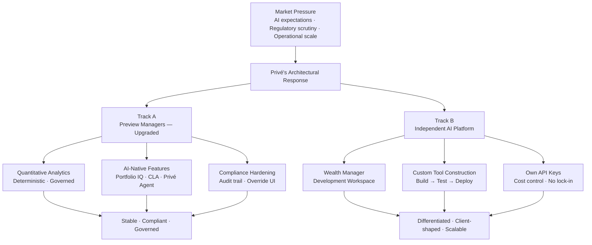
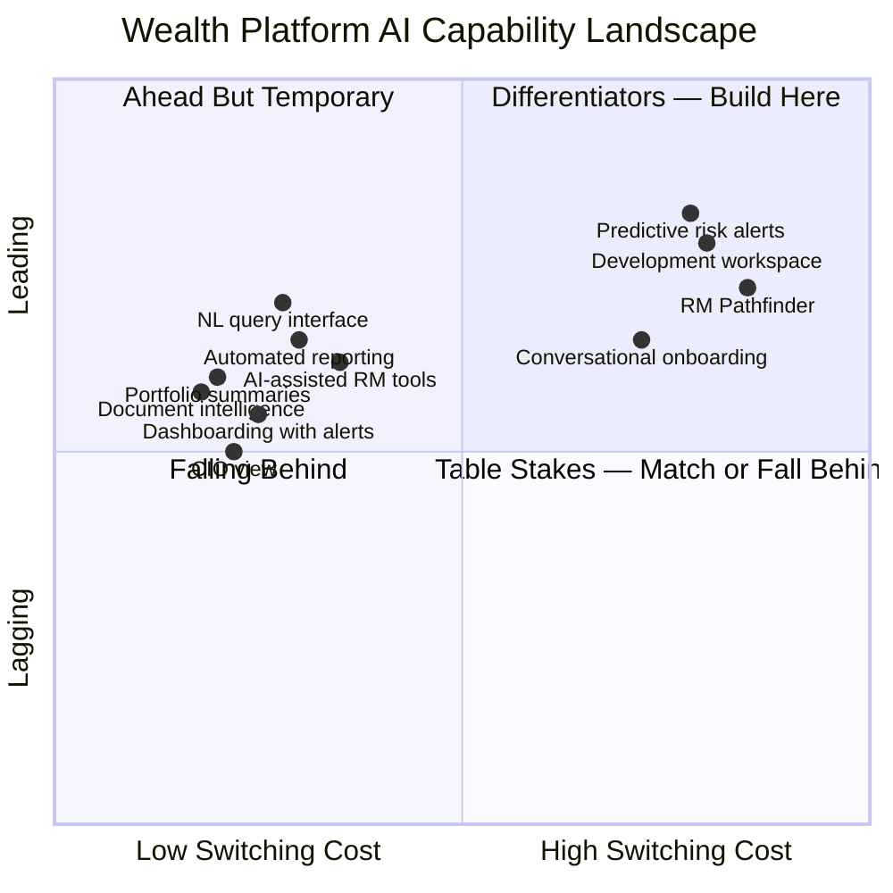

# Section 04: Bridge
**Slides 7–8**
**Narrative function:** Transition from the diagnostic (what is broken about bolt-on AI) to the strategic response (how Privé has chosen to build). These two slides reframe the conversation from "what does Privé offer?" to "why is Privé's architecture the right bet for where wealth management is heading?"

---

## Slide 7: Privé's Response: A Dual-Track Product Strategy
**Type:** Diagram | **Section:** Bridge
**Intent:** Introduce the two-track structure — Track A (upgrading Preview Managers with proven quantitative analytics, incremental AI features, and compliance hardening) and Track B (an independent AI platform for wealth manager-driven construction) — as a deliberate architecture, not a product roadmap.

### Layout

```
┌─────────────────────────────────────────────────────────────────────────┐
│  TWO TRACKS. ONE DELIBERATE ARCHITECTURE.                               │
├─────────────────────────────────────────────────────────────────────────┤
│                                                                         │
│  ┌──────────────────────────────┐  ┌──────────────────────────────┐    │
│  │        TRACK A               │  │        TRACK B               │    │
│  │   Preview Managers           │  │   Independent AI Platform    │    │
│  │   — Upgraded                 │  │   — Purpose-Built            │    │
│  ├──────────────────────────────┤  ├──────────────────────────────┤    │
│  │ Quantitative analytics       │  │ Wealth manager-driven        │    │
│  │  · Portfolio Optimiser       │  │  construction environment    │    │
│  │  · Health Checks             │  │                              │    │
│  │  · Scenario Analysis         │  │ Build → Test → Deploy        │    │
│  │  (deterministic, governed)   │  │  custom AI tools             │    │
│  ├──────────────────────────────┤  │  without a product request   │    │
│  │ AI-native features           │  │                              │    │
│  │  · Portfolio IQ              │  │ Own API keys for             │    │
│  │  · Client Lifecycle Agent    │  │  AI-intensive products       │    │
│  │  · Privé Agent (NL)          │  │                              │    │
│  ├──────────────────────────────┤  │ Clients shift from           │    │
│  │ Compliance hardening         │  │  consumers → co-creators     │    │
│  │  · Governance layer          │  │                              │    │
│  │  · Audit trail               │  └──────────────────────────────┘    │
│  │  · Platform automation       │                                       │
│  └──────────────────────────────┘                                       │
│                                                                         │
│  Track A stabilises and governs.  Track B differentiates and scales.   │
└─────────────────────────────────────────────────────────────────────────┘
```

### Content

**Headline:** Two tracks, built separately, for a reason — one governs the present, one owns the future.

**Body:**

Most platform vendors respond to AI pressure by shipping features. Privé's response is architectural: two parallel tracks with distinct purposes, risk profiles, and timelines.

**Track A — Upgrade the existing platform (Preview Managers)**
- Quantitative analytics hardened for production: Portfolio Optimiser, Health Checks, Scenario Analysis — deterministic and audit-ready, not generative AI
- AI-native features added with human oversight built in from day one: Portfolio IQ (LLM-generated insights), Client Lifecycle Agent, Privé Agent natural language interface
- Compliance layer: governance, audit trail, and override UI running across all features
- Platform automation: asset onboarding and fund document updates converted from manual to governed, automated flows

**Track B — Build the independent AI platform**
- A separate environment — not a feature, not a module — purpose-built for wealth managers to construct, test, and deploy their own AI-powered tools
- No product cycle dependency: wealth managers build when they need to, not when engineering ships
- Clients can supply their own API keys for AI-intensive use cases — cost control and customisation without lock-in
- The distinction that matters: Track B makes clients co-creators of the platform, not consumers of it

**The architectural logic:** Keeping the tracks separate protects Track A's stability and compliance posture while giving Track B the freedom to move at the pace of client demand. A single platform serving both would force a governance tradeoff that hurts both.

**Speaker notes:**
The natural question here is "why two tracks?" — the answer is risk separation, not resource allocation. Track A has to be regulator-ready, auditable, and stable. Track B has to be fast, flexible, and client-shaped. Those two requirements cannot live in the same codebase without one compromising the other. What you're looking at isn't a product roadmap — it's a deliberate architecture that lets Privé run both without either constraining the other. Track B in particular is where the switching cost gets built: once a wealth manager has built tooling on this platform, that's not a feature you can poach with a competitor demo.

---



---

## Slide 8: Where the Market Is Moving: Table Stakes vs. Differentiators
**Type:** Diagram | **Section:** Bridge
**Intent:** Present the four-quadrant market framework. Table stakes (expected within 12–18 months, offered by competitors): dashboarding with alerts, portfolio summaries, CIO view, automated client reporting, document intelligence, AI-assisted RM tools, NL query interface. Differentiators (build switching costs, early-mover advantage): development workspace for wealth managers to build custom tools, conversational onboarding, RM Pathfinder, predictive client risk alerts. Client should see that Privé is building into the differentiator column, not just catching up.

### Layout

```
┌─────────────────────────────────────────────────────────────────────────┐
│  THE MARKET IS SORTING. WHICH COLUMN DO YOU WANT TO BE IN?             │
├───────────────────────────┬─────────────────────────────────────────────┤
│    TABLE STAKES           │    DIFFERENTIATORS                          │
│    (12–18 months)         │    (build switching cost now)               │
│    Competitors offer this │    Early movers own this                    │
├───────────────────────────┼─────────────────────────────────────────────┤
│                           │                                             │
│  · Dashboarding           │  · Wealth manager development               │
│    with alerts            │    workspace — build custom tools           │
│                           │                                             │
│  · Portfolio summaries    │  · Conversational onboarding                │
│                           │                                             │
│  · CIO view               │  · RM Pathfinder                           │
│                           │                                             │
│  · Automated client       │  · Predictive client risk alerts            │
│    reporting              │                                             │
│                           │                                             │
│  · Document intelligence  │                                             │
│                           │                                             │
│  · AI-assisted RM tools   │                                             │
│                           │                                             │
│  · NL query interface     │                                             │
│                           │                                             │
├───────────────────────────┼─────────────────────────────────────────────┤
│  Match these or fall      │  ◀── Privé is building here                 │
│  behind. No margin here.  │       This is where the bet is.             │
└───────────────────────────┴─────────────────────────────────────────────┘
```

### Content

**Headline:** Table stakes buy you a seat. Differentiators determine who stays at the table.

**Body:**

The wealth platform AI market is sorting into two columns. The left column is where every credible competitor will be within 12–18 months. The right column is where real switching cost gets built — and where most vendors are not yet playing.

**Table stakes — necessary but not sufficient:**

| Capability | Why it's commoditising |
|---|---|
| Dashboarding with alerts | Offered by Addepar, Masttro, and most incumbents |
| Portfolio summaries | NL generation is now a wrapper, not a feature |
| CIO view | Standard in institutional platforms |
| Automated client reporting | Straight-line AI application to existing reporting pipelines |
| Document intelligence | Generic LLM capability, low differentiation |
| AI-assisted RM tools | Every vendor is shipping some version of this |
| NL query interface | Table-stakes within 12 months across the category |

Privé delivers these. They matter for retention. They do not build switching cost.

**Differentiators — where early movers build durable advantage:**

- **Wealth manager development workspace:** The ability for RMs and wealth managers to build, test, and deploy their own AI-powered tools — without a product request — is structurally new. No major competitor has shipped this at the institutional level.
- **Conversational onboarding:** Reducing client onboarding friction through AI-driven guided flows compresses a multi-week process into a structured, auditable conversation.
- **RM Pathfinder:** Next-best-action intelligence for relationship managers — surfacing which clients to engage, when, and with what — built on live portfolio and behavioural signals.
- **Predictive client risk alerts:** Forward-looking, signal-based alerts that surface client risk before it crystallises — not a dashboard refresh, but a proactive intelligence layer.

**Where Privé is investing:** The differentiator column. Table stakes are being built because they must be. The product bet is on the right side of this framework.

**Speaker notes:**
This framework is the honest version of the competitive question. If you ask any wealth platform vendor where they're investing, they'll point you at dashboards and NL interfaces — because that's where client demand is loudest right now. The problem is that by the time clients are asking for it loudly, competitors are already shipping it. The differentiators on the right are quieter asks today, but they're the ones that create the integration depth that makes switching painful. The development workspace is the clearest example — once a wealth manager has built proprietary tooling on Privé's platform, that's not a feature you can replicate with a demo. Privé's decision to build Track B before clients are demanding it universally is the early-mover call this slide is making.

---



---

*Section 04 complete. Slides 7–8 written.*
