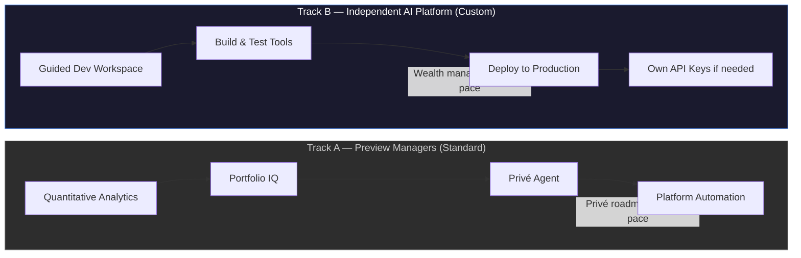

# Section 06: Track B — Slides 14–16

**Narrative position:** The independent AI platform is the primary differentiator. This section turns Track B from an abstract concept into something the client can picture, evaluate commercially, and benchmark against what competitors offer.

---

## Slide 14: Track B: The Independent AI Platform
**Type:** Diagram | **Section:** Track B
**Intent:** Introduce the independent AI platform as the primary differentiator — a separate, purpose-built environment where wealth managers construct, test, and deploy custom AI-powered tools without filing a feature request or waiting for a product cycle. This is the USP that builds real switching cost.

### Layout

```
┌─────────────────────────────────────────────────────────────────────┐
│  TRACK B: THE INDEPENDENT AI PLATFORM                               │
│  A purpose-built environment. Separate. Wealth manager-controlled.  │
├───────────────────────────┬─────────────────────────────────────────┤
│  TRACK A                  │  TRACK B                                │
│  Preview Managers         │  Independent AI Platform                │
│  (Standard platform)      │  (Custom development environment)       │
│                           │                                         │
│  Quantitative analytics   │  Build custom analytics views           │
│  Portfolio IQ             │  Create bespoke reporting templates      │
│  Privé Agent              │  Deploy proprietary scoring models       │
│  Platform automation      │  Automate firm-specific workflows        │
│                           │                                         │
│  Managed by Privé         │  Constructed by wealth managers         │
│  Product cycle: Privé     │  Product cycle: yours                   │
└───────────────────────────┴─────────────────────────────────────────┘

          ▼ No feature request. No wait. No dependency on Privé's roadmap.
```



### Content

**Headline:** Track B is not a feature — it is a separate platform where wealth managers build their own.

**Body:**

- Track A upgrades the existing platform. Track B is architecturally independent — a purpose-built environment with its own development workspace, testing layer, and deployment pipeline.
- Wealth managers do not wait for Privé's product cycle. They construct tools, test them, and deploy them on their own timeline.
- For AI-intensive use cases — such as Nexus-tier enterprise clients — firms can supply their own API keys, giving them direct control over token costs and model access.
- The result is not just a better platform. It is a platform where your firm's proprietary tools live — tools a competitor cannot replicate by switching vendors.

**Speaker notes:**
Track B answers a question every sophisticated client eventually asks: what happens when the standard platform does not do what we need? Most vendors say file a feature request. We built a different answer. This is a separate, independent platform — not a developer console bolted onto the side of Track A. Wealth managers can construct tools here that are unique to their firm. Once they have built them, those tools create real switching cost — not because we locked the client in, but because they built something worth keeping.

---

## Slide 15: What Wealth Managers Can Build — and Why That Matters
**Type:** Content | **Section:** Track B
**Intent:** Make the independent platform tangible: custom analytics views, bespoke client reporting templates, workflow automations, and proprietary scoring models — constructed by wealth managers through a guided development workspace. Position this as a shift from platform consumer to platform co-creator.

### Layout

```
┌─────────────────────────────────────────────────────────────────────┐
│  WHAT WEALTH MANAGERS CAN BUILD                                     │
│  From platform consumer → platform co-creator                       │
├──────────────────────┬──────────────────────┬───────────────────────┤
│  Custom Analytics    │  Client Reporting    │  Workflow Automation  │
│  Views               │  Templates           │                       │
│                      │                      │                       │
│  Build views that    │  Generate bespoke    │  Automate sequences   │
│  reflect your risk   │  reports in your     │  specific to your     │
│  framework, not      │  firm's format,      │  operational model —  │
│  Privé's defaults    │  language, and tone  │  not generic flows    │
├──────────────────────┴──────────────────────┴───────────────────────┤
│  Proprietary Scoring Models                                          │
│  Build client risk, opportunity, or engagement scores using your    │
│  own criteria — housed on the platform, not in a spreadsheet        │
├─────────────────────────────────────────────────────────────────────┤
│  All built through a guided development workspace                   │
│  No vendor dependency. No feature queue. No shared roadmap.         │
└─────────────────────────────────────────────────────────────────────┘
```

### Content

**Headline:** Four things wealth managers can build today — none of which require a feature request.

**Body:**

| What you can build | What it replaces | Why it matters |
|----|----|----|
| Custom analytics views | Adapting your process to Privé's default views | Your risk lens, your data hierarchy — built into the platform |
| Bespoke client reporting templates | Generic platform output reformatted offline | Reports in your format, your language, issued directly from the platform |
| Workflow automations | Manual operational sequences run outside the platform | Firm-specific processes automated with full audit trail |
| Proprietary scoring models | Scoring logic maintained in spreadsheets or siloed tools | Your methodology housed on the platform, not in a file someone owns |

- These are not configurations or toggles — they are tools that wealth managers construct through a guided development workspace, with testing before deployment.
- The shift this represents: from selecting features a vendor offers, to building tools a vendor enables.
- A firm that has built four proprietary tools on this platform has, in practice, built part of its operating model here. That is switching cost that was earned, not manufactured.

**Speaker notes:**
The guided development workspace is the mechanism that makes this real. It is not a blank code editor dropped in front of a wealth manager. It is a structured environment where they can construct tools — analytics views, reporting templates, scoring models, workflow automations — test them against real data, and deploy them without a Privé engineer in the loop. The transition we are describing is meaningful: from being a consumer of what the platform offers, to being a builder of what the platform does. That shift changes how the firm relates to the platform — and it changes what it would cost to leave it.

---

## Slide 16: Why a Separate Platform Is the Right Architecture
**Type:** Content | **Section:** Track B
**Intent:** Explain the rationale without technical jargon: a single platform serving both standard and custom AI use cases creates stability and governance tradeoffs. A separate AI platform lets wealth managers move at their own pace, with their own API keys where needed, without exposing the core platform to custom development risk.

### Layout

```
┌─────────────────────────────────────────────────────────────────────┐
│  WHY A SEPARATE PLATFORM IS THE RIGHT ARCHITECTURE                  │
│  Two reasons — one for the client, one for the platform             │
├──────────────────────────────┬──────────────────────────────────────┤
│  SINGLE PLATFORM             │  SEPARATE PLATFORM                   │
│  (what most vendors do)      │  (what Privé built)                  │
│                              │                                      │
│  Custom development shares   │  Custom development runs in its      │
│  infrastructure with         │  own environment — isolated from     │
│  standard AI features        │  core platform stability             │
│                              │                                      │
│  Governance applies to       │  Governance applies where it         │
│  everything or nothing       │  should — standard AI features       │
│  — blurring the audit trail  │  carry their own audit layer;        │
│                              │  custom tools carry theirs           │
│  Vendor controls pace        │  Wealth manager controls pace        │
│  of custom development       │  of custom development               │
│                              │                                      │
│  One API key pool            │  Own API keys available for          │
│  — cost absorbed centrally   │  enterprise/AI-heavy clients         │
└──────────────────────────────┴──────────────────────────────────────┘

      ▶ Separation is not complexity — it is the architecture of safety and control.
```

### Content

**Headline:** Mixing standard and custom AI on one platform creates the exact governance risk regulators are already asking about.

**Body:**

- When custom AI development runs inside the same environment as production client-facing features, any instability in a custom tool — a workflow that loops, a scoring model with unexpected outputs — can affect the broader platform. Separation eliminates that exposure.
- Governance clarity follows the same logic: Track A features carry a defined, auditable AI governance layer. Track B tools carry their own governance — isolated, not shared. Regulators can see exactly what applies to which output.
- Wealth managers move at their own pace without being slowed by platform-wide change controls or accelerated by Privé's release cycle. The two tracks do not block each other.
- For enterprise and AI-intensive clients — particularly where usage volume makes token costs material — Track B supports client-supplied API keys. This is structured cost architecture: clients who need scale do not subsidise it through opaque platform pricing.
- The architecture is deliberate. It is not two products — it is one platform strategy with two operating modes, designed to serve different risk and governance profiles cleanly.

**Speaker notes:**
The question we anticipated is: why not just add a custom development layer to the existing platform? The answer is governance and stability. A platform that mixes standard production AI features with experimental custom tools creates a blurred audit trail and shared failure risk — exactly what regulators at MAS, SFC, and FCA are scrutinising. Separation keeps those concerns cleanly apart. It also gives wealth managers something they rarely have: genuine autonomy over their own development timeline, without waiting on a shared roadmap or a vendor's change management process. And for clients where AI usage is significant — Nexus-tier engagements — the ability to supply their own API keys means token costs are transparent, manageable, and theirs to optimise.

---
