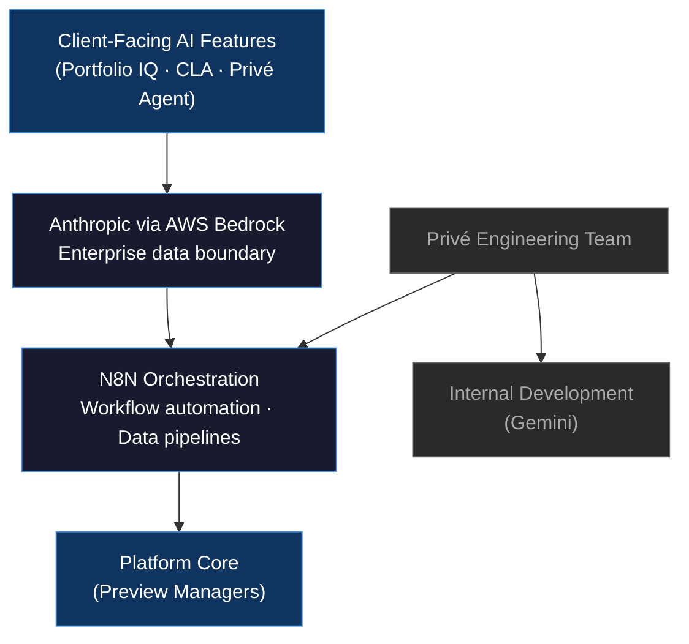

# Section 07: Architecture
## Slides 17 and 23

---

## Slide 17: The AI Stack Behind the Platform
**Type:** Diagram | **Section:** Architecture
**Intent:** Present the confirmed stack: Anthropic via AWS Bedrock for client-facing AI features; Gemini for internal development; N8N for workflow orchestration. Flag transparently that stack standardisation is an active open item due to existing technical debt. Transparency here is a credibility signal — it shows Privé operates like a mature technology organisation.

### Layout

```
┌─────────────────────────────────────────────────────────────────────┐
│  THE AI STACK BEHIND THE PLATFORM                                   │
│  Three layers. Two providers. One orchestration engine.             │
├─────────────────────────────────────────────────────────────────────┤
│                                                                     │
│   CLIENT-FACING AI                                                  │
│  ┌──────────────────────────────────────────────────────────────┐  │
│  │  Anthropic (Claude) via AWS Bedrock                          │  │
│  │  Portfolio IQ · Client Lifecycle Agent · Privé Agent         │  │
│  │  Enterprise data boundary · No model training on client data │  │
│  └──────────────────────────────────────────────────────────────┘  │
│                          │                                          │
│                          ▼                                          │
│   ORCHESTRATION                                                     │
│  ┌──────────────────────────────────────────────────────────────┐  │
│  │  N8N                                                         │  │
│  │  Workflow automation · Asset onboarding · Data pipelines     │  │
│  └──────────────────────────────────────────────────────────────┘  │
│                                                                     │
│   INTERNAL DEVELOPMENT                                              │
│  ┌──────────────────────────────────────────────────────────────┐  │
│  │  Gemini                                                      │  │
│  │  Internal tooling · Developer workflows · Build acceleration │  │
│  └──────────────────────────────────────────────────────────────┘  │
│                                                                     │
│  ┌──────────────────────────────────────────────────────────────┐  │
│  │  NOTE  Stack standardisation is an active internal workstream│  │
│  │  — technical debt is being resolved deliberately, not        │  │
│  │  deferred. Client-facing stack is stable and fixed.          │  │
│  └──────────────────────────────────────────────────────────────┘  │
└─────────────────────────────────────────────────────────────────────┘
```

### Content

**Headline:** Client-facing AI runs on Anthropic via AWS Bedrock — the boundary between what clients touch and how we build internally is deliberate.

**Body:**

**Client-facing layer — Anthropic via AWS Bedrock**
- All generative AI features client-facing (Portfolio IQ, Client Lifecycle Agent, Privé Agent) run on Claude models delivered via AWS Bedrock
- AWS Bedrock provides an enterprise data boundary: client data is not used to train or fine-tune models
- Model provider selection at this layer was driven by compliance posture and data handling commitments, not feature benchmarks

**Orchestration — N8N**
- Workflow automation layer that connects platform events to actions: asset onboarding, fund document updates, data freshness pipelines
- Sits between the platform core and the AI layer — not client-visible, but responsible for the operational reliability of automated features

**Internal development — Gemini**
- Used for internal developer workflows, tooling, and build acceleration
- Kept separate from client-facing AI deliberately — different governance requirements, different data exposure profile

**Open item — stack standardisation**
- Privé currently maintains two model providers (Anthropic for production, Gemini for internal) as a result of legacy technical debt
- Stack consolidation is an active internal workstream — not a gap, a managed transition
- Client-facing stack is stable; the open item is on the internal side only

### Diagram



**Speaker notes:**
The stack here is not aspirational — it is what is in production today. Client-facing AI runs through AWS Bedrock because it gives us the enterprise data boundary that institutional clients require: your data does not leave the boundary, and it does not train the model. N8N sits below the AI layer handling orchestration — the plumbing that makes automation reliable. We use Gemini internally for developer tooling, which creates two providers in the current architecture. We are being transparent about that because the consolidation work is underway — the client-facing stack is already stable, and we are not going to pretend the internal picture is cleaner than it is.

---

## Slide 23: Build-First: Why Privé Owns Its Core AI Infrastructure
**Type:** Content | **Section:** Architecture
**Intent:** State the build-first stance and what it means for clients: governance, compliance architecture, and audit infrastructure are owned and developed internally — not licensed from a third party who can change terms, deprecate an API, or fail to meet a regulator's requirements. Third-party providers are used as interim bridges, not permanent dependencies.

### Layout

```
┌─────────────────────────────────────────────────────────────────────┐
│  BUILD-FIRST: WHY PRIVÉ OWNS ITS CORE AI INFRASTRUCTURE            │
│  Compliance infrastructure you license can be taken away.           │
│  Ours cannot.                                                       │
├──────────────────────────────┬──────────────────────────────────────┤
│                              │                                      │
│  WHAT PRIVÉ BUILDS           │  WHAT THAT MEANS FOR YOU            │
│  INTERNALLY                  │                                      │
│                              │                                      │
│  · Audit trail layer         │  · No vendor can deprecate your     │
│  · Governance architecture   │    compliance posture               │
│  · Compliance infrastructure │  · No licence renewal that puts     │
│  · Override and logging UI   │    your audit trail at risk         │
│  · Decision record schema    │  · No third-party terms change      │
│                              │    that affects your regulator      │
│  Currently: SIT phase        │    submission                       │
│                              │                                      │
│  WHAT WE USE THIRD PARTIES   │  Third-party providers are used     │
│  FOR (INTERIM)               │  as model delivery infrastructure   │
│                              │  — not as compliance infrastructure  │
│  · Model delivery            │                                      │
│    (Anthropic via Bedrock)   │  The distinction matters when a     │
│  · Internal tooling          │  regulator asks who owns the        │
│    (Gemini)                  │  governance layer.                  │
│  · Workflow automation       │                                      │
│    (N8N)                     │  The answer is: Privé does.         │
│                              │                                      │
└──────────────────────────────┴──────────────────────────────────────┘
```

### Content

**Headline:** The compliance architecture is not a licensed product — it is built and owned by Privé, which means no third party can change its terms, deprecate it, or fail to meet a regulator's requirements on your behalf.

**Body:**

**What build-first means in practice**

Privé's product backlog prioritises internal development for anything that sits in the governance, compliance, or audit layer of the platform. This is not a philosophical preference — it is a risk management decision with direct implications for clients.

The foundational compliance infrastructure currently in SIT (System Integration Testing) phase includes:
- Audit trail layer — structured, immutable log of every AI invocation
- Decision record schema — captures AI output, confidence signal, and human decision in a single linked record
- Override and logging UI — gives wealth managers explicit accept/modify/reject control with a logged rationale
- Governance architecture — the rules and enforcement layer that determines which AI features require human oversight and at what threshold

**Why this matters to institutional clients**

Licensed compliance tooling carries three risks that internal builds do not:
1. **Deprecation risk** — a third-party vendor can sunset an API or change a feature with notice periods that do not align to regulatory audit cycles
2. **Terms risk** — licence terms can change in ways that affect how data is handled, stored, or accessed by the vendor
3. **Accountability gap** — when a regulator asks who owns the governance layer, the answer cannot be "our vendor does"

With Privé's build-first approach, the answer is unambiguous: Privé owns the compliance infrastructure end to end.

**Where third parties sit**

Third-party providers — Anthropic via AWS Bedrock for model delivery, N8N for orchestration — are used as infrastructure bridges, not as compliance dependencies. If a model provider changes their terms or is replaced, the governance and audit layer is unaffected. The compliance posture travels with the platform, not with any single vendor.

**Speaker notes:**
The question we hear from compliance and risk teams at institutional clients is: what happens to your audit trail if Anthropic changes something? The answer is that the audit infrastructure does not sit inside Anthropic — it sits inside Privé. We use Bedrock for model delivery, but the layer that logs decisions, attaches confidence scores, and produces the audit record is ours. That layer is currently in SIT, which means it is not yet in production — we are telling you that explicitly. What is already in production is the architecture decision: compliance infrastructure is built internally, and that does not change regardless of what any model provider does.
```

---
