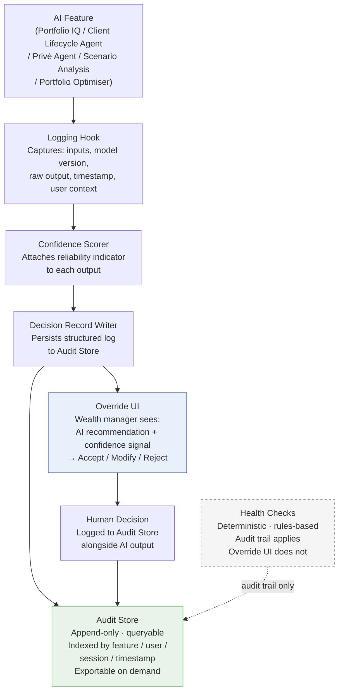

## Slide 18: Compliance Mapping: MiFID II, FCA, SFC, and MAS
**Type:** Table | **Section:** Compliance
**Intent:** Map platform capabilities to the four regulatory regimes across a single table. Lead with the common thread: MAS, SFC, and FCA all share one central requirement — human oversight of AI decisions. Show how Privé's architecture satisfies that requirement and where each feature sits against each regime.

### Layout

```
┌──────────────────────────────────────────────────────────────────────────────────┐
│  Compliance Mapping: MiFID II, FCA, SFC, and MAS                                 │
│                                                                                  │
│  One platform. Four regulatory regimes. A single common requirement:             │
│  human oversight of AI decisions.                                                │
│                                                                                  │
├──────────────────────────┬────────────┬────────────┬────────────┬────────────────┤
│ Platform Capability      │ MiFID II   │ FCA        │ SFC (HK)   │ MAS (SG)       │
├──────────────────────────┼────────────┼────────────┼────────────┼────────────────┤
│ Override UI              │ —          │ ✓ required │ ✓ required │ ✓ required     │
│ (Accept/Modify/Reject)   │            │ (AI in     │ (AI in     │ (Accountability│
│                          │            │  reg. act.)│  inv. mgmt)│  Principle)    │
├──────────────────────────┼────────────┼────────────┼────────────┼────────────────┤
│ Audit Store              │ ✓ required │ ✓ required │ ✓ required │ ✓ required     │
│ (immutable, exportable)  │ (suitabil. │ (Consumer  │ (AI rec.   │ (Transparency  │
│                          │  records)  │  Duty)     │  records)  │  Principle)    │
├──────────────────────────┼────────────┼────────────┼────────────┼────────────────┤
│ Confidence Scorer        │ ✓ supports │ ✓ supports │ ✓ supports │ ✓ supports     │
│                          │ best exec. │ explainab. │ explainab. │ Fairness /     │
│                          │ evidence   │ expectat.  │ expectat.  │ Ethics Princ.  │
├──────────────────────────┼────────────┼────────────┼────────────┼────────────────┤
│ Logging Hook             │ ✓ supports │ ✓ supports │ ✓ supports │ ✓ supports     │
│ (model version,          │ audit trail│ audit trail│ AI rec.    │ Accountability │
│  inputs, timestamp)      │            │            │ records    │ Principle      │
├──────────────────────────┼────────────┼────────────┼────────────┼────────────────┤
│ Deterministic analytics  │ ✓ inherent │ ✓ inherent │ ✓ inherent │ ✓ inherent     │
│ (Portfolio Optimiser,    │ (reproduc. │ (reproduc. │ (reproduc. │ (reproduc.     │
│  Health Checks,          │  outputs)  │  outputs)  │  outputs)  │  outputs)      │
│  Scenario Analysis)      │            │            │            │                │
├──────────────────────────┼────────────┼────────────┼────────────┼────────────────┤
│ Generative AI features   │ ✓ via      │ ✓ via      │ ✓ via      │ ✓ via          │
│ (Portfolio IQ, Client    │ governance │ governance │ governance │ governance     │
│  Lifecycle Agent,        │ layer      │ layer      │ layer      │ layer          │
│  Privé Agent)            │            │            │            │                │
└──────────────────────────┴────────────┴────────────┴────────────┴────────────────┘

  Note: Override UI applies to generative AI features + Scenario Analysis + Portfolio
  Optimiser. Health Checks are deterministic threshold monitors — no override required.
```

### Content

**Headline:** MAS, SFC, and FCA converge on one requirement — human oversight of AI decisions. The platform is built to satisfy that requirement across all four regimes.

**Body:**

The common thread across three of the four regimes:

- **MAS (Singapore) — FEAT Principles:** Firms must document how AI models affect client decisions. Accountability and Transparency require demonstrable human oversight and override capability.
- **SFC (Hong Kong) — AI Circular:** AI used in investment advice or portfolio management requires human review before action. Firms must maintain records of AI-generated recommendations and the human decisions taken on them.
- **FCA (UK/Europe) — AI Update + Consumer Duty:** Audit trail required for AI touching regulated activities. Explainability expected. Consumer Duty raises the bar on AI-driven client-facing outputs.
- **MiFID II (EU):** Best execution documentation, suitability records, and audit trail for investment recommendations — regime is pre-AI but maps directly onto Privé's structured logging architecture.

Key scoping point: deterministic analytics (Portfolio Optimiser, Health Checks, Scenario Analysis) produce reproducible, rules-based outputs that are inherently auditable. The full governance layer — including Override UI — applies to generative AI features. Health Checks operate as threshold monitors and do not require override capability.

**Speaker notes:**
The table is not a compliance claim — it is a capability map. What matters to this audience is not that Privé has read the regulations, but that the platform architecture was designed with them in mind. The Override UI and Audit Store are not add-ons; they are structural. MAS, SFC, and FCA are all moving in the same direction — human accountability for AI outputs — and Privé's governance layer satisfies that requirement today, not on a roadmap.

---

## Slide 19: How Human Oversight Works in the Platform
**Type:** Diagram | **Section:** Compliance
**Intent:** Walk through the governance architecture in client language: Logging Hook captures every AI invocation; Confidence Scorer attaches a reliability signal; Decision Record Writer creates a structured log; Audit Store holds an immutable, queryable record; Override UI gives the wealth manager explicit accept/modify/reject control. Clarify scope: this layer applies to the generative AI features and to Scenario Analysis and Portfolio Optimiser — Health Checks are deterministic and do not require override capability.

### Layout

```
┌──────────────────────────────────────────────────────────────────────────────────┐
│  How Human Oversight Works in the Platform                                       │
│                                                                                  │
│  Five components. One governance loop.                                           │
│                                                                                  │
│  ┌───────────────┐    ┌───────────────┐    ┌──────────────────┐                 │
│  │  AI Feature   │───▶│ Logging Hook  │───▶│ Confidence       │                 │
│  │  (generative) │    │               │    │ Scorer           │                 │
│  │               │    │ Captures:     │    │                  │                 │
│  │  • Portfolio  │    │ • Inputs      │    │ Attaches         │                 │
│  │    IQ         │    │ • Model ver.  │    │ reliability      │                 │
│  │  • Client     │    │ • Raw output  │    │ indicator to     │                 │
│  │    Lifecycle  │    │ • Timestamp   │    │ each output      │                 │
│  │    Agent      │    │ • User ctx    │    │                  │                 │
│  │  • Privé      │    │               │    │                  │                 │
│  │    Agent      │    │               │    │                  │                 │
│  │  • Scenario   │    │               │    │                  │                 │
│  │    Analysis   │    └───────────────┘    └──────────────────┘                 │
│  │  • Portfolio  │              │                    │                           │
│  │    Optimiser  │              └────────────────────┘                           │
│  └───────────────┘                        │                                      │
│                                           ▼                                      │
│  ┌───────────────┐    ┌───────────────────────────────┐                         │
│  │  Override UI  │◀───│   Decision Record Writer       │                         │
│  │               │    │                               │                         │
│  │  Wealth mgr   │    │   Persists structured log     │                         │
│  │  sees AI rec. │    │   to Audit Store              │                         │
│  │  + confidence │    └───────────────────────────────┘                         │
│  │               │                    │                                          │
│  │  ┌─────────┐  │                    ▼                                          │
│  │  │ Accept  │  │    ┌───────────────────────────────┐                         │
│  │  ├─────────┤  │    │   Audit Store                 │                         │
│  │  │ Modify  │  │    │                               │                         │
│  │  ├─────────┤  │    │   Append-only, queryable      │                         │
│  │  │ Reject  │  │    │   Indexed by feature / user   │                         │
│  │  └─────────┘  │    │   / session / timestamp       │                         │
│  │               │    │   Exportable on demand        │                         │
│  │  Human dec.   │───▶│                               │                         │
│  │  logged here  │    └───────────────────────────────┘                         │
│  └───────────────┘                                                               │
│                                                                                  │
│  Health Checks = deterministic, rules-based. Audit trail applies.               │
│  Override UI does not — no AI-generated recommendation is produced.              │
└──────────────────────────────────────────────────────────────────────────────────┘
```

### Content

**Headline:** Every AI-generated output passes through five governance components before it becomes a wealth manager decision.

**Body:**

The governance layer operates as a closed loop — no AI output reaches a wealth manager without passing through it:

1. **Logging Hook (backend):** Intercepts every model call. Records inputs, model version, raw output, confidence score, timestamp, and authenticated user context before anything else happens.

2. **Confidence Scorer (model layer):** Attaches a reliability indicator to each output. The wealth manager sees this signal alongside the recommendation — not buried in a log.

3. **Decision Record Writer:** Takes the logged invocation and the confidence signal and persists a structured record to the Audit Store.

4. **Audit Store (data layer):** Append-only. Cannot be edited or deleted. Queryable and indexed by feature, user, session, and timestamp. Exportable in full for regulatory audit.

5. **Override UI:** The wealth manager sees the AI recommendation, the confidence signal, and three explicit actions: Accept, Modify, or Reject. The human decision — whatever it is — is written back to the Audit Store alongside the original AI output.

**Scope clarification:**
This full loop — including the Override UI — applies to all generative AI features (Portfolio IQ, Client Lifecycle Agent, Privé Agent) and to Scenario Analysis and Portfolio Optimiser. Health Checks are deterministic, threshold-based monitoring tools. They produce no AI-generated recommendation, so the Override UI does not apply. The Audit Store still captures Health Check activity.

**Speaker notes:**
The key point for a compliance-oriented audience is that the human decision is never implicit. The wealth manager cannot receive an AI recommendation and act on it without the platform recording what they chose to do. That log — the original AI output, the confidence signal, and the human decision — is what a regulator asks for, and it exists on demand rather than being reconstructed after the fact. Regulators under MAS, SFC, and FCA are asking this exact question: show me that a human reviewed the AI output before action was taken. This architecture answers that question structurally.

### Governance Architecture — Mermaid



---

## Slide 20: What Your Audit Trail Looks Like in Practice
**Type:** Content | **Section:** Compliance
**Intent:** Translate the governance architecture into what institutional clients actually need to show a regulator: every AI-assisted recommendation produces a structured, exportable record; human decisions are logged alongside the AI output; the audit package is available on demand, not reconstructed after the fact.

### Layout

```
┌──────────────────────────────────────────────────────────────────────────────────┐
│  What Your Audit Trail Looks Like in Practice                                    │
│                                                                                  │
│  When a regulator asks for evidence of human oversight, this is what you hand   │
│  them — on demand, not reconstructed.                                            │
│                                                                                  │
│  ┌──────────────────────────────────────────────────────────────────────────┐   │
│  │  EXAMPLE AUDIT RECORD — Portfolio IQ Recommendation                      │   │
│  │                                                                          │   │
│  │  Timestamp:        2026-06-26T09:14:33Z                                  │   │
│  │  Feature:          Portfolio IQ — Rebalancing Commentary                 │   │
│  │  User:             RM ID #4821 (authenticated session)                   │   │
│  │  Client:           [Client reference — anonymised here]                  │   │
│  │  Model version:    anthropic.claude-3-5-sonnet-20241022-v2:0             │   │
│  │  AI output:        [Structured recommendation text — full record]        │   │
│  │  Confidence score: 0.87                                                  │   │
│  │  Human decision:   Modified                                              │   │
│  │  RM annotation:    "Adjusted allocation — client risk tolerance update"  │   │
│  │  Final output:     [Modified recommendation — full record]               │   │
│  │  Record status:    Immutable · Exportable                                │   │
│  └──────────────────────────────────────────────────────────────────────────┘   │
│                                                                                  │
│  What this gives you:                                                            │
│                                                                                  │
│  ▶ Every AI-assisted recommendation → structured, exportable record              │
│  ▶ Human decision logged alongside AI output — not inferred, not implied        │
│  ▶ Full audit package available on demand — per feature, per RM, per session    │
│  ▶ No reconstruction — the record exists at the moment the decision is made     │
│                                                                                  │
└──────────────────────────────────────────────────────────────────────────────────┘
```

### Content

**Headline:** Every AI-assisted decision leaves a complete, exportable record — the human choice logged next to the AI output, available the moment a regulator asks for it.

**Body:**

What the audit trail contains for each AI-assisted recommendation:

- **AI output:** The full text of the AI-generated recommendation, as produced by the model at that moment.
- **Model version:** The specific model that generated the output — version-pinned, not a generic reference.
- **Confidence signal:** The reliability indicator attached by the Confidence Scorer at the time of generation.
- **Authenticated user context:** The RM who received the recommendation, their session, and the client context.
- **Human decision:** Accept, Modify, or Reject — recorded explicitly, not inferred from subsequent action.
- **RM annotation (where provided):** Free-text rationale the RM can attach to a modification or rejection.
- **Timestamp:** UTC-stamped at the moment of AI generation and again at the moment of human decision.
- **Record status:** Append-only. Cannot be edited after writing.

**What this means operationally for institutional clients:**

- Regulator requests an evidence package for AI-assisted investment recommendations → exported directly from the Audit Store, no manual assembly.
- Internal compliance review of RM AI usage → queryable by feature, RM, client, date range, or decision type (Accept / Modify / Reject).
- Post-incident review → the exact AI output, confidence level, and human decision for any session are available without relying on RM recall.
- The record exists at the moment the decision is made. It is not a summary reconstructed afterward.

**Scope note:** This applies to generative AI features (Portfolio IQ, Client Lifecycle Agent, Privé Agent) and to Scenario Analysis and Portfolio Optimiser. Health Check activity is also logged, but as a deterministic threshold event — no AI recommendation record is produced because no AI recommendation is generated.

**Speaker notes:**
The distinction that matters most to compliance teams at Citi and UOB tier institutions is "available on demand" versus "reconstructed after the fact." Reconstructed records carry legal risk and examiner scepticism. The Privé Audit Store produces the record at the moment the decision is made — the AI output and the human response are written simultaneously. That is the architecture regulators want to see under MAS, SFC, and FCA, and it is what this platform delivers today. The query interface means compliance teams can pull an audit package in minutes without involving engineering.
```
