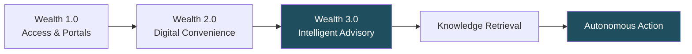
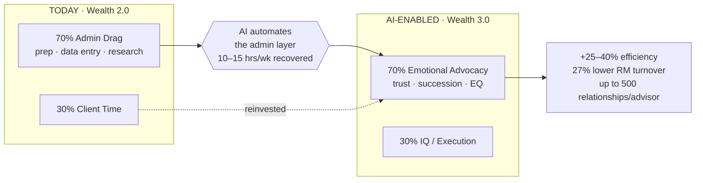
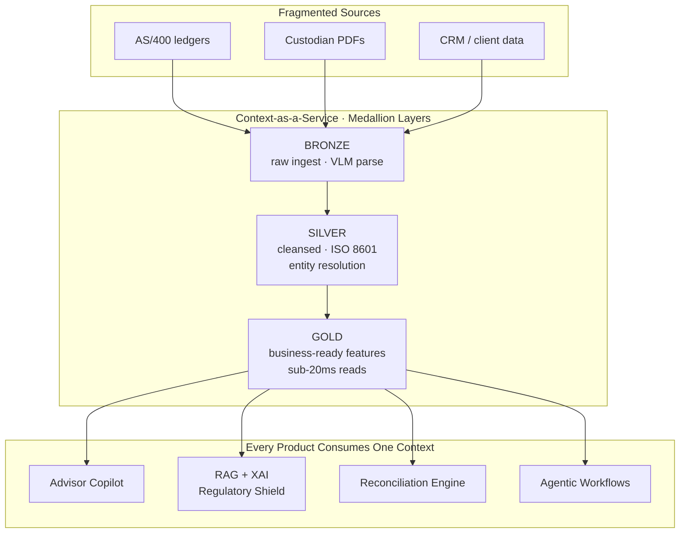
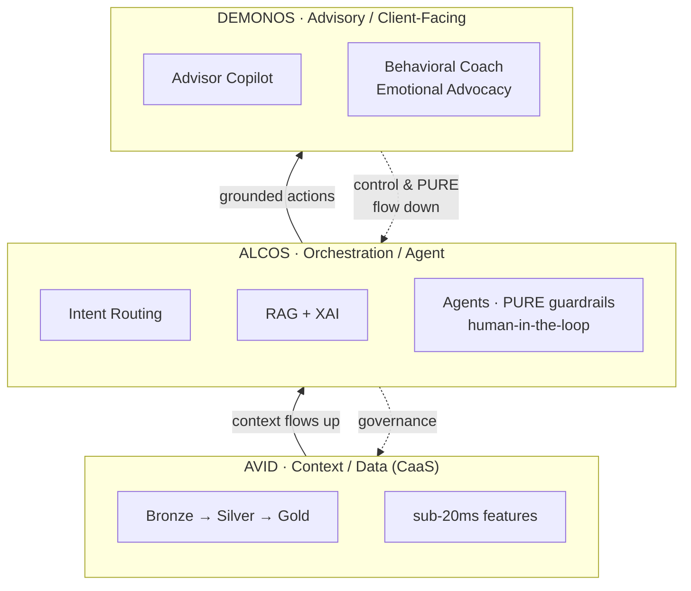
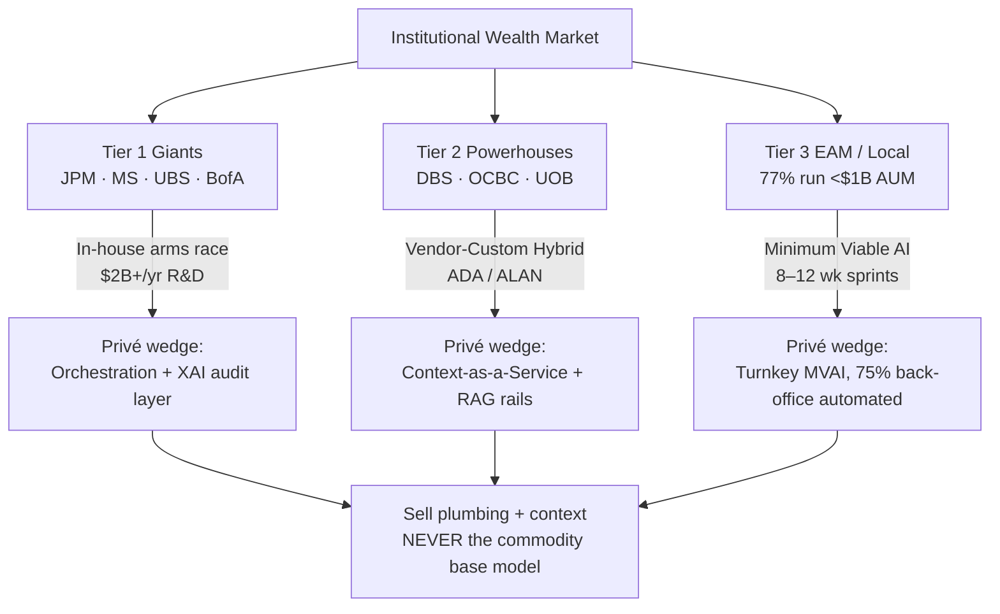
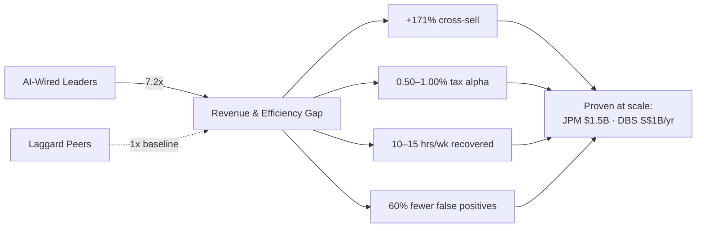
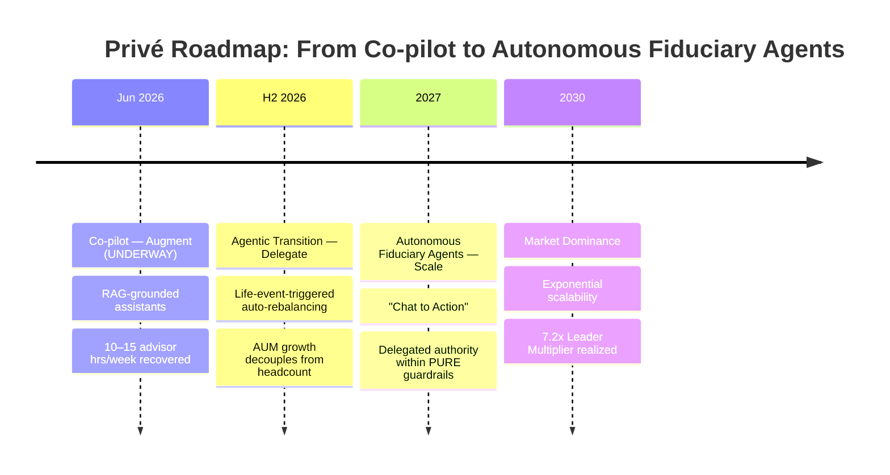

## Narrative arc

Situation → Complication → Resolution

The presentation begins by framing the global shift to Wealth 3.0—moving from simple digital access to "Intelligent Advisory." It then identifies the critical complication: the "70/30" administrative drag that is eroding advisor margins. The resolution is presented through Privé’s three-pillar strategy, culminating in a vision of Autonomous Fiduciary Agents that decouple AUM growth from operational costs.

---

## Slide outline

| # | Title | Section | Type | Intent |
|---|-------|---------|------|--------|
| 1 | The Intelligent Alpha: Privé’s Strategic AI Roadmap | Title | Title | Establish a sense of urgency and strategic leadership in the AI-first market. |
| 2 | From Convenience to Intelligence: The Wealth 3.0 Era | Situation | Content | Align the board on the market shift from "Digital Portals" to "Autonomous Insights." |
| 3 | The Productivity Trap: Solving the 70/30 Admin Drag | Complication | Data | Quantify the 15-hour/week loss to manual workflows that threatens firm survival. |
| 4 | The 70/30 Flip: Reclaiming the Human Advantage | Resolution | Diagram | Visualize the strategy to flip the ratio, moving advisor focus to "Emotional Advocacy." |
| 5 | Pillar 1: Context-as-a-Service (CaaS) | Pillar 1 | Diagram | Position Privé’s core posture: AI not as a feature, but as organizational infrastructure. |
| 6 | Building the Muscle: Near-Term Automation Wins | Pillar 2 | Content | Demonstrate low-risk, high-impact near-term wins in reconciliation and API readiness. |
| 7 | The Three-Layer Model: Avid, Alcos, and Demonos | Pillar 2 | Diagram | Introduce the core product strategy layers to frame the future roadmap architecture. |
| 8 | Pillar 3: Capturing the Institutional Landscape | Pillar 3 | Content | Detail the tiered strategy for Tier 1 Giants (In-house) vs Tier 2 Powerhouses (Hybrid). |
| 9 | Value-Based Growth: Outcome-Driven Monetization | Pillar 3 | Data | Propose a shift from "license seats" to "outcome-based" pricing models linked to ROI. |
| 10 | The Regulatory Shield: Trust Through PURE AI | Trust | Quote | Address risk concerns by detailing the PURE framework (Purposeful, Unbiased, Respectful, Explainable). |
| 11 | Industrialized ROI: The 7.2x Leader Multiplier | Impact | Data | Present the quantitative evidence of success from AI leaders to justify the investment. |
| 12 | The Road to 2027: Autonomous Fiduciary Agents | Vision | CTA | Secure final approval on the roadmap toward agentic infrastructure and market dominance. |

---

## Slide 1: The Intelligent Alpha: Privé's Strategic AI Roadmap
**Type:** Title | **Section:** Title
**Intent:** Establish a sense of urgency and strategic leadership in the AI-first market.

### Layout

```
┌──────────────────────────────────────────────────────────────┐
│                                                              │
│                                                              │
│                                                              │
│            THE INTELLIGENT ALPHA                             │
│            ─────────────────────                            │
│            Privé's Strategic AI Roadmap                      │
│                                                              │
│            Winning the Wealth 3.0 Era: 2026 → 2030          │
│                                                              │
│                                                              │
│                                                              │
│   Board Strategy Session  ·  June 2026  ·  CONFIDENTIAL     │
│                                                              │
└──────────────────────────────────────────────────────────────┘
```

### Content

**Headline:** The firms that wire AI into their core are already outperforming peers by 7.2x — this is the roadmap to put Privé on the winning side.

**Body:**
- The wealth industry is mid-transition from Wealth 2.0 ("Digital Convenience") to Wealth 3.0 ("Intelligent Advisory") — and the gap between leaders and laggards is widening fast.
- This session asks the Board to approve a three-pillar AI strategy and the Avid / Alcos / Demonos product vision spanning 2026–2030.
- The objective is not incremental tooling. It is decoupling AUM growth from headcount and building a durable advantage before the window closes.

**Speaker notes:**
This is a leadership moment, not a technology briefing — open by framing AI as the deciding factor in who survives margin compression and who gets commoditised. The single number to plant now is 7.2x: AI leaders are pulling away from the pack, and that divergence is the reason we are here today rather than next year. Keep this slide short; the room wants to know you have a plan, and the next two slides prove the threat is real before we get to the solution.

---

## Slide 2: From Convenience to Intelligence: The Wealth 3.0 Era
**Type:** Content | **Section:** Situation
**Intent:** Align the board on the market shift from "Digital Portals" to "Autonomous Insights."

### Layout

```
┌──────────────────────────────────────────────────────────────┐
│ FROM CONVENIENCE TO INTELLIGENCE: THE WEALTH 3.0 ERA         │
├───────────────────────────────┬──────────────────────────────┤
│ THE SHIFT                     │  WHY NOW                     │
│                               │                              │
│  Wealth 1.0  Portals/Access   │  • $68T wealth transfer to   │
│       ▼                       │    AI-native heirs           │
│  Wealth 2.0  Digital          │  • 91% of next-gen HNWIs     │
│              Convenience      │    demand an "innovator"     │
│       ▼                       │  • GenAI (2023) moved tech   │
│  Wealth 3.0  Intelligent      │    Automation → Autonomy     │
│              Advisory         │  • AI now the infrastructure,│
│                               │    not a feature             │
│  "Knowledge Retrieval"        │                              │
│        →  "Autonomous Action" │  Lag = obsolescence          │
└───────────────────────────────┴──────────────────────────────┘
```

### Content

**Headline:** AI has stopped being a feature bolted onto the portal — in Wealth 3.0 it is the infrastructure the entire advisor-client relationship runs on.

**Body:**
- **The three eras.** Wealth 1.0 gave clients access; Wealth 2.0 gave them digital convenience; Wealth 3.0 gives them intelligent, autonomous advisory. The shift is from "knowledge retrieval" to "autonomous action."
- **The catalyst.** Generative AI in 2023 flipped technology from automation (doing tasks faster) to augmentation (doing things humans couldn't), making AI the foundation rather than an add-on.
- **The demographic forcing function.** $68 trillion is transferring to Millennial and Gen Z heirs who are AI-native. 91% of these next-gen HNWIs prioritise working with an "innovator" — and read the absence of AI as a sign of obsolescence.
- **The stakes.** This is a defensive shield against margin compression and an offensive engine to capture the largest wealth transfer in history.

**Speaker notes:**
The goal here is alignment, not persuasion on tactics — get every Board member nodding that the ground has genuinely shifted. The $68T transfer is the line that lands: our future clients are the children of our current clients, and they will judge us on whether we feel modern. Be ready for the sceptic who says "we've heard 'AI changes everything' before" — the honest answer is that 2023 GenAI is the first wave that moves us from automation to autonomy, which is a different category of change. Hold the "how" for the pillars; this slide only needs to establish the "why now."



---

## Slide 3: The Productivity Trap: Solving the 70/30 Admin Drag
**Type:** Data | **Section:** Complication
**Intent:** Quantify the 15-hour/week loss to manual workflows that threatens firm survival.

### Layout

```
┌──────────────────────────────────────────────────────────────┐
│ THE PRODUCTIVITY TRAP: THE 70/30 ADMIN DRAG                  │
├───────────────────────────────┬──────────────────────────────┤
│  WHERE ADVISOR TIME GOES TODAY│  THE COST OF DOING NOTHING   │
│                               │                              │
│   ████████████████ 70%        │  10–15 hrs/week lost per     │
│   Admin "heavy lifting":      │  advisor to manual work      │
│   prep · data entry · research│                              │
│                               │  Benchmarks already hit:     │
│   ██████ 30%                  │   • RM prep time   ▼ 95%     │
│   Time WITH clients           │   • SoA drafting  7h → 90m   │
│                               │   • SoW report  10d → 1h     │
│   ─────────────────────────   │                              │
│   Manual baseline = margin    │  27% lower RM turnover when  │
│   compression + attrition risk│  drudge work is removed      │
└───────────────────────────────┴──────────────────────────────┘
```

### Content

**Headline:** Our advisors spend 70% of their time on administrative heavy lifting and only 30% with clients — that is 10 to 15 hours a week, per advisor, of lost margin we are paying for.

**Body:**

| What's broken | The number | What it costs |
|---|---|---|
| Time split today | 70% admin / 30% client | Inverted value: highest-paid people doing lowest-value work |
| Weekly time lost | 10–15 hrs/advisor | Direct margin drag; caps how many relationships each advisor can hold |
| RM meeting prep | Already cut 95% by leaders (DBS) | We are paying full cost for a task competitors have near-eliminated |
| Statement of Advice drafting | 7 hours → 90 minutes (Iress) | Every manual SoA is ~5.5 hours of recoverable time |
| Source of Wealth report | 10 days → 1 hour (Bank of Singapore) | Onboarding speed becomes a competitive weapon |
| Talent retention | 27% lower voluntary turnover when admin removed | Drudge work is actively driving our best people out |

- The primary hurdle is not technology — it is change management. The tools to flip this ratio already exist and are in production at peer firms.
- Left unaddressed, the 70/30 drag compounds: margin compression on one side, advisor attrition on the other. This is the survival case, not an efficiency nicety.

**Speaker notes:**
This is the complication slide — the room should leave it slightly uncomfortable. Anchor on the inversion: we hire and pay for relationship expertise, then spend 70% of that expensive time on data entry and prep. The 95%, 7h-to-90m, and 10-days-to-1-hour figures are not aspirational — they are already shipped at DBS, Iress, and Bank of Singapore, so the question shifts from "can this be done" to "why aren't we doing it." Watch for the CFO who hears "productivity" and thinks "headcount cuts" — pre-empt it: this is about lifting capacity and keeping our best advisors, evidenced by the 27% turnover reduction, not reducing the workforce. This sets up the resolution in the next section, where we flip the ratio.

---

## Slide 4: The 70/30 Flip: Reclaiming the Human Advantage
**Type:** Diagram | **Section:** Resolution
**Intent:** Visualize the strategy to flip the ratio, moving advisor focus to "Emotional Advocacy."

### Layout

```
┌──────────────────────────────────────────────────────────────────┐
│  THE 70/30 FLIP — From Admin Drag to Emotional Advocacy           │
├──────────────────────────────────────────────────────────────────┤
│                                                                    │
│   TODAY (Wealth 2.0)              AI-ENABLED (Wealth 3.0)          │
│                                                                    │
│   ┌────────────────────┐          ┌────────────────────┐          │
│   │ 70%  ADMIN         │          │ 70%  CLIENT / EQ   │          │
│   │  prep · data entry │   ═══▶   │  advocacy · trust  │          │
│   │  research · notes  │  AI does │  succession · calm │          │
│   ├────────────────────┤  the     ├────────────────────┤          │
│   │ 30%  CLIENT        │  lifting │ 30%  IQ / EXECUTION│          │
│   └────────────────────┘          └────────────────────┘          │
│                                                                    │
│   Recovered: 10–15 hrs / advisor / week  →  +25–40% efficiency    │
│   Watch-out: "Status Threat" — advisors fear becoming button-     │
│   pushers. Reposition as Behavioral Coaches, not data clerks.     │
└──────────────────────────────────────────────────────────────────┘
                         Privé · Intelligent Alpha · Pillar Resolution
```

### Content

**Headline:** AI doesn't replace the advisor — it gives them back the 70% of their week stolen by admin, and points it at the one thing machines can't do: human trust.

**Body:**
- **The flip:** Advisors spend 70% of their time on administrative heavy-lifting (prep, data entry, research, notes) and only 30% with clients. AI inverts this — automating the drag so 70% of the week goes to high-EQ client work.
- **The recovered capital:** 10–15 hours per advisor per week, driving a 25–40% improvement in operational efficiency and letting a single advisor hold up to 500 complex relationships.
- **Where the human wins:** As rebalancing and tax-loss harvesting get commoditized by agents, advisor value pivots to "Emotional Advocacy" — succession counseling, family-dispute navigation, and psychological steadiness during volatility. This is the work with "shared stakes" that AI structurally lacks.
- **The retention dividend:** Stripping out drudge work cut voluntary RM turnover by 27%; Bank of America hit a record-low 6%.
- **The honest risk:** Many advisors read this as a "Status Threat" — fear of being seen as button-pushers. The flip only lands if the firm rebrands advisors as Behavioral Coaches and reinvests the time, not banks it as headcount savings.

**Speaker notes:**
This is the emotional turn of the deck — we've named the 70/30 trap as the threat, now we resolve it. Stress that the time recovered is reinvested in relationships, not cut as cost; that distinction is what neutralizes advisor resistance in the room. Expect a board member to ask "won't advisors resist?" — get ahead of it by naming the Status Threat yourself and framing the Behavioral Coach repositioning as the change-management answer. The 27% turnover reduction is your proof that the flip is a retention tool, not a layoff plan.



---

## Slide 5: Pillar 1: Context-as-a-Service (CaaS)
**Type:** Diagram | **Section:** Pillar 1
**Intent:** Position Privé's core posture: AI not as a feature, but as organizational infrastructure.

### Layout

```
┌──────────────────────────────────────────────────────────────────┐
│  PILLAR 1 — CONTEXT-AS-A-SERVICE (CaaS)                           │
│  AI is not a feature you bolt on. It is the infrastructure.       │
├──────────────────────────────────────────────────────────────────┤
│                                                                    │
│     ┌─────────────────────────────────────────────────┐          │
│     │  GOLD   Business-ready features                  │  ◀ sub-  │
│     │         Wealth Propensity · risk scores          │   20ms   │
│     ├─────────────────────────────────────────────────┤   reads  │
│     │  SILVER Cleansed · ISO 8601 · entity resolution  │          │
│     ├─────────────────────────────────────────────────┤          │
│     │  BRONZE Raw ledgers + PDFs via Vision-Language   │          │
│     └─────────────────────────────────────────────────┘          │
│                          │                                         │
│                          ▼  served as context to every app        │
│     ┌──────────┐  ┌──────────┐  ┌──────────┐  ┌──────────┐       │
│     │ Advisor  │  │   RAG    │  │  Recon   │  │ Agentic  │       │
│     │ Copilot  │  │ + XAI    │  │ Engine   │  │ Workflows│       │
│     └──────────┘  └──────────┘  └──────────┘  └──────────┘       │
│                                                                    │
│   98% of APAC banks say data silos are the #1 AI blocker.         │
│   CaaS turns clean context into a shared utility, not a per-      │
│   project rebuild.                                                 │
└──────────────────────────────────────────────────────────────────┘
                              Privé · Intelligent Alpha · Pillar 1
```

### Content

**Headline:** Privé's posture is that context — clean, governed, traceable data — is a shared utility every product draws from, not something each AI feature rebuilds from scratch.

**Body:**
- **The problem CaaS solves:** 98% of Asian financial institutions name data silos as their primary AI bottleneck, and 80% of AI effort is wasted on data prep. You cannot ship trustworthy AI on a swamp. Build the context layer once, serve it everywhere.
- **The Medallion foundation (three data tiers):**
  - **Bronze** — raw ledger data and unstructured PDFs ingested via Vision-Language Models into a first-draft schema.
  - **Silver** — normalized currencies, ISO 8601 standardization, and probabilistic Entity Resolution that unifies one client's identity across fragmented systems.
  - **Gold** — business-ready features (e.g. Wealth Propensity Scores) in low-latency stores tuned for **sub-20ms reads**.
- **Context-as-a-Service means:** that Gold layer is exposed as a governed service. The advisor copilot, the RAG-grounded research tool, the reconciliation engine, and future agents all consume the same vetted context — so accuracy, compliance, and traceability are inherited, not re-engineered per app.
- **The regulatory payoff:** because every output traces back to a specific vetted source, CaaS is also the spine of the "Regulatory Shield" (RAG + XAI) we detail later — a built-in Rationale Audit Trail for HKMA and the EU AI Act.

**Speaker notes:**
The single message here is posture: we are not buying chatbots, we are building infrastructure. Use the "build once, serve everywhere" line — it's how you justify the upfront data investment to a CFO who wants per-feature ROI. If pushed on why this beats just licensing a vendor copilot, the answer is differentiation: vendors sell the same model to everyone; the proprietary Gold context layer is what makes Privé's AI ours and defensible. Sub-20ms reads and the 98%-silos stat are your two hardest numbers — lead with them if the room gets skeptical.



---

## Slide 6: Building the Muscle: Near-Term Automation Wins
**Type:** Content | **Section:** Pillar 2
**Intent:** Demonstrate low-risk, high-impact near-term wins in reconciliation and API readiness.

### Layout

```
┌──────────────────────────────────────────────────────────────────┐
│  PILLAR 2 — BUILDING THE MUSCLE                                   │
│  Low-risk wins that fund the roadmap and build organizational     │
│  trust in AI.                                                     │
├──────────────────────────────────────────────────────────────────┤
│                                                                    │
│  WIN                  TODAY            WITH AI         RISK        │
│  ─────────────────────────────────────────────────────────────   │
│  Reconciliation /     silent NAV       auto-flagged   LOW         │
│  custodial handshake  breaks, months   in real time   (back-      │
│                       to surface                       office)    │
│  ─────────────────────────────────────────────────────────────   │
│  Source-of-Wealth     10 days          1 hour         LOW         │
│  reporting                                                         │
│  ─────────────────────────────────────────────────────────────   │
│  Statement of Advice  7 hrs            90 mins         LOW         │
│  drafting                                                          │
│  ─────────────────────────────────────────────────────────────   │
│  KYC / onboarding     5 days           6 hours        LOW         │
│  ─────────────────────────────────────────────────────────────   │
│  API readiness        AS/400 closed    REST-wrapped   ENABLER     │
│  (decommission legacy)  loop           context        for all     │
│                                                                    │
│   Up to 75% of back-office tasks automatable · 8–12 week sprints  │
└──────────────────────────────────────────────────────────────────┘
                              Privé · Intelligent Alpha · Pillar 2
```

### Content

**Headline:** Before we automate advice, we automate the back office — low-risk wins that pay for themselves in weeks and earn the organization's trust in AI.

**Body:**

| Win | Manual today | With AI | Why it's low-risk |
|---|---|---|---|
| **Reconciliation / custodial handshake** | Silent NAV breaks persist for months at the EAM-to-custodian handoff | Automated recon flags schema mismatches in real time | Back-office; no client-facing decision |
| **Source-of-Wealth reporting** | 10 days | 1 hour | Document generation, human-reviewed |
| **Statement of Advice drafting** | 7 hours | 90 minutes (80% complete) | Advisor still signs off |
| **KYC / onboarding** | 5 days | 6 hours | Rules-bound, audit-trailed |
| **API readiness** | AS/400 "closed loop," cryptic 8-char fields, no native REST | Legacy wrapped in REST APIs; legacy apps decommissioned | Foundation, not a bet |

- **The reconciliation case:** the "Custodial Gap" is real money — over 70% of Singapore/Hong Kong EAMs lack institutional-grade plumbing, and unflagged NAV discrepancies erode trust and rack up recovery costs. Automated reconciliation is the cleanest possible first win: high pain, zero advisory risk.
- **API readiness is the unlock:** 98% of Asian FIs call legacy core (IBM i / AS/400) their #1 AI blocker. The proof it's solvable — UBS decommissioned **1,700 legacy applications** through the Credit Suisse integration, contributing to **$11.5B in cost savings**. Wrapping legacy in REST APIs is what lets the CaaS context layer reach the data in the first place.
- **The pattern:** these are 8–12 week sprints (Minimum Viable AI), automating up to 75% of back-office tasks. Each one funds the next and builds the muscle for the harder, client-facing automation in Pillar 2's product layers.

**Speaker notes:**
This slide is deliberately unglamorous, and that's the point — it's the de-risking slide. The board's two fears are hallucinations in advice and big R&D bills with no near-term return; reconciliation and SoW reporting answer both because they're back-office, human-reviewed, and measured in weeks not years. Lean on the UBS 1,700-apps / $11.5B number as external proof that legacy modernization is survivable, not theoretical. If asked "why not jump straight to the AI advisor?" — the answer is trust: you earn the right to automate advice by first proving AI on tasks where a mistake is caught by a human and costs nothing.

---

## Slide 7: The Three-Layer Model: Avid, Alcos, and Demonos
**Type:** Diagram | **Section:** Pillar 2
**Intent:** Introduce the core product strategy layers to frame the future roadmap architecture.

### Layout

```
┌──────────────────────────────────────────────────────────────────┐
│  THE THREE-LAYER MODEL — Avid · Alcos · Demonos                  │
│  The product architecture that turns context into autonomous     │
│  advisory.                                                        │
├──────────────────────────────────────────────────────────────────┤
│                                                                    │
│   ┌────────────────────────────────────────────────────┐         │
│   │  DEMONOS — Advisory / Client-Facing Layer          │  client │
│   │  copilot · behavioral coach · emotional advocacy   │   ▲     │
│   └────────────────────────────────────────────────────┘   │     │
│   ┌────────────────────────────────────────────────────┐   │     │
│   │  ALCOS — Orchestration / Agent Layer               │  human- │
│   │  intent routing · RAG+XAI · agents · PURE guardrails│ in-loop│
│   └────────────────────────────────────────────────────┘   │     │
│   ┌────────────────────────────────────────────────────┐   │     │
│   │  AVID — Context / Data Layer (CaaS · Medallion)    │  data  │
│   │  Bronze → Silver → Gold · sub-20ms features        │   ▲     │
│   └────────────────────────────────────────────────────┘         │
│                                                                    │
│   Each layer is independently shippable. Trust flows up;          │
│   context flows up; control (human-in-the-loop) flows down.       │
└──────────────────────────────────────────────────────────────────┘
                              Privé · Intelligent Alpha · Pillar 2
```

### Content

**Headline:** Three named layers — Avid (context), Alcos (orchestration), Demonos (advisory) — turn clean data into governed, autonomous client advice, each shippable on its own.

**Body:**
- **Avid — the Context Layer (the foundation):** This is Pillar 1's CaaS made concrete — the Medallion Bronze→Silver→Gold pipeline serving governed, sub-20ms features. Nothing above it is trustworthy without it. Avid is what we're already building through the reconciliation and API-readiness wins.
- **Alcos — the Orchestration / Agent Layer (the brain):** Intent routing, RAG grounding for accuracy, XAI for explainability, and the agents that execute multi-step workflows. This is where the "Regulatory Shield" lives — every action carries a Rationale Audit Trail, governed by the PURE framework (Purposeful, Unbiased, Respectful, Explainable) with mandatory human-in-the-loop checkpoints.
- **Demonos — the Advisory / Client-Facing Layer (the face):** The advisor copilot and, ultimately, the Behavioral Coach experience that delivers the 70/30 flip's "Emotional Advocacy." This is the only layer the client and advisor actually see.
- **Why three layers:** each is independently shippable — we earn revenue and trust at the bottom while the top matures. **Context flows up** (clean data feeds smarter agents feeds better advice); **control flows down** (human oversight and PURE guardrails constrain every layer below the advisor). This is the architecture that decouples AUM growth from headcount.

**Speaker notes:**
Be transparent that "Avid / Alcos / Demonos" are our internal names for the three-layer architecture — map each to its plain-English job (data, agents, advisor) so no one fixates on the labels. The strategic point is the stacking order: we are not betting the firm on a single moonshot product; each layer ships and earns on its own, which is exactly the risk posture the board wants. Tie it back explicitly — Avid is Pillar 1 (CaaS), the near-term wins from the last slide are Avid being built now, and Demonos is where the 70/30 flip becomes a product. This slide is the bridge from posture to the roadmap and GTM in Section 3.



---

## Slide 8: Pillar 3: Capturing the Institutional Landscape
**Type:** Content | **Section:** Pillar 3
**Intent:** Detail the tiered strategy for Tier 1 Giants (In-house) vs Tier 2 Powerhouses (Hybrid).

### Layout

```
┌──────────────────────────────────────────────────────────────────────┐
│  PILLAR 3 · GTM        One Market, Three Buyers — One Wedge for Each   │
├──────────────────────────────────────────────────────────────────────┤
│                                                                        │
│  ┌─────────────────┐  ┌─────────────────┐  ┌─────────────────┐        │
│  │ TIER 1 GIANTS   │  │ TIER 2 POWER-   │  │ TIER 3 EAM /    │        │
│  │ "In-House Arms  │  │ HOUSES "Vendor- │  │ LOCAL "Minimum  │        │
│  │  Race"          │  │  Custom Hybrid" │  │  Viable AI"     │        │
│  │                 │  │                 │  │                 │        │
│  │ JPM·MS·UBS·BofA │  │ DBS·OCBC·UOB    │  │ 77% of SG EAMs  │        │
│  │ Build own LLMs  │  │ Vendor LLM +    │  │ run <$1B AUM    │        │
│  │ $2B+/yr R&D     │  │ own orchestrat. │  │ Manual / siloed │        │
│  │                 │  │ layer (ADA/ALAN)│  │                 │        │
│  │ ▶ WEDGE:        │  │ ▶ WEDGE:        │  │ ▶ WEDGE:        │        │
│  │ Sell the ORCHE- │  │ Sell the CaaS   │  │ Sell turnkey    │        │
│  │ STRATION layer  │  │ context + RAG   │  │ MVAI: 8–12 wk   │        │
│  │ + XAI audit, not│  │ rails under     │  │ sprint, automate│        │
│  │ the base model  │  │ their brand     │  │ 75% back-office │        │
│  └─────────────────┘  └─────────────────┘  └─────────────────┘        │
│   LAND with infra      EXPAND under brand    VOLUME play, fast ROI     │
├──────────────────────────────────────────────────────────────────────┤
│  Privé sells PLUMBING + CONTEXT, never the commodity base model       │
└──────────────────────────────────────────────────────────────────────┘
```

### Content

**Headline:** The institutional market is not one buyer — it is three, and Privé wins each by selling the orchestration layer, never the commodity model underneath.

**Body:**

| Tier | Who | Their Strategy | Privé's Wedge |
|------|-----|----------------|---------------|
| **Tier 1 Giants** | JPMorgan, Morgan Stanley, UBS, BofA | "In-house arms race" — building proprietary, firewall-protected LLMs ($2B+/yr R&D at JPM) | Sell the **orchestration + XAI audit-trail layer** that sits above their own models — we are infrastructure, not a competing model |
| **Tier 2 Powerhouses** | DBS, OCBC, UOB | "Vendor-Custom Hybrid" — rent base LLMs (Vertex/Azure), build their own orchestration (ADA/ALAN, Hydra) for differentiation | Sell **Context-as-a-Service + RAG rails** that plug under their brand voice and advisory logic |
| **Tier 3 EAM / Local** | 77% of Singapore EAMs run <$1B AUM | "Minimum Viable AI" — 8–12 week sprints, SaaS/API-first to automate back-office | Sell **turnkey MVAI**: automate up to 75% of back-office, ROI in one quarter |

- The common thread: every tier has converged on **RAG over a vetted institutional database** as the standard. Nobody wins by selling another base model — Big Tech already commoditized that. The margin is in the orchestration, the context, and the audit trail.
- Tier 1 is a **land-with-infrastructure** play; Tier 2 is **expand-under-their-brand**; Tier 3 is a **volume play with fast, provable ROI**.

**Speaker notes:**
The single most important point on this slide: we do not compete with JPMorgan's $2 billion AI budget — we sell the layer that makes any model usable and auditable in a regulated environment. For Tier 2 banks like DBS, their own ADA and ALAN frameworks prove they want to own the orchestration — so we sell the context rails beneath it, not a finished product that competes with their brand. Watch for the board asking "aren't we too small to sell to JPMorgan?" — the answer is we are not selling them a model, we are selling them plumbing, and even the giants buy plumbing. Tier 3 is where we get volume and reference logos fast.



---

## Slide 9: Value-Based Growth: Outcome-Driven Monetization
**Type:** Data | **Section:** Pillar 3
**Intent:** Propose a shift from "license seats" to "outcome-based" pricing models linked to ROI.

### Layout

```
┌──────────────────────────────────────────────────────────────────────┐
│  PILLAR 3 · MONETIZATION    Surviving the "SaaSpocalypse"             │
├──────────────────────────────────────────────────────────────────────┤
│                                                                        │
│   OLD MODEL ─ License Seats          NEW MODEL ─ Outcome-Based         │
│   ┌──────────────────────┐           ┌──────────────────────┐         │
│   │ $X per seat / month  │   ───▶    │ Flat fee + bps on AUM│         │
│   │ Flat. Decoupled from │           │ Share of value created│        │
│   │ value. Commoditizing │           │ Incentives ALIGNED    │         │
│   │ as AI makes core     │           │ with client growth    │         │
│   │ services "free"      │           │                       │         │
│   └──────────────────────┘           └──────────────────────┘         │
│                                                                        │
│   ┌──── PROOF: value Privé can price against ────────────────┐        │
│   │  +171% cross-sell conversion (predictive lead scoring)   │        │
│   │  +0.50–1.00% annual tax alpha (daily AI harvesting)      │        │
│   │  10–15 hrs/week recovered per advisor                    │        │
│   │  Bench: $500M-AUM EAM @ 5–10 bps = $250k–$500k / yr      │        │
│   └──────────────────────────────────────────────────────────┘        │
├──────────────────────────────────────────────────────────────────────┤
│  Price the OUTCOME, not the login. Monetize the 70/30 Flip.           │
└──────────────────────────────────────────────────────────────────────┘
```

### Content

**Headline:** As AI makes core advisory services "free," seat licenses die — Privé must price the outcome it creates, not the login it issues.

**Body:**

- **The threat — the "SaaSpocalypse":** AI is commoditizing rebalancing, tax planning, and research. Services that were once high-margin are becoming table stakes. A flat per-seat license, decoupled from the value delivered, races to zero in this market.
- **The shift — outcome-based pricing:** Move to a **flat platform fee plus basis points on AUM**, so Privé's revenue scales with the value the client realizes. This is already the direction of travel: Additiv prices at **5–10 bps on AUM** — for a $500M-AUM firm that is **$250k–$500k/year**, higher than seat-based but aligned to growth.
- **The proof we can price against** — concrete, monetizable outcomes from the research:
  - **+171% cross-sell conversion uplift** from predictive lead scoring
  - **+0.50% to 1.00% annual tax alpha** from daily AI tax-loss harvesting
  - **10–15 hours/week recovered** per advisor — the monetizable core of the "70/30 Flip"
- **The strategic logic:** outcome pricing aligns vendor and client incentives. We only win bigger when the client's AUM and productivity grow — which is exactly the story a board wants to fund.

**Speaker notes:**
The framing here is defensive then offensive: seat licensing is a melting ice cube because AI is making the underlying services free, so standing still is not neutral, it is decline. The move to bps-on-AUM is not just a price change, it is an incentive realignment — we get paid more only when the client grows, which is the most defensible position in a commoditizing market. Anchor the numbers: a 171% conversion uplift and a full point of tax alpha are not soft benefits, they are dollars we can legitimately take a share of. If the board pushes on "why would a client accept a higher bps fee?" — because they pay nothing extra when they are not growing, and the upside is shared.

---

## Slide 10: The Regulatory Shield: Trust Through PURE AI
**Type:** Quote | **Section:** Trust
**Intent:** Address risk concerns by detailing the PURE framework (Purposeful, Unbiased, Respectful, Explainable).

### Layout

```
┌──────────────────────────────────────────────────────────────────────┐
│                                                                        │
│                                                                        │
│        "  Every trade carries a traceable rationale.                   │
│           Every recommendation, a human-readable why.                  │
│                                                                        │
│           That is the difference between a black box                   │
│           and a Regulatory Shield.  "                                   │
│                                                                        │
│                                                                        │
│        ┌──────────────────────────────────────────────┐               │
│        │   P · Purposeful                              │               │
│        │   U · Unbiased                                │               │
│        │   R · Respectful                              │               │
│        │   E · Explainable                             │               │
│        └──────────────────────────────────────────────┘               │
│                                                                        │
│        — The PURE framework, pioneered by DBS;                         │
│          enforced via RAG + XAI audit trails                           │
│                                                                        │
│        Backstop: EU AI Act penalty = up to 7% of global turnover       │
│                                                                        │
└──────────────────────────────────────────────────────────────────────┘
```

### Content

**Headline:** Trust is not a feature you bolt on — it is an architecture, and PURE is how Privé turns regulatory risk into a competitive shield.

**Body:**

> **"Purposeful, Unbiased, Respectful, Explainable — every autonomous action passes all four, or it does not run."**

- **PURE** (pioneered by DBS and embedded in its ALAN protocol) is the governance spine that lets the board approve autonomy without approving recklessness:
  - **Purposeful** — every action ties to a defined client objective, not a firm-margin shortcut
  - **Unbiased** — models tested against fairness metrics (MAS Veritas: SPD, AOD) to catch proxy discrimination
  - **Respectful** — client agency and data residency preserved (HKMA "Human-in-the-Loop")
  - **Explainable** — every recommendation backed by a human-readable rationale
- **How it is enforced, technically:** **RAG** grounds every output in a vetted institutional database — killing hallucination — and **XAI** (e.g. LIME real-time rationales) produces the "Rationale Audit Trail" the EU AI Act (Article 13) and HKMA transparency principles demand.
- **Why the board should care now:** the EU AI Act carries penalties of **up to 7% of global turnover**. PURE is not compliance overhead — it is the moat that lets Privé sell into HKMA/MAS-regulated institutions that cannot touch a black box.

**Speaker notes:**
This is the slide that disarms the board's single biggest fear — hallucination and the "black box" risk in fiduciary advice. The key reframe: PURE plus RAG plus XAI does not slow us down, it is the precondition for selling autonomy at all in this region. Lead with the quote, let it land, then make the money point — 7% of global turnover is an existential penalty, so a provable audit trail is not a cost centre, it is what lets us sell to the regulated giants our competitors cannot. If anyone raises the Charles Schwab cash-sweep settlement, that is exactly the "Purposeful" pillar at work: no firm-margin shortcuts baked into the code.

---

## Slide 11: Industrialized ROI: The 7.2x Leader Multiplier
**Type:** Data | **Section:** Impact
**Intent:** Present the quantitative evidence of success from AI leaders to justify the investment.

### Layout

```
┌──────────────────────────────────────────────────────────────────────┐
│  IMPACT       The Gap Between Leaders and Laggards Is Now 7.2x         │
├──────────────────────────────────────────────────────────────────────┤
│                                                                        │
│     ╔════════════════════════════════════════════════════╗            │
│     ║   7.2x   revenue & efficiency vs. laggard peers     ║            │
│     ║          (PwC Global CEO Survey 2026)               ║            │
│     ╚════════════════════════════════════════════════════╝            │
│                                                                        │
│   ┌────────────┐ ┌────────────┐ ┌────────────┐ ┌────────────┐         │
│   │  +171%     │ │ 0.50–1.00% │ │ 10–15 hrs  │ │   60%      │         │
│   │ cross-sell │ │ tax alpha  │ │  / week    │ │  fewer     │         │
│   │ conversion │ │ per year   │ │ recovered  │ │  false +ve │         │
│   │            │ │ (Vanguard  │ │ per advisor│ │ (HSBC DRA, │         │
│   │ (lead      │ │  MinTax    │ │ 25–40% eff.│ │  1B txns/  │         │
│   │  scoring)  │ │  $38B '25) │ │  uplift    │ │  month)    │         │
│   └────────────┘ └────────────┘ └────────────┘ └────────────┘         │
│                                                                        │
│   PROOF AT SCALE:  JPM $1.5B value · DBS S$1B/yr · 27% lower turnover  │
├──────────────────────────────────────────────────────────────────────┤
│  This is no longer experimentation. It is Industrialized ROI.         │
└──────────────────────────────────────────────────────────────────────┘
```

### Content

**Headline:** The market has split — firms that wired AI into their core run 7.2x ahead of the laggards, and the gap compounds every quarter we wait.

**Body:**

**The headline number:** Firms that successfully wire AI into their core operating model realize revenue and efficiency metrics **7.2 times higher** than laggard peers (PwC Global CEO Survey 2026). This is the cost of inaction stated as a multiple.

| Metric | Result | Source / Proof |
|--------|--------|----------------|
| **Cross-sell conversion** | **+171%** uplift | Predictive lead scoring; Fidelity Catchlight: 2–3x lead conversion |
| **Tax alpha** | **+0.50–1.00%** net return/yr | Vanguard MinTax processed $38B in 2025 |
| **Advisor productivity** | **10–15 hrs/week** recovered; **25–40%** efficiency gain | Morgan Stanley / industry benchmark |
| **Risk / compliance** | **60% fewer** false-positive alerts; 2–4x more crime caught | HSBC Dynamic Risk Assessment, 1B transactions/month |

**Proof it scales:** JPMorgan reports **$1.5B in measured business value** (2024); DBS reports **S$1B in annual economic value** (2025); AI-driven retention has cut voluntary advisor turnover by **27%**. This is not a pilot benchmark — it is industrialized, audited, repeatable return.

**Speaker notes:**
This is the close of the business case — everything before justified the strategy, this slide justifies the spend. The 7.2x is deliberately framed as the cost of doing nothing: the laggards are not standing still, they are falling 7x behind, and that gap compounds. Walk the four tiles as a portfolio — top-line (171% conversion), returns (tax alpha), cost (advisor hours), and risk (HSBC false positives) — so the board sees AI hits every line of the P&L, not just one. Land on the scaled proof: when JPMorgan books $1.5B and DBS books S$1B, the question is no longer "does this work" but "can we afford to be the laggard." This sets up Slide 12's ask for roadmap approval.



---

## Slide 12: The Road to 2027: Autonomous Fiduciary Agents
**Type:** CTA | **Section:** Vision
**Intent:** Secure final approval on the roadmap toward agentic infrastructure and market dominance.

### Layout

```
┌──────────────────────────────────────────────────────────────────────┐
│  THE ROAD TO 2027: AUTONOMOUS FIDUCIARY AGENTS                         │
│  Decouple AUM growth from headcount. Own the agentic era.             │
├──────────────────────────────────────────────────────────────────────┤
│                                                                        │
│   NOW (Jun 2026) ──▶ H2 2026 ─────▶ 2027 ──────────▶ 2030             │
│   CO-PILOT           AGENTIC          AUTONOMOUS        MARKET          │
│   (Augment) ✓        TRANSITION       FIDUCIARY         DOMINANCE       │
│   UNDERWAY           (Delegate)       AGENTS            (Scale)         │
│   ┌────────┐       ┌──────────┐      ┌───────────┐    ┌──────────┐     │
│   │ RAG    │       │ Life-    │      │ "Chat to  │    │ AUM ↑    │     │
│   │ assist │  ──▶  │ event    │ ──▶  │  Action"  │──▶ │ Headcount│     │
│   │ 15 hrs │       │ triggers │      │ delegated │    │  flat    │     │
│   │ saved  │       │ auto-    │      │ authority │    │          │     │
│   │ /wk    │       │ rebalance│      │ in PURE   │    │ 7.2x ROI │     │
│   └────────┘       └──────────┘      └───────────┘    └──────────┘     │
│                                                                        │
│   ── Guardrail across all phases: PURE framework ──────────────────    │
│      Purposeful · Unbiased · Respectful · Explainable                  │
│                                                                        │
├──────────────────────────────────────────────────────────────────────┤
│  ▶ THE ASK                                                             │
│    1. APPROVE the 2024–2027 AI roadmap (3-pillar strategy)            │
│    2. APPROVE the shift to outcome-based monetization                  │
│    3. MANDATE PURE as the firm-wide guardrail for delegated authority  │
└──────────────────────────────────────────────────────────────────────┘
```

### Content

**Headline:** Approve the 2026–2030 roadmap now, and Privé moves from selling seats to selling outcomes — growing AUM without growing headcount.

**Body:**

The endgame is not a better chatbot. It is **Autonomous Fiduciary Agents** that hold *delegated authority* to act on the client's behalf within hard guardrails — the industry's 2027–2030 horizon.

The path is three phases, each de-risking the next:

- **Now (June 2026) — Co-pilot (Augment):** RAG-grounded assistants already recovering 10–15 advisor hours/week. The muscle-building phase is underway — reconciliation, SoW automation, and API-readiness wins are live or in sprint.
- **H2 2026 — Agentic Transition (Delegate):** Agents act, not just answer — autonomously rebalancing on life-event triggers detected in transaction data. This is where AUM growth begins **decoupling from headcount**.
- **2027 — Autonomous Fiduciary Agents (Scale):** The shift from "Chat to Action." Agents manage the full client-meeting lifecycle and execute complex tax strategies end-to-end, enabling exponential scalability.

Two structural forces make this non-optional. The **"SaaSpocalypse"** will commoditize rebalancing and tax planning — today's high-margin services become free — forcing a pivot to **value-based pricing** that monetizes the 70/30 flip. And the **7.2x Leader Multiplier** means the gap between leaders and laggards compounds; waiting is the expensive option.

Every autonomous action stays inside the **PURE framework** (Purposeful, Unbiased, Respectful, Explainable), pioneered by DBS — the same Regulatory Shield from Slide 10, now load-bearing. Delegated authority without PURE is reckless; PURE is what makes the agentic era boardroom-safe.

**The Ask — explicit:**
1. **Approve** the 2026–2030 three-pillar AI roadmap.
2. **Approve** the shift from license-seat pricing to **outcome-based monetization** tied to client ROI.
3. **Mandate** PURE as the firm-wide guardrail governing all delegated-authority agents.

**Speaker notes:**
"Everything you've seen builds to one decision today. We are asking the Board to approve the full 2026-to-2030 roadmap and — critically — to back the shift from selling software seats to selling outcomes, because the services we charge for today will be free by 2027. The PURE framework is what lets us delegate real authority to AI without taking on reckless risk; it is our shield, not a constraint. The firms that wire this in now will operate at 7.2 times their peers — so the real risk on the table is not approving and moving, it is waiting. I'm asking for that approval now."



---
